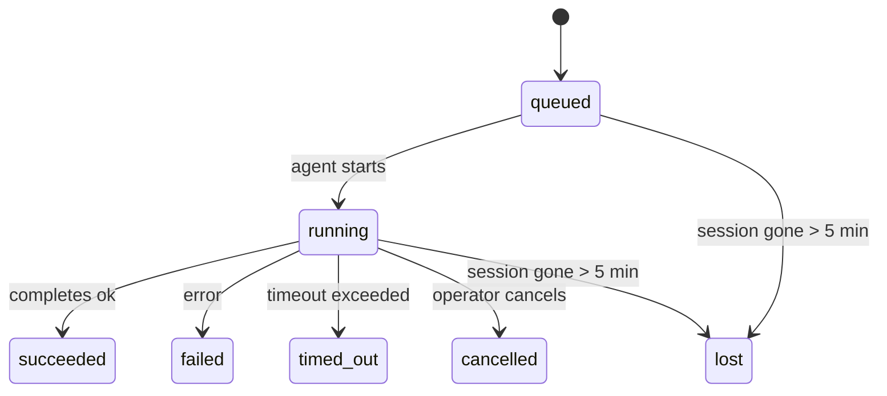

# 后台任务

> **Cron 与 Heartbeat 与 Tasks？** 参见 [Cron vs Heartbeat](/automation/cron-vs-heartbeat) 选择合适的调度机制。本页面介绍**跟踪**后台工作，而非调度。

后台任务跟踪在**主对话 Session 之外**运行的工作：
ACP 运行、子 Agent 生成、隔离 Cron 任务执行和 CLI 发起的操作。

Tasks 并**不**替代 Session、Cron 任务或 Heartbeat — 它们是**活动台账**，记录分离的工作何时发生、是否成功。

<Note>
并非每次 Agent 运行都会创建 Task。Heartbeat 轮次和普通交互聊天不会创建。所有 Cron 执行、ACP 生成、子 Agent 生成和 CLI Agent 命令都会创建。
</Note>

## 摘要

- Tasks 是**记录**，不是调度器 — Cron 和 Heartbeat 决定_何时_运行工作，Tasks 跟踪_发生了什么_。
- ACP、子 Agent、所有 Cron 任务和 CLI 操作会创建 Tasks。Heartbeat 轮次不会。
- 每个 Task 经历 `queued → running → terminal`（succeeded、failed、timed_out、cancelled 或 lost）。
- 完成通知直接投递到 Channel 或排队等待下一次 Heartbeat。
- `openclaw tasks list` 显示所有 Tasks；`openclaw tasks audit` 显示问题。
- 终止记录保留 7 天，然后自动清理。

## 快速开始

```bash
# 列出所有 Tasks（最新的在前）
openclaw tasks list

# 按运行时或状态过滤
openclaw tasks list --runtime acp
openclaw tasks list --status running

# 显示特定 Task 的详情（通过 ID、运行 ID 或 Session key）
openclaw tasks show <lookup>

# 取消正在运行的 Task（终止子 Session）
openclaw tasks cancel <lookup>

# 更改 Task 的通知策略
openclaw tasks notify <lookup> state_changes

# 运行健康审计
openclaw tasks audit
```

## 什么会创建 Task

| 来源                   | 运行时类型      | 何时创建 Task 记录                             | 默认通知策略      |
| ---------------------- | ------------ | ---------------------------------------------- | --------------------- |
| ACP 后台运行           | `acp`        | 生成子 ACP Session                              | `done_only`           |
| 子 Agent 编排           | `subagent`   | 通过 `sessions_spawn` 生成子 Agent              | `done_only`           |
| Cron 任务（所有类型）   | `cron`       | 每次 Cron 执行（主 Session 和隔离执行）          | `silent`              |
| CLI 操作               | `cli`        | 通过 Gateway 运行的 `openclaw agent` 命令        | `done_only`           |

主 Session Cron Tasks 默认使用 `silent` 通知策略 — 它们创建记录用于跟踪，但不生成通知。隔离 Cron Tasks 也默认为 `silent`，但因在自己的 Session 中运行而更加可见。

**不会创建 Tasks 的情况：**

- Heartbeat 轮次 — 主 Session；参见 [Heartbeat](/gateway/heartbeat)
- 普通交互聊天轮次
- 直接 `/command` 响应

## Task 生命周期



| 状态        | 含义                                                              |
| ----------- | -------------------------------------------------------------------------- |
| `queued`    | 已创建，等待 Agent 启动                                            |
| `running`   | Agent 轮次正在执行                                                |
| `succeeded` | 成功完成                                                          |
| `failed`    | 以错误结束                                                        |
| `timed_out` | 超过配置的超时时间                                                |
| `cancelled` | 被操作员通过 `openclaw tasks cancel` 停止                          |
| `lost`      | 后台子 Session 消失（在 5 分钟宽限期后检测到）                    |

状态转换自动发生 — 当关联的 Agent 运行结束时，Task 状态会相应更新。

## 投递和通知

当 Task 达到终止状态时，OpenClaw 会通知您。有两条投递路径：

**直接投递** — 如果 Task 有 Channel 目标（`requesterOrigin`），完成消息直接发送到该 Channel（Telegram、Discord、Slack 等）。

**Session 排队投递** — 如果直接投递失败或未设置来源，更新会作为系统事件排队到请求者的 Session 中，并在下次 Heartbeat 时显示。

<Tip>
Task 完成会触发立即的 Heartbeat 唤醒，以便您快速看到结果 — 无需等待下一次定时 Heartbeat 触发。
</Tip>

### 通知策略

控制每个 Task 的通知量：

| 策略                   | 投递内容                                                       |
| --------------------- | ----------------------------------------------------------------------- |
| `done_only`（默认）    | 仅终止状态（succeeded、failed 等）— **这是默认值**                |
| `state_changes`        | 每次状态转换和进度更新                                          |
| `silent`              | 完全不通知                                                      |

在 Task 运行时更改策略：

```bash
openclaw tasks notify <lookup> state_changes
```

## CLI 参考

### `tasks list`

```bash
openclaw tasks list [--runtime <acp|subagent|cron|cli>] [--status <status>] [--json]
```

输出列：Task ID、Kind、Status、Delivery、Run ID、Child Session、Summary。

### `tasks show`

```bash
openclaw tasks show <lookup>
```

lookup 令牌接受 Task ID、运行 ID 或 Session key。显示完整记录，包括时间、投递状态、错误和终止摘要。

### `tasks cancel`

```bash
openclaw tasks cancel <lookup>
```

对于 ACP 和子 Agent Tasks，这会终止子 Session。状态转换为 `cancelled`，并发送投递通知。

### `tasks notify`

```bash
openclaw tasks notify <lookup> <done_only|state_changes|silent>
```

### `tasks audit`

```bash
openclaw tasks audit [--json]
```

显示操作问题。当检测到问题时，发现结果也会出现在 `openclaw status` 中。

| 发现                      | 严重性   | 触发条件                                               |
| ------------------------- | -------- | ----------------------------------------------------- |
| `stale_queued`            | warn     | 排队超过 10 分钟                                       |
| `stale_running`           | error    | 运行超过 30 分钟                                       |
| `lost`                    | error    | 后台 Session 消失                                      |
| `delivery_failed`         | warn     | 投递失败且通知策略不是 `silent`                         |
| `missing_cleanup`         | warn     | 终止 Task 没有清理时间戳                                |
| `inconsistent_timestamps` | warn     | 时间线违规（例如结束时间早于开始时间）                  |

## 状态集成（Task 压力）

`openclaw status` 包含 Task 摘要概览：

```
Tasks: 3 queued · 2 running · 1 issues
```

摘要报告：

- **active** — `queued` + `running` 数量
- **failures** — `failed` + `timed_out` + `lost` 数量
- **byRuntime** — 按 `acp`、`subagent`、`cron`、`cli` 分类

## 存储和维护

### Tasks 存储位置

Task 记录持久化在 SQLite 中：

```
$OPENCLAW_STATE_DIR/tasks/runs.sqlite
```

注册表在 Gateway 启动时加载到内存中，并将写操作同步到 SQLite 以在重启后保持持久性。

### 自动维护

清理器每 **60 秒**运行一次，处理三件事：

1. **协调** — 检查活跃 Task 的后台 Session 是否仍然存在。如果子 Session 已消失超过 5 分钟，Task 标记为 `lost`。
2. **清理时间戳** — 在终止 Task 上设置 `cleanupAfter` 时间戳（endedAt + 7 天）。
3. **清理** — 删除超过 `cleanupAfter` 日期的记录。

**保留期**：终止 Task 记录保留 **7 天**，然后自动清理。无需配置。

## Tasks 与其他系统的关系

### Tasks 与 Cron

Cron 任务**定义**存储在 `~/.openclaw/cron/jobs.json` 中。**每次** Cron 执行都会创建 Task 记录 — 主 Session 和隔离模式都会。主 Session Cron Tasks 默认为 `silent` 通知策略，因此跟踪时不生成通知。

参见 [Cron 任务](/automation/cron-jobs)。

### Tasks 与 Heartbeat

Heartbeat 运行是主 Session 轮次 — 它们不创建 Task 记录。当 Task 完成时，可以触发 Heartbeat 唤醒，以便您快速看到结果。

参见 [Heartbeat](/gateway/heartbeat)。

### Tasks 与 Session

Task 可能引用 `childSessionKey`（工作运行的地方）和 `requesterSessionKey`（启动者）。Session 是对话上下文；Tasks 是其上的活动跟踪。

### Tasks 与 Agent 运行

Task 的 `runId` 链接到执行工作的 Agent 运行。Agent 生命周期事件（启动、结束、错误）自动更新 Task 状态 — 无需手动管理生命周期。

## 相关

- [Cron 任务](/automation/cron-jobs) — 调度后台工作
- [Cron vs Heartbeat](/automation/cron-vs-heartbeat) — 选择正确的机制
- [Heartbeat](/gateway/heartbeat) — 定期主 Session 轮次
- [CLI: Tasks](/cli/index#tasks) — CLI 命令参考
