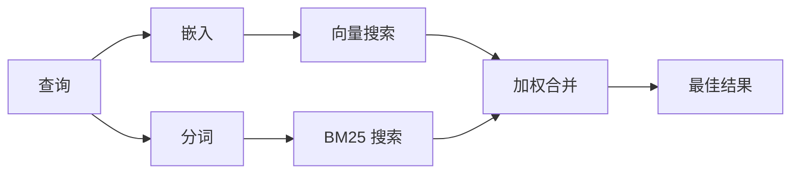

# 记忆搜索

`memory_search` 从您的记忆文件中找到相关笔记，即使措辞与原始文本不同。它通过将记忆索引为小块，并使用嵌入、关键词或两者结合来搜索它们。

## 快速开始

如果您配置了 OpenAI、Gemini、Voyage 或 Mistral 的 API key，记忆搜索会自动工作。要明确设置 Provider：

```json5
{
  agents: {
    defaults: {
      memorySearch: {
        provider: "openai", // 或 "gemini"、"local"、"ollama" 等
      },
    },
  },
}
```

对于无 API key 的本地嵌入，使用 `provider: "local"`（需要 node-llama-cpp）。

## 支持的 Provider

| Provider | ID        | 需要 API key | 备注                          |
| -------- | --------- | ------------- | ----------------------------- |
| OpenAI   | `openai`  | 是            | 自动检测，快速                |
| Gemini   | `gemini`  | 是            | 支持图像/音频索引              |
| Voyage   | `voyage`  | 是            | 自动检测                      |
| Mistral  | `mistral` | 是            | 自动检测                      |
| Ollama   | `ollama`  | 否            | 本地，必须明确设置             |
| Local    | `local`   | 否            | GGUF 模型，约 0.6 GB 下载     |

## 搜索工作原理

OpenClaw 并行运行两条检索路径并合并结果：



- **向量搜索**：找到含义相似的笔记（"gateway host" 匹配 "运行 OpenClaw 的机器"）。
- **BM25 关键词搜索**：找到精确匹配（ID、错误字符串、配置键）。

如果只有一条路径可用（无嵌入或无 FTS），则单独运行另一条。

## 提升搜索质量

当您有大量笔记历史时，两个可选功能有所帮助：

### 时间衰减

旧笔记会逐渐失去排名权重，使最近的信息优先显示。默认半衰期为 30 天，上个月的笔记得分为其原始权重的 50%。`MEMORY.md` 等常青文件永远不会衰减。

<Tip>
如果您的 Agent 有几个月的日常笔记，而陈旧信息不断超过最近上下文的排名，请启用时间衰减。
</Tip>

### MMR（多样性）

减少冗余结果。如果五篇笔记都提到相同的路由器配置，MMR 确保最佳结果涵盖不同主题而不是重复。

<Tip>
如果 `memory_search` 持续从不同的日常笔记中返回几乎重复的片段，请启用 MMR。
</Tip>

### 同时启用两者

```json5
{
  agents: {
    defaults: {
      memorySearch: {
        query: {
          hybrid: {
            mmr: { enabled: true },
            temporalDecay: { enabled: true },
          },
        },
      },
    },
  },
}
```

## 多模态记忆

使用 Gemini Embedding 2，您可以在 Markdown 旁边索引图像和音频文件。搜索查询仍为文本，但它们会与视觉和音频内容匹配。参见 [记忆配置参考](/reference/memory-config) 了解设置方法。

## Session 记忆搜索

您可以选择索引 Session 转录，以便 `memory_search` 可以召回早期对话。这通过 `memorySearch.experimental.sessionMemory` 选择加入。参见
[配置参考](/reference/memory-config) 了解详情。

## 故障排除

**无结果？** 运行 `openclaw memory status` 检查索引。如果为空，运行 `openclaw memory index --force`。

**只有关键词匹配？** 您的嵌入 Provider 可能未配置。检查 `openclaw memory status --deep`。

**找不到 CJK 文本？** 使用 `openclaw memory index --force` 重建 FTS 索引。

## 延伸阅读

- [记忆](/concepts/memory) — 文件布局、后端、工具
- [记忆配置参考](/reference/memory-config) — 所有配置选项
