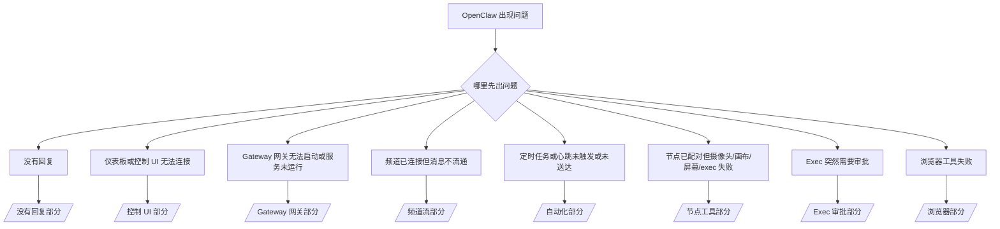

---
read_when:
  - OpenClaw 出现问题，你需要最快的修复路径
  - 深入排查前需要一个分诊流程
summary: OpenClaw 的症状优先故障排除中心
title: 一般故障排除
x-i18n:
  generated_at: "2026-03-30T00:00:00Z"
  model: claude-sonnet-4-6
  provider: pi
  source_hash: 132d127a606c4114425effb4503940ce7258311c6f3ec2f7320383593d0a3952
  source_path: help/troubleshooting.md
  workflow: 15
---

# 故障排除

如果你只有 2 分钟，使用本页作为分诊入口。

## 最初的六十秒

按顺序运行以下命令：

```bash
openclaw status
openclaw status --all
openclaw gateway probe
openclaw gateway status
openclaw doctor
openclaw channels status --probe
openclaw logs --follow
```

快速检查要点：

- `openclaw status` → 显示已配置的频道，没有明显的认证错误。
- `openclaw status --all` → 完整报告存在且可分享。
- `openclaw gateway probe` → 预期的 Gateway 网关目标可达（`Reachable: yes`）。`RPC: limited - missing scope: operator.read` 是诊断降级，不是连接失败。
- `openclaw gateway status` → `Runtime: running` 且 `RPC probe: ok`。
- `openclaw doctor` → 没有阻塞性的配置/服务错误。
- `openclaw channels status --probe` → 频道报告 `connected` 或 `ready`。
- `openclaw logs --follow` → 活动稳定，没有重复的致命错误。

## Anthropic 长上下文 429

如果你看到：
`HTTP 429: rate_limit_error: Extra usage is required for long context requests`，
前往 [/gateway/troubleshooting#anthropic-429-extra-usage-required-for-long-context](/gateway/troubleshooting#anthropic-429-extra-usage-required-for-long-context)。

## 插件安装失败，提示缺少 openclaw extensions

如果安装失败并报 `package.json missing openclaw.extensions`，说明该插件包使用了 OpenClaw 不再接受的旧格式。

在插件包中修复：

1. 将 `openclaw.extensions` 添加到 `package.json`。
2. 将条目指向已构建的运行时文件（通常是 `./dist/index.js`）。
3. 重新发布插件并再次运行 `openclaw plugins install <package>`。

示例：

```json
{
  "name": "@openclaw/my-plugin",
  "version": "1.2.3",
  "openclaw": {
    "extensions": ["./dist/index.js"]
  }
}
```

参考：[插件架构](/plugins/architecture)

## 决策树



### 没有回复

```bash
openclaw status
openclaw gateway status
openclaw channels status --probe
openclaw pairing list --channel <channel> [--account <id>]
openclaw logs --follow
```

良好输出的特征：

- `Runtime: running`
- `RPC probe: ok`
- 你的频道在 `channels status --probe` 中显示 connected/ready
- 发送者已批准（或 DM 策略为 open/allowlist）

常见日志签名：

- `drop guild message (mention required` → Discord 中提及门控阻止了消息。
- `pairing request` → 发送者未获批准，等待 DM 配对批准。
- `blocked` / `allowlist` 在频道日志中 → 发送者、房间或群组被过滤。

深入页面：

- [/gateway/troubleshooting#no-replies](/gateway/troubleshooting#no-replies)
- [/channels/troubleshooting](/channels/troubleshooting)
- [/channels/pairing](/channels/pairing)

### 仪表板或控制 UI 无法连接

```bash
openclaw status
openclaw gateway status
openclaw logs --follow
openclaw doctor
openclaw channels status --probe
```

良好输出的特征：

- `openclaw gateway status` 中显示 `Dashboard: http://...`
- `RPC probe: ok`
- 日志中没有认证循环

常见日志签名：

- `device identity required` → HTTP/非安全上下文无法完成设备认证。
- `AUTH_TOKEN_MISMATCH` 带有重试提示（`canRetryWithDeviceToken=true`）→ 可能自动发生一次受信任的设备令牌重试。
- 重试后继续出现 `unauthorized` → 令牌/密码错误、认证模式不匹配或设备令牌已过期。
- `gateway connect failed:` → UI 指向了错误的 URL/端口或无法访问的 Gateway 网关。

深入页面：

- [/gateway/troubleshooting#dashboard-control-ui-connectivity](/gateway/troubleshooting#dashboard-control-ui-connectivity)
- [/web/control-ui](/web/control-ui)
- [/gateway/authentication](/gateway/authentication)

### Gateway 网关无法启动或已安装服务未运行

```bash
openclaw status
openclaw gateway status
openclaw logs --follow
openclaw doctor
openclaw channels status --probe
```

良好输出的特征：

- `Service: ... (loaded)`
- `Runtime: running`
- `RPC probe: ok`

常见日志签名：

- `Gateway start blocked: set gateway.mode=local` → Gateway 网关模式未设置/为远程模式。
- `refusing to bind gateway ... without auth` → 非回环绑定但没有令牌/密码。
- `another gateway instance is already listening` 或 `EADDRINUSE` → 端口已被占用。

深入页面：

- [/gateway/troubleshooting#gateway-service-not-running](/gateway/troubleshooting#gateway-service-not-running)
- [/gateway/background-process](/gateway/background-process)
- [/gateway/configuration](/gateway/configuration)

### 频道已连接但消息不流通

```bash
openclaw status
openclaw gateway status
openclaw logs --follow
openclaw doctor
openclaw channels status --probe
```

良好输出的特征：

- 频道传输已连接。
- 配对/允许列表检查通过。
- 在需要时检测到提及。

常见日志签名：

- `mention required` → 群组提及门控阻止了处理。
- `pairing` / `pending` → DM 发送者尚未批准。
- `not_in_channel`、`missing_scope`、`Forbidden`、`401/403` → 频道权限令牌问题。

深入页面：

- [/gateway/troubleshooting#channel-connected-messages-not-flowing](/gateway/troubleshooting#channel-connected-messages-not-flowing)
- [/channels/troubleshooting](/channels/troubleshooting)

### 定时任务或心跳未触发或未送达

```bash
openclaw status
openclaw gateway status
openclaw cron status
openclaw cron list
openclaw cron runs --id <jobId> --limit 20
openclaw logs --follow
```

良好输出的特征：

- `cron.status` 显示已启用并有下一次唤醒时间。
- `cron runs` 显示最近的 `ok` 条目。
- 心跳已启用且不在非活跃时间段内。

常见日志签名：

- `cron: scheduler disabled; jobs will not run automatically` → 定时任务已禁用。
- `heartbeat skipped` 带 `reason=quiet-hours` → 在已配置的活跃时间段之外。
- `requests-in-flight` → 主通道繁忙；心跳唤醒被延迟。
- `unknown accountId` → 心跳送达目标账户不存在。

深入页面：

- [/gateway/troubleshooting#cron-and-heartbeat-delivery](/gateway/troubleshooting#cron-and-heartbeat-delivery)
- [/automation/troubleshooting](/automation/troubleshooting)
- [/gateway/heartbeat](/gateway/heartbeat)

### 节点已配对但工具失败（摄像头/画布/屏幕/exec）

```bash
openclaw status
openclaw gateway status
openclaw nodes status
openclaw nodes describe --node <idOrNameOrIp>
openclaw logs --follow
```

良好输出的特征：

- 节点列为已连接并为 `node` 角色配对。
- 你调用的命令存在对应能力。
- 该工具的权限状态已授权。

常见日志签名：

- `NODE_BACKGROUND_UNAVAILABLE` → 将节点应用切换到前台。
- `*_PERMISSION_REQUIRED` → OS 权限被拒绝/缺失。
- `SYSTEM_RUN_DENIED: approval required` → exec 审批待处理。
- `SYSTEM_RUN_DENIED: allowlist miss` → 命令不在 exec 允许列表中。

深入页面：

- [/gateway/troubleshooting#node-paired-tool-fails](/gateway/troubleshooting#node-paired-tool-fails)
- [/nodes/troubleshooting](/nodes/troubleshooting)
- [/tools/exec-approvals](/tools/exec-approvals)

### Exec 突然需要审批

```bash
openclaw config get tools.exec.host
openclaw config get tools.exec.security
openclaw config get tools.exec.ask
openclaw gateway restart
```

发生了什么变化：

- 如果 `tools.exec.host` 未设置，默认值为 `auto`。
- `host=auto` 在沙箱运行时活跃时解析为 `sandbox`，否则解析为 `gateway`。
- 在 `gateway` 和 `node` 上，未设置的 `tools.exec.security` 默认为 `allowlist`。
- 未设置的 `tools.exec.ask` 默认为 `on-miss`。
- 结果：普通主机命令现在可能暂停并显示 `Approval required`，而不是立即运行。

恢复旧的 Gateway 网关无审批行为：

```bash
openclaw config set tools.exec.host gateway
openclaw config set tools.exec.security full
openclaw config set tools.exec.ask off
openclaw gateway restart
```

更安全的替代方案：

- 如果你只是想要稳定的主机路由但仍想要审批，只设置 `tools.exec.host=gateway`。
- 如果你想要主机 exec 但仍想审查允许列表缺失项，保持 `security=allowlist` 和 `ask=on-miss`。
- 如果你希望 `host=auto` 解析回 `sandbox`，启用沙箱模式。

常见日志签名：

- `Approval required.` → 命令正在等待 `/approve ...`。
- `SYSTEM_RUN_DENIED: approval required` → 节点主机 exec 审批待处理。
- `exec host=sandbox requires a sandbox runtime for this session` → 隐式/显式选择了沙箱但沙箱模式已关闭。

深入页面：

- [/tools/exec](/tools/exec)
- [/tools/exec-approvals](/tools/exec-approvals)
- [/gateway/security#runtime-expectation-drift](/gateway/security#runtime-expectation-drift)

### 浏览器工具失败

```bash
openclaw status
openclaw gateway status
openclaw browser status
openclaw logs --follow
openclaw doctor
```

良好输出的特征：

- 浏览器状态显示 `running: true` 和已选择的浏览器/配置文件。
- `openclaw` 已启动，或 `user` 可以看到本地 Chrome 标签页。

常见日志签名：

- `unknown command "browser"` 或 `unknown command 'browser'` → `plugins.allow` 已设置且不包含 `browser`。
- `Failed to start Chrome CDP on port` → 本地浏览器启动失败。
- `browser.executablePath not found` → 已配置的二进制文件路径错误。
- `No Chrome tabs found for profile="user"` → Chrome MCP 附加配置文件没有打开的本地 Chrome 标签页。
- `Browser attachOnly is enabled ... not reachable` → 仅附加配置文件没有活动的 CDP 目标。

深入页面：

- [/gateway/troubleshooting#browser-tool-fails](/gateway/troubleshooting#browser-tool-fails)
- [/tools/browser#missing-browser-command-or-tool](/tools/browser#missing-browser-command-or-tool)
- [/tools/browser-linux-troubleshooting](/tools/browser-linux-troubleshooting)
- [/tools/browser-wsl2-windows-remote-cdp-troubleshooting](/tools/browser-wsl2-windows-remote-cdp-troubleshooting)

## 常见的"出问题了"情况

### `openclaw: command not found`

几乎总是 Node/npm PATH 问题。从这里开始：

- [安装（Node/npm PATH 安装完整性检查）](/install/node#troubleshooting)

### 安装程序失败（或你需要完整日志）

以详细模式重新运行安装程序以查看完整跟踪和 npm 输出：

```bash
curl -fsSL https://openclaw.ai/install.sh | bash -s -- --verbose
```

对于 beta 安装：

```bash
curl -fsSL https://openclaw.ai/install.sh | bash -s -- --beta --verbose
```

你也可以设置 `OPENCLAW_VERBOSE=1` 代替标志。

### Gateway 网关"unauthorized"、无法连接或持续重连

- [Gateway 网关故障排除](/gateway/troubleshooting)
- [Gateway 网关认证](/gateway/authentication)

### 控制 UI 在 HTTP 上失败（需要设备身份）

- [Gateway 网关故障排除](/gateway/troubleshooting)
- [控制 UI](/web/control-ui#insecure-http)

### `docs.openclaw.ai` 显示 SSL 错误（Comcast/Xfinity）

一些 Comcast/Xfinity 连接通过 Xfinity Advanced Security 阻止 `docs.openclaw.ai`。
禁用 Advanced Security 或将 `docs.openclaw.ai` 添加到允许列表，然后重试。

- Xfinity Advanced Security 帮助：https://www.xfinity.com/support/articles/using-xfinity-xfi-advanced-security
- 快速检查：尝试移动热点或 VPN 以确认这是 ISP 级别的过滤

### 服务显示运行中，但 RPC 探测失败

- [Gateway 网关故障排除](/gateway/troubleshooting)
- [后台进程/服务](/gateway/background-process)

### 模型/认证失败（速率限制、账单、"all models failed"）

- [模型](/cli/models)
- [OAuth / 认证概念](/concepts/oauth)

### `/model` 显示 `model not allowed`

这通常意味着 `agents.defaults.models` 配置为允许列表。当它非空时，只能选择那些提供商/模型键。

- 检查允许列表：`openclaw config get agents.defaults.models`
- 添加你想要的模型（或清除允许列表）然后重试 `/model`
- 使用 `/models` 浏览允许的提供商/模型

### 提交问题时

粘贴一份安全报告：

```bash
openclaw status --all
```

如果可以的话，包含来自 `openclaw logs --follow` 的相关日志尾部。
