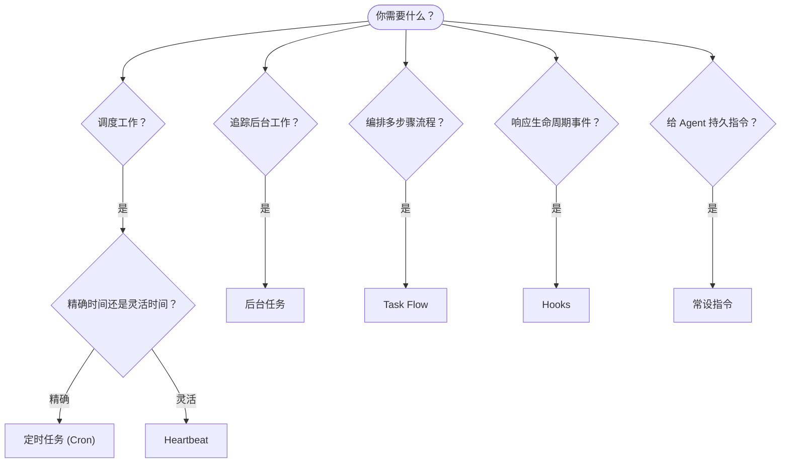

# 自动化与任务

OpenClaw 通过任务、定时作业、事件 Hooks 和常设指令在后台运行工作。本页帮助你选择合适的机制，并了解它们如何协同工作。

## 快速决策指南

| 使用场景                                | 推荐                   | 原因                                             |
| --------------------------------------- | ---------------------- | ------------------------------------------------ |
| 每天上午 9 点准时发送报告               | 定时任务 (Cron)        | 精确时间，独立执行                               |
| 20 分钟后提醒我                         | 定时任务 (Cron)        | 使用 `--at` 的精确时间一次性任务                 |
| 运行每周深度分析                        | 定时任务 (Cron)        | 独立任务，可使用不同模型                         |
| 每 30 分钟检查收件箱                    | Heartbeat              | 与其他检查批量处理，上下文感知                   |
| 监控日历中即将到来的事件                | Heartbeat              | 定期感知的自然选择                               |
| 检查子 Agent 或 ACP 运行的状态          | 后台任务               | 任务账本追踪所有后台工作                         |
| 审计运行内容和时间                      | 后台任务               | `openclaw tasks list` 和 `openclaw tasks audit`  |
| 多步骤研究后汇总                        | Task Flow              | 带修订追踪的持久编排                             |
| 会话重置时运行脚本                      | Hooks                  | 事件驱动，在生命周期事件触发                     |
| 每次工具调用时执行代码                  | Hooks                  | Hooks 可按事件类型过滤                           |
| 总是在回复前检查合规性                  | 常设指令               | 自动注入每个会话                                 |

### 定时任务 (Cron) vs Heartbeat

| 维度             | 定时任务 (Cron)                     | Heartbeat                             |
| ---------------- | ----------------------------------- | ------------------------------------- |
| 时间精度         | 精确（Cron 表达式、一次性）         | 近似（默认每 30 分钟）                |
| 会话上下文       | 全新（独立）或共享                  | 完整的主会话上下文                    |
| 任务记录         | 始终创建                            | 从不创建                              |
| 传递方式         | Channel、Webhook 或静默             | 内联于主会话                          |
| 最适合           | 报告、提醒、后台作业                | 收件箱检查、日历、通知                |

需要精确时间或独立执行时使用定时任务 (Cron)。工作受益于完整会话上下文且近似时间可接受时使用 Heartbeat。

## 核心概念

### 定时任务 (Cron)

Cron 是 Gateway 的内置调度器，用于精确时间控制。它持久化作业，在正确时间唤醒 Agent，并可将输出传递到聊天 Channel 或 Webhook 端点。支持一次性提醒、周期性表达式和入站 Webhook 触发器。

参见 [定时任务](/automation/cron-jobs)。

### 任务

后台任务账本追踪所有后台工作：ACP 运行、子 Agent 生成、独立 Cron 执行和 CLI 操作。任务是记录，不是调度器。使用 `openclaw tasks list` 和 `openclaw tasks audit` 来检查它们。

参见 [后台任务](/automation/tasks)。

### Task Flow

Task Flow 是后台任务之上的流程编排基础设施。它管理带有托管模式和镜像同步模式的持久多步骤流程、修订追踪，以及用于检查的 `openclaw tasks flow list|show|cancel`。

参见 [Task Flow](/automation/taskflow)。

### 常设指令

常设指令为 Agent 授予已定义程序的永久操作权限。它们保存在工作空间文件（通常是 `AGENTS.md`）中，并注入每个会话。与 Cron 结合使用可实现基于时间的强制执行。

参见 [常设指令](/automation/standing-orders)。

### Hooks

Hooks 是由 Agent 生命周期事件（`/new`、`/reset`、`/stop`）、会话压缩、Gateway 启动、消息流和工具调用触发的事件驱动脚本。Hooks 会从目录中自动发现，并可以通过 `openclaw hooks` 管理。

参见 [Hooks](/automation/hooks)。

### Heartbeat

Heartbeat 是周期性的主会话轮次（默认每 30 分钟）。它在一个 Agent 轮次中批量处理多个检查（收件箱、日历、通知），并带有完整的会话上下文。Heartbeat 轮次不创建任务记录。使用 `HEARTBEAT.md` 作为小清单，或在 Heartbeat 内部需要仅到期的定期检查时使用 `tasks:` 块。空的 Heartbeat 文件以 `empty-heartbeat-file` 跳过；仅到期任务模式以 `no-tasks-due` 跳过。

参见 [Heartbeat](/gateway/heartbeat)。

## 协同工作

- **Cron** 处理精确调度（每日报告、每周回顾）和一次性提醒。所有 Cron 执行都创建任务记录。
- **Heartbeat** 每 30 分钟在一个批量轮次中处理例行监控（收件箱、日历、通知）。
- **Hooks** 通过自定义脚本响应特定事件（工具调用、会话重置、压缩）。
- **常设指令** 为 Agent 提供持久上下文和权限边界。
- **Task Flow** 在各个任务之上协调多步骤流程。
- **任务** 自动追踪所有后台工作，以便你检查和审计。

## 相关文档

- [定时任务](/automation/cron-jobs) — 精确调度和一次性提醒
- [后台任务](/automation/tasks) — 所有后台工作的任务账本
- [Task Flow](/automation/taskflow) — 持久多步骤流程编排
- [Hooks](/automation/hooks) — 事件驱动的生命周期脚本
- [常设指令](/automation/standing-orders) — 持久 Agent 指令
- [Heartbeat](/gateway/heartbeat) — 周期性主会话轮次
- [配置参考](/gateway/configuration-reference) — 所有配置键
