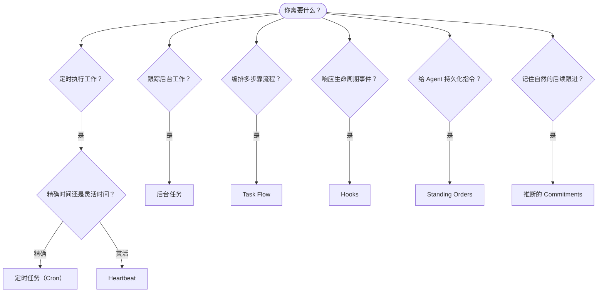

OpenClaw 通过任务、定时任务、推断的 Commitments、事件 Hooks 和常驻指令在后台运行工作。本页帮助你选择合适的机制并了解它们如何协同工作。

## 快速决策指南

| 使用场景                           | 推荐方式               | 原因                                              |
| ---------------------------------- | ---------------------- | ------------------------------------------------- |
| 每天早 9 点准时发送报告            | 定时任务（Cron）       | 精确时间，隔离执行                                |
| 20 分钟后提醒我                    | 定时任务（Cron）       | 精确时间的一次性任务（`--at`）                    |
| 运行每周深度分析                   | 定时任务（Cron）       | 独立任务，可使用不同模型                          |
| 每 30 分钟检查收件箱               | Heartbeat              | 批量合并其他检查，感知上下文                      |
| 监控日历中即将到来的事件           | Heartbeat              | 非常适合周期性感知                                |
| 提到的面试后跟进                   | 推断的 Commitments     | 记忆式跟进，无需精确提醒请求                      |
| 根据用户上下文进行温和的关怀跟进   | 推断的 Commitments     | 限定在相同 Agent 和 Channel 范围内                |
| 检查子 Agent 或 ACP 运行状态       | 后台任务               | 任务账本跟踪所有后台工作                          |
| 审计运行了什么及何时运行           | 后台任务               | `openclaw tasks list` 和 `openclaw tasks audit`   |
| 多步骤研究然后汇总                 | Task Flow              | 持久化编排，支持修订跟踪                          |
| 在会话重置时运行脚本               | Hooks                  | 事件驱动，触发生命周期事件                        |
| 在每次工具调用时执行代码           | Plugin hooks           | 进程内 Hooks 可拦截工具调用                       |
| 回复前始终检查合规性               | Standing Orders        | 自动注入每个会话                                  |

### 定时任务（Cron）与 Heartbeat

| 维度         | 定时任务（Cron）                     | Heartbeat                              |
| ------------ | ------------------------------------ | -------------------------------------- |
| 时间精度     | 精确（Cron 表达式，一次性）          | 近似（默认每 30 分钟）                 |
| 会话上下文   | 全新（隔离）或共享                   | 完整的主会话上下文                     |
| 任务记录     | 始终创建                             | 从不创建                               |
| 交付方式     | Channel、Webhook 或静默              | 内联到主会话                           |
| 最适合       | 报告、提醒、后台任务                 | 收件箱检查、日历、通知                 |

需要精确时间或隔离执行时使用定时任务（Cron）。工作受益于完整会话上下文且近似时间可接受时使用 Heartbeat。

## 核心概念

### 定时任务（Cron）

Cron 是 Gateway 内置的精确时间调度器。它持久化任务，在合适的时间唤醒 Agent，并可将输出交付到聊天 Channel 或 Webhook 端点。支持一次性提醒、周期性表达式和入站 Webhook 触发器。

参见[定时任务](/automation/cron-jobs)。

### 任务

后台任务账本跟踪所有后台工作：ACP 运行、子 Agent 生成、隔离的 Cron 执行以及 CLI 操作。任务是记录，而非调度器。使用 `openclaw tasks list` 和 `openclaw tasks audit` 来查看它们。

参见[后台任务](/automation/tasks)。

### 推断的 Commitments

Commitments 是可选的短期跟进记忆。OpenClaw 从正常对话中推断它们，将其限定在相同 Agent 和 Channel 范围内，并通过 Heartbeat 交付到期的跟进。用户明确要求的提醒仍属于 Cron。

参见[推断的 Commitments](/concepts/commitments)。

### Task Flow

Task Flow 是位于后台任务之上的流程编排基础设施。它管理持久化多步骤流程，具有托管和镜像同步模式、修订跟踪，以及用于检查的 `openclaw tasks flow list|show|cancel`。

参见 [Task Flow](/automation/taskflow)。

### Standing Orders

Standing Orders 为 Agent 授予针对已定义程序的永久操作权限。它们存放在工作区文件中（通常是 `AGENTS.md`），并注入到每个会话中。与 Cron 结合使用可实现基于时间的执行。

参见 [Standing Orders](/automation/standing-orders)。

### Hooks

内部 Hooks 是由 Agent 生命周期事件（`/new`、`/reset`、`/stop`）、会话压缩、Gateway 启动和消息流触发的事件驱动脚本。它们会自动从目录中发现，并可使用 `openclaw hooks` 管理。对于进程内工具调用拦截，请使用 [Plugin hooks](/plugins/hooks)。

参见 [Hooks](/automation/hooks)。

### Heartbeat

Heartbeat 是周期性的主会话轮次（默认每 30 分钟）。它在一次 Agent 轮次中以完整会话上下文批量处理多项检查（收件箱、日历、通知）。Heartbeat 轮次不创建任务记录，也不延伸每日/空闲会话重置新鲜度。使用 `HEARTBEAT.md` 提供简短清单，或在 Heartbeat 自身内部使用 `tasks:` 块进行仅到期的周期性检查。空的 Heartbeat 文件会以 `empty-heartbeat-file` 跳过；仅到期任务模式以 `no-tasks-due` 跳过。Cron 工作活动或排队时 Heartbeat 会延迟，`heartbeat.skipWhenBusy` 也可在子 Agent 或嵌套通道繁忙时延迟 Heartbeat。

参见 [Heartbeat](/gateway/heartbeat)。

## 协同工作

- **Cron** 处理精确时间表（每日报告、每周回顾）和一次性提醒。所有 Cron 执行都会创建任务记录。
- **Heartbeat** 每 30 分钟在一次批量轮次中处理日常监控（收件箱、日历、通知）。
- **Hooks** 通过自定义脚本响应特定事件（会话重置、压缩、消息流）。Plugin hooks 涵盖工具调用。
- **Standing orders** 为 Agent 提供持久化上下文和权限边界。
- **Task Flow** 在各个任务之上协调多步骤流程。
- **任务**自动跟踪所有后台工作，以便检查和审计。

## 相关

- [定时任务](/automation/cron-jobs) — 精确调度和一次性提醒
- [推断的 Commitments](/concepts/commitments) — 记忆式跟进
- [后台任务](/automation/tasks) — 所有后台工作的任务账本
- [Task Flow](/automation/taskflow) — 持久化多步骤流程编排
- [Hooks](/automation/hooks) — 事件驱动的生命周期脚本
- [Plugin hooks](/plugins/hooks) — 进程内工具、提示词、消息和生命周期 Hooks
- [Standing Orders](/automation/standing-orders) — 持久化 Agent 指令
- [Heartbeat](/gateway/heartbeat) — 周期性主会话轮次
- [配置参考](/gateway/configuration-reference) — 所有配置键
