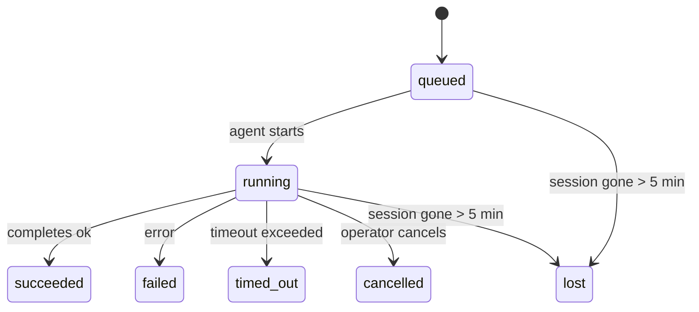

<Note>
在寻找调度功能？参见[自动化与任务](/automation)选择合适的机制。本页是后台工作的活动账本，而非调度器。
</Note>

后台任务跟踪在**你的主对话 Session 之外**运行的工作：ACP 运行、子 Agent 生成、隔离 Cron 任务执行以及 CLI 发起的操作。

任务**不**替代 Session、Cron 任务或 Heartbeat——它们是记录后台工作发生了什么、何时发生以及是否成功的**活动账本**。

<Note>
并非每个 Agent 运行都会创建任务。Heartbeat 轮次和正常的交互式聊天不会。所有 Cron 执行、ACP 生成、子 Agent 生成和 CLI Agent 命令都会。
</Note>

## 简述

- 任务是**记录**，而非调度器——Cron 和 Heartbeat 决定_何时_运行工作，任务跟踪_发生了什么_。
- ACP、子 Agent、所有 Cron 任务和 CLI 操作会创建任务。Heartbeat 轮次不会。
- 每个任务经过 `queued → running → terminal`（succeeded、failed、timed_out、cancelled 或 lost）。
- 只要 Cron 运行时仍将该任务标记为运行中，Cron 任务就保持存活；如果内存中的运行时状态消失，任务维护会先检查持久化 Cron 运行历史，再将任务标记为 lost。
- 完成是推送驱动的：后台工作可以直接通知或在完成时唤醒请求者 Session/Heartbeat，因此状态轮询循环通常不是正确的方式。
- 隔离 Cron 运行和子 Agent 完成会尽力清理其子 Session 的已跟踪浏览器标签/进程，然后进行最终清理。
- 隔离 Cron 交付在后代子 Agent 工作仍在排空时会抑制过时的父级临时回复，并在最终后代输出到达之前优先使用该输出。
- 完成通知直接交付到 Channel 或排队等待下一次 Heartbeat。
- `openclaw tasks list` 显示所有任务；`openclaw tasks audit` 暴露问题。
- 终止记录保留 7 天，然后自动清理。

## 快速开始

<Tabs>
  <Tab title="列出和过滤">
    ```bash
    # 列出所有任务（最新优先）
    openclaw tasks list

    # 按运行时或状态过滤
    openclaw tasks list --runtime acp
    openclaw tasks list --status running
    ```

  </Tab>
  <Tab title="检查">
    ```bash
    # 按 ID、运行 ID 或 Session 键显示特定任务的详情
    openclaw tasks show <lookup>
    ```
  </Tab>
  <Tab title="取消和通知">
    ```bash
    # 取消正在运行的任务（终止子 Session）
    openclaw tasks cancel <lookup>

    # 更改任务的通知策略
    openclaw tasks notify <lookup> state_changes
    ```

  </Tab>
  <Tab title="审计和维护">
    ```bash
    # 运行健康审计
    openclaw tasks audit

    # 预览或应用维护
    openclaw tasks maintenance
    openclaw tasks maintenance --apply
    ```

  </Tab>
  <Tab title="Task Flow">
    ```bash
    # 检查 TaskFlow 状态
    openclaw tasks flow list
    openclaw tasks flow show <lookup>
    openclaw tasks flow cancel <lookup>
    ```
  </Tab>
</Tabs>

## 什么会创建任务

| 来源                   | 运行时类型   | 何时创建任务记录                                       | 默认通知策略   |
| ---------------------- | ------------ | ------------------------------------------------------ | -------------- |
| ACP 后台运行           | `acp`        | 生成子 ACP Session                                     | `done_only`    |
| 子 Agent 编排          | `subagent`   | 通过 `sessions_spawn` 生成子 Agent                     | `done_only`    |
| Cron 任务（所有类型）  | `cron`       | 每次 Cron 执行（主 Session 和隔离）                    | `silent`       |
| CLI 操作               | `cli`        | 通过 Gateway 运行的 `openclaw agent` 命令              | `silent`       |
| Agent 媒体任务         | `cli`        | Session 支持的 `image_generate`/`music_generate`/`video_generate` 运行  | `silent`       |

<AccordionGroup>
  <Accordion title="Cron 和媒体的默认通知">
    主 Session Cron 任务默认使用 `silent` 通知策略——它们创建用于跟踪的记录，但不生成通知。隔离 Cron 任务也默认为 `silent`，但更可见，因为它们在自己的 Session 中运行。

    Session 支持的 `image_generate`、`music_generate` 和 `video_generate` 运行也使用 `silent` 通知策略。它们仍然创建任务记录，但完成会作为内部唤醒回传到原始 Agent Session，以便 Agent 可以写后续消息并附加已完成的媒体。生成媒体的完成事件需要通过 message 工具交付：Agent 必须用 `message` 工具发送已完成的媒体，然后回复 `NO_REPLY`。如果请求方 Session 不再活跃，且完成 Agent 遗漏了部分或全部生成的媒体，OpenClaw 会向原始 Channel 目标发送幂等的直接回退，仅包含缺失的媒体。

  </Accordion>
  <Accordion title="并发媒体生成守卫">
    当 Session 支持的媒体生成任务仍处于活跃状态时，媒体工具还充当意外重试的守卫。对同一提示词重复调用 `image_generate` 会返回匹配的活跃任务状态，而不同的图像提示词则可以启动自己的任务。`music_generate` 和 `video_generate` 调用仍会返回该 Session 的活跃任务状态，而不是启动第二个并发生成。当你希望从 Agent 侧进行明确的进度/状态查询时，请使用 `action: "status"`。
  </Accordion>
  <Accordion title="什么不会创建任务">
    - Heartbeat 轮次——主 Session；参见 [Heartbeat](/gateway/heartbeat)
    - 正常的交互式聊天轮次
    - 直接 `/command` 响应

  </Accordion>
</AccordionGroup>

## 任务生命周期



| 状态        | 含义                                                                       |
| ----------- | -------------------------------------------------------------------------- |
| `queued`    | 已创建，等待 Agent 开始                                                    |
| `running`   | Agent 轮次正在活跃执行                                                     |
| `succeeded` | 成功完成                                                                   |
| `failed`    | 以错误完成                                                                 |
| `timed_out` | 超过配置的超时时间                                                         |
| `cancelled` | 被操作者通过 `openclaw tasks cancel` 停止                                  |
| `lost`      | 运行时在 5 分钟宽限期后失去权威性的支持状态                                |

转换自动发生——当关联的 Agent 运行结束时，任务状态更新以匹配。

Agent 运行完成对活跃任务记录具有权威性。成功的后台运行最终确定为 `succeeded`，普通运行错误最终确定为 `failed`，超时或中止结果最终确定为 `timed_out`。如果操作者已取消任务，或运行时已记录更强的终止状态（如 `failed`、`timed_out` 或 `lost`），后来的成功信号不会降级该终止状态。

`lost` 是运行时感知的：

- ACP 任务：支持的 ACP 子 Session 元数据消失。
- 子 Agent 任务：子 Session 从目标 Agent 存储中消失。
- Cron 任务：Cron 运行时不再将任务标记为活跃，且持久化 Cron 运行历史不显示该运行的终止结果。离线 CLI 审计不将自身内存中空的 Cron 运行时状态视为权威。
- CLI 任务：带有运行 ID/来源 ID 的任务使用实时运行上下文，因此残留的子 Session 或聊天 Session 行在 Gateway 拥有的运行消失后不会保持它们存活。没有运行标识的旧版 CLI 任务仍然回退到子 Session。Gateway 支持的 `openclaw agent` 运行也从其运行结果完成，因此已完成的运行不会坐在活跃状态直到扫描器将其标记为 `lost`。

## 交付和通知

当任务达到终止状态时，OpenClaw 通知你。有两条交付路径：

**直接交付**——如果任务有 Channel 目标（`requesterOrigin`），完成消息会直接发送到该 Channel（Telegram、Discord、Slack 等）。群组和 Channel 任务完成改为通过请求者 Session 路由，以便父 Agent 可以写可见回复。对于子 Agent 完成，OpenClaw 还会在可用时保留绑定的线程/话题路由，并可以在放弃直接交付之前从请求者 Session 存储的路由（`lastChannel`/`lastTo`/`lastAccountId`）填充缺失的 `to`/账户。

**Session 排队交付**——如果直接交付失败或未设置来源，更新会作为系统事件排队到请求者的 Session，并在下次 Heartbeat 时显示。

<Tip>
任务完成会触发立即的 Heartbeat 唤醒，因此你可以快速看到结果——不必等待下一个预定的 Heartbeat 周期。
</Tip>

这意味着通常的工作流是推送驱动的：启动一次后台工作，然后让运行时在完成时唤醒或通知你。只有在需要调试、干预或明确审计时才轮询任务状态。

### 通知策略

控制你对每个任务的了解程度：

| 策略                  | 交付内容                                                                |
| --------------------- | ----------------------------------------------------------------------- |
| `done_only`（默认）   | 仅终止状态（succeeded、failed 等）——**这是默认值**                      |
| `state_changes`       | 每次状态转换和进度更新                                                  |
| `silent`              | 完全不通知                                                              |

在任务运行时更改策略：

```bash
openclaw tasks notify <lookup> state_changes
```

## CLI 参考

<AccordionGroup>
  <Accordion title="tasks list">
    ```bash
    openclaw tasks list [--runtime <acp|subagent|cron|cli>] [--status <status>] [--json]
    ```

    输出列：任务 ID、类型、状态、交付、运行 ID、子 Session、摘要。

  </Accordion>
  <Accordion title="tasks show">
    ```bash
    openclaw tasks show <lookup>
    ```

    查找令牌接受任务 ID、运行 ID 或 Session 键。显示完整记录，包括时间、交付状态、错误和终止摘要。

  </Accordion>
  <Accordion title="tasks cancel">
    ```bash
    openclaw tasks cancel <lookup>
    ```

    对于 ACP 和子 Agent 任务，这会终止子 Session。对于 CLI 跟踪的任务，取消记录在任务注册表中（没有单独的子运行时句柄）。状态转换为 `cancelled`，在适用时发送交付通知。

  </Accordion>
  <Accordion title="tasks notify">
    ```bash
    openclaw tasks notify <lookup> <done_only|state_changes|silent>
    ```
  </Accordion>
  <Accordion title="tasks audit">
    ```bash
    openclaw tasks audit [--json]
    ```

    暴露操作问题。检测到问题时，发现也会出现在 `openclaw status` 中。

    | 发现                      | 严重性     | 触发条件                                                                                                     |
    | ------------------------- | ---------- | ------------------------------------------------------------------------------------------------------------ |
    | `stale_queued`            | warn       | 排队超过 10 分钟                                                                                             |
    | `stale_running`           | error      | 运行超过 30 分钟                                                                                             |
    | `lost`                    | warn/error | 运行时支持的任务所有权消失；保留的 lost 任务在 `cleanupAfter` 之前发出警告，之后变为错误                    |
    | `delivery_failed`         | warn       | 交付失败且通知策略不是 `silent`                                                                              |
    | `missing_cleanup`         | warn       | 没有清理时间戳的终止任务                                                                                     |
    | `inconsistent_timestamps` | warn       | 时间线违规（例如在开始之前结束）                                                                             |

  </Accordion>
  <Accordion title="tasks maintenance">
    ```bash
    openclaw tasks maintenance [--json]
    openclaw tasks maintenance --apply [--json]
    ```

    用于预览或应用任务、Task Flow 状态和过时 Cron 运行 Session 注册行的对账、清理时间戳和清理。

    对账是运行时感知的：

    - ACP/子 Agent 任务检查其支持的子 Session。
    - 子 Session 有重启恢复墓碑的子 Agent 任务被标记为 lost，而非被视为可恢复的支持 Session。
    - Cron 任务检查 Cron 运行时是否仍拥有任务，然后从持久化 Cron 运行日志/任务状态恢复终止状态，之后回退到 `lost`。只有 Gateway 进程对内存中的 Cron 活跃任务集具有权威性；离线 CLI 审计使用持久化历史，但不会仅因为本地集为空就将 Cron 任务标记为 lost。
    - 带有运行标识的 CLI 任务检查拥有的实时运行上下文，而非仅子 Session 或聊天 Session 行。

    完成清理也是运行时感知的：

    - 子 Agent 完成在通知清理继续之前尽力关闭子 Session 的已跟踪浏览器标签/进程。
    - 隔离 Cron 完成在运行完全拆解之前尽力关闭 Cron Session 的已跟踪浏览器标签/进程。
    - 隔离 Cron 交付在需要时等待后代子 Agent 后续，并抑制过时的父级确认文本，而非直接通知。
    - 子 Agent 完成交付优先使用最新的可见助手文本；如果为空，则回退到经过清理的最新工具/工具结果文本，仅超时工具调用运行可以折叠为简短的部分进度摘要。终止失败运行通知失败状态，而不重放捕获的回复文本。
    - 清理失败不会掩盖实际的任务结果。

    应用维护时，OpenClaw 还会删除超过 7 天的旧 `cron:<jobId>:run:<uuid>` Session 注册行，同时保留当前运行的 Cron 任务行，并不修改非 Cron Session 行。

  </Accordion>
  <Accordion title="tasks flow list | show | cancel">
    ```bash
    openclaw tasks flow list [--status <status>] [--json]
    openclaw tasks flow show <lookup> [--json]
    openclaw tasks flow cancel <lookup>
    ```

    当你关心的是编排 Task Flow 而非单个后台任务记录时使用这些命令。

  </Accordion>
</AccordionGroup>

## 聊天任务看板（`/tasks`）

在任何聊天 Session 中使用 `/tasks` 查看与该 Session 关联的后台任务。看板显示活跃和最近完成的任务，包含运行时、状态、时间以及进度或错误详情。

当当前 Session 没有可见的关联任务时，`/tasks` 会回退到 Agent 本地任务计数，以便你获得概览而不泄漏其他 Session 的详情。

对于完整的操作者账本，请使用 CLI：`openclaw tasks list`。

## 状态集成（任务压力）

`openclaw status` 包含任务摘要快速概览：

```
Tasks: 3 queued · 2 running · 1 issues
```

摘要报告：

- **active** - `queued` + `running` 计数
- **failures** - `failed` + `timed_out` + `lost` 计数
- **byRuntime** - 按 `acp`、`subagent`、`cron`、`cli` 细分

`/status` 和 `session_status` 工具都使用清理感知的任务快照：活跃任务优先，过时已完成行隐藏，最近失败仅在没有活跃工作时显示。这使状态卡专注于当前重要的内容。

## 存储和维护

### 任务存放位置

任务记录持久化在 SQLite：

```
$OPENCLAW_STATE_DIR/tasks/runs.sqlite
```

注册表在 Gateway 启动时加载到内存，并将写入同步到 SQLite 以实现跨重启的持久性。Gateway 使用 SQLite 的默认自动检查点阈值加上周期性和关机 `TRUNCATE` 检查点来保持 SQLite 预写日志有界。

### 自动维护

扫描器每 **60 秒**运行一次，处理四件事：

<Steps>
  <Step title="对账">
    检查活跃任务是否仍有权威性的运行时支持。ACP/子 Agent 任务使用子 Session 状态，Cron 任务使用活跃任务所有权，带有运行标识的 CLI 任务使用拥有的运行上下文。如果该支持状态消失超过 5 分钟，任务被标记为 `lost`。
  </Step>
  <Step title="ACP Session 修复">
    关闭终止的或孤立的父拥有的一次性 ACP Session，以及仅在没有活跃对话绑定时关闭终止的或孤立的持久 ACP Session。
  </Step>
  <Step title="清理时间戳">
    在终止任务上设置 `cleanupAfter` 时间戳（endedAt + 7 天）。在保留期间，lost 任务仍作为警告出现在审计中；`cleanupAfter` 过期或清理元数据缺失后，它们变为错误。
  </Step>
  <Step title="清理">
    删除已超过其 `cleanupAfter` 日期的记录。
  </Step>
</Steps>

<Note>
**保留：** 终止任务记录保留 **7 天**，然后自动清理。无需配置。
</Note>

## 任务与其他系统的关系

<AccordionGroup>
  <Accordion title="任务和 Task Flow">
    [Task Flow](/automation/taskflow) 是后台任务之上的流程编排层。单个流程在其生命周期内可能使用托管或镜像同步模式协调多个任务。使用 `openclaw tasks` 检查单个任务记录，使用 `openclaw tasks flow` 检查编排流程。

    参见 [Task Flow](/automation/taskflow) 了解详情。

  </Accordion>
  <Accordion title="任务和 Cron">
    Cron 任务**定义**存放在 `~/.openclaw/cron/jobs.json`；运行时执行状态存放在旁边的 `~/.openclaw/cron/jobs-state.json`。**每次** Cron 执行都创建任务记录——包括主 Session 和隔离执行。主 Session Cron 任务默认为 `silent` 通知策略，因此它们在跟踪时不生成通知。

    参见 [Cron 任务](/automation/cron-jobs)。

  </Accordion>
  <Accordion title="任务和 Heartbeat">
    Heartbeat 运行是主 Session 轮次——它们不创建任务记录。当任务完成时，它可以触发 Heartbeat 唤醒，使你快速看到结果。

    参见 [Heartbeat](/gateway/heartbeat)。

  </Accordion>
  <Accordion title="任务和 Session">
    任务可能引用 `childSessionKey`（工作运行的地方）和 `requesterSessionKey`（谁启动了它）。Session 是对话上下文；任务是在其之上的活动跟踪。
  </Accordion>
  <Accordion title="任务和 Agent 运行">
    任务的 `runId` 链接到执行工作的 Agent 运行。Agent 生命周期事件（开始、结束、错误）自动更新任务状态——你不需要手动管理生命周期。
  </Accordion>
</AccordionGroup>

## 相关

- [自动化与任务](/automation) — 所有自动化机制概览
- [CLI：tasks](/cli/tasks) — CLI 命令参考
- [Heartbeat](/gateway/heartbeat) — 周期性主会话轮次
- [定时任务](/automation/cron-jobs) — 调度后台工作
- [Task Flow](/automation/taskflow) — 任务之上的流程编排
