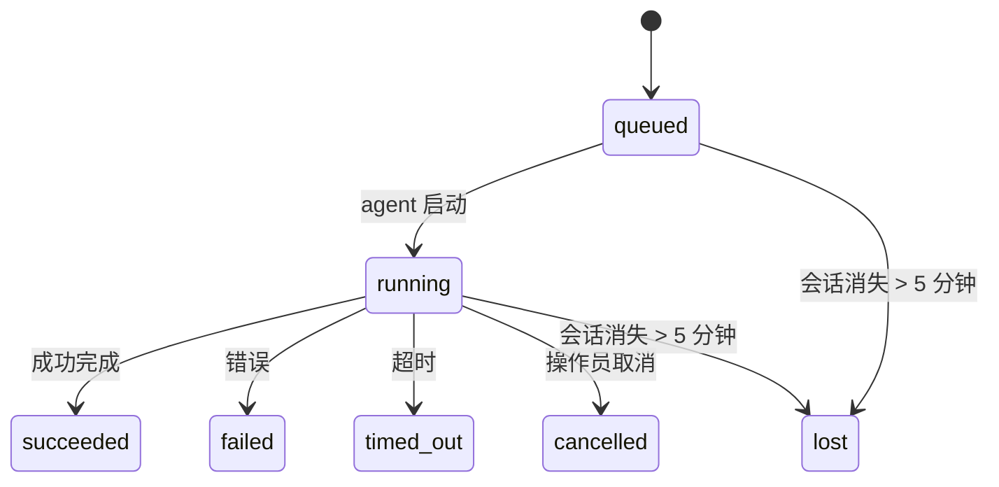

# 后台任务

> **寻找调度功能？** 参见[自动化与任务](/automation)以选择合适的机制。本页介绍**追踪**后台工作，而非调度。

后台任务追踪**在你的主对话会话之外**运行的工作：ACP 运行、子 Agent 生成、独立 Cron 作业执行和 CLI 发起的操作。

任务**不**替代会话、Cron 作业或 Heartbeat——它们是记录后台工作发生情况、时间以及是否成功的**活动账本**。

<Note>
并非每次 Agent 运行都会创建任务。Heartbeat 轮次和普通交互式聊天不会创建。所有 Cron 执行、ACP 生成、子 Agent 生成和 CLI Agent 命令都会创建。
</Note>

## TL;DR

- 任务是**记录**，不是调度器——Cron 和 Heartbeat 决定工作*何时*运行，任务追踪*发生了什么*。
- ACP、子 Agent、所有 Cron 作业和 CLI 操作创建任务。Heartbeat 轮次不创建。
- 每个任务经过 `queued → running → terminal`（succeeded、failed、timed_out、cancelled 或 lost）。
- Cron 任务在 Cron 运行时仍拥有该作业期间保持活动；聊天支持的 CLI 任务仅在其拥有的运行上下文仍活动时保持活动。
- 完成是推送驱动的：后台工作可以直接通知或在完成时唤醒请求方会话/Heartbeat，因此状态轮询循环通常是错误的方式。
- 独立 Cron 运行和子 Agent 完成在最终清理记录之前会尽力清理其子会话的追踪浏览器标签/进程。
- 独立 Cron 传递会在后代子 Agent 工作仍在排出时抑制陈旧的中间父回复，并在最终后代输出在传递前到达时优先使用它。
- 完成通知直接传递到 Channel 或排队等待下一次 Heartbeat。
- `openclaw tasks list` 显示所有任务；`openclaw tasks audit` 暴露问题。
- 终态记录保留 7 天，然后自动清理。

## 快速开始

```bash
# 列出所有任务（最新在前）
openclaw tasks list

# 按运行时或状态过滤
openclaw tasks list --runtime acp
openclaw tasks list --status running

# 显示特定任务的详情（按 ID、运行 ID 或会话键）
openclaw tasks show <lookup>

# 取消运行中的任务（终止子会话）
openclaw tasks cancel <lookup>

# 更改任务的通知策略
openclaw tasks notify <lookup> state_changes

# 运行健康审计
openclaw tasks audit

# 预览或应用维护
openclaw tasks maintenance
openclaw tasks maintenance --apply

# 检查 TaskFlow 状态
openclaw tasks flow list
openclaw tasks flow show <lookup>
openclaw tasks flow cancel <lookup>
```

## 什么会创建任务

| 来源                   | 运行时类型      | 任务记录创建时机                                       | 默认通知策略          |
| ---------------------- | --------------- | ------------------------------------------------------ | --------------------- |
| ACP 后台运行           | `acp`           | 生成子 ACP 会话时                                      | `done_only`           |
| 子 Agent 编排          | `subagent`      | 通过 `sessions_spawn` 生成子 Agent 时                  | `done_only`           |
| Cron 作业（所有类型）  | `cron`          | 每次 Cron 执行（主会话和独立）                         | `silent`              |
| CLI 操作               | `cli`           | 通过 Gateway 运行的 `openclaw agent` 命令              | `silent`              |
| Agent 媒体作业         | `cli`           | 会话支持的 `video_generate` 运行                       | `silent`              |

主会话 Cron 任务默认使用 `silent` 通知策略——它们创建记录用于追踪，但不生成通知。独立 Cron 任务也默认为 `silent`，但更显眼，因为它们在自己的会话中运行。

会话支持的 `video_generate` 运行也使用 `silent` 通知策略。它们仍然创建任务记录，但完成时会作为内部唤醒交回给原始 Agent 会话，以便 Agent 可以写入后续消息并自己附加完成的视频。如果你选择 `tools.media.asyncCompletion.directSend`，异步 `music_generate` 和 `video_generate` 完成会先尝试直接 Channel 传递，然后再回退到请求方会话唤醒路径。

当会话支持的 `video_generate` 任务仍然活动时，工具还充当护栏：同一会话中重复的 `video_generate` 调用会返回活动任务状态，而不是启动第二个并发生成。当你想要从 Agent 侧进行显式的进度/状态查询时，使用 `action: "status"`。

**不会创建任务的情况：**

- Heartbeat 轮次——主会话；参见 [Heartbeat](/gateway/heartbeat)
- 普通交互式聊天轮次
- 直接 `/command` 响应

## 任务生命周期



| 状态        | 含义                                                               |
| ----------- | ------------------------------------------------------------------ |
| `queued`    | 已创建，等待 Agent 启动                                            |
| `running`   | Agent 轮次正在主动执行                                             |
| `succeeded` | 成功完成                                                           |
| `failed`    | 完成时出错                                                         |
| `timed_out` | 超过配置的超时时间                                                 |
| `cancelled` | 被操作员通过 `openclaw tasks cancel` 停止                          |
| `lost`      | 5 分钟宽限期后运行时失去权威的支撑状态                             |

过渡自动发生——当关联的 Agent 运行结束时，任务状态自动更新以匹配。

`lost` 状态是运行时感知的：

- ACP 任务：支撑的 ACP 子会话元数据消失。
- 子 Agent 任务：支撑的子会话从目标 Agent 存储中消失。
- Cron 任务：Cron 运行时不再将该作业追踪为活动。
- CLI 任务：独立子会话任务使用子会话；聊天支持的 CLI 任务使用活动运行上下文，因此残留的 Channel/组/直接会话行不会使它们保持活动。

## 传递和通知

当任务达到终态时，OpenClaw 会通知你。有两个传递路径：

**直接传递** — 如果任务有 Channel 目标（`requesterOrigin`），完成消息直接发送到该 Channel（Telegram、Discord、Slack 等）。对于子 Agent 完成，OpenClaw 还会在可用时保留绑定的线程/主题路由，并可以在放弃直接传递之前从请求方会话的存储路由（`lastChannel`/`lastTo`/`lastAccountId`）填充缺失的 `to`/账户。

**会话排队传递** — 如果直接传递失败或未设置来源，更新将作为系统事件排队到请求方会话中，并在下一次 Heartbeat 时浮现。

<Tip>
任务完成会触发立即的 Heartbeat 唤醒，让你快速看到结果——不必等待下一次计划的 Heartbeat 时钟。
</Tip>

这意味着通常的工作流是推送驱动的：启动一次后台工作，然后让运行时在完成时唤醒或通知你。仅在需要调试、干预或显式审计时才轮询任务状态。

### 通知策略

控制你对每个任务了解的程度：

| 策略                   | 传递内容                                                         |
| ---------------------- | ---------------------------------------------------------------- |
| `done_only`（默认）    | 仅终态（succeeded、failed 等）——**这是默认值**                   |
| `state_changes`        | 每次状态过渡和进度更新                                           |
| `silent`               | 完全不传递                                                       |

在任务运行时更改策略：

```bash
openclaw tasks notify <lookup> state_changes
```

## CLI 参考

### `tasks list`

```bash
openclaw tasks list [--runtime <acp|subagent|cron|cli>] [--status <status>] [--json]
```

输出列：任务 ID、类型、状态、传递、运行 ID、子会话、摘要。

### `tasks show`

```bash
openclaw tasks show <lookup>
```

查找令牌接受任务 ID、运行 ID 或会话键。显示完整记录，包括时间、传递状态、错误和终态摘要。

### `tasks cancel`

```bash
openclaw tasks cancel <lookup>
```

对于 ACP 和子 Agent 任务，这会终止子会话。对于 CLI 追踪的任务，取消操作记录在任务注册表中（没有单独的子运行时句柄）。状态过渡到 `cancelled` 并在适用时发送传递通知。

### `tasks notify`

```bash
openclaw tasks notify <lookup> <done_only|state_changes|silent>
```

### `tasks audit`

```bash
openclaw tasks audit [--json]
```

暴露操作问题。当检测到问题时，发现结果也会出现在 `openclaw status` 中。

| 发现                      | 严重性 | 触发条件                                              |
| ------------------------- | ------ | ----------------------------------------------------- |
| `stale_queued`            | warn   | 排队超过 10 分钟                                      |
| `stale_running`           | error  | 运行超过 30 分钟                                      |
| `lost`                    | error  | 运行时支持的任务所有权消失                            |
| `delivery_failed`         | warn   | 传递失败且通知策略不是 `silent`                       |
| `missing_cleanup`         | warn   | 没有清理时间戳的终态任务                              |
| `inconsistent_timestamps` | warn   | 时间轴违规（例如结束时间早于开始时间）                |

### `tasks maintenance`

```bash
openclaw tasks maintenance [--json]
openclaw tasks maintenance --apply [--json]
```

用于预览或应用任务和 Task Flow 状态的协调、清理标记和清理。

协调是运行时感知的：

- ACP/子 Agent 任务检查其支撑子会话。
- Cron 任务检查 Cron 运行时是否仍拥有该作业。
- 聊天支持的 CLI 任务检查拥有的活动运行上下文，而不仅仅是聊天会话行。

完成清理也是运行时感知的：

- 子 Agent 完成在宣告清理继续之前，尽力关闭子会话的追踪浏览器标签/进程。
- 独立 Cron 完成在运行完全拆除之前，尽力关闭 Cron 会话的追踪浏览器标签/进程。
- 独立 Cron 传递在需要时等待后代子 Agent 后续处理，并抑制陈旧的父确认文本而不宣告它。
- 子 Agent 完成传递优先使用最新可见的助手文本；如果为空，则回退到清理后的最新工具/工具结果文本，仅超时工具调用运行可以折叠为简短的部分进度摘要。
- 清理失败不会掩盖实际任务结果。

### `tasks flow list|show|cancel`

```bash
openclaw tasks flow list [--status <status>] [--json]
openclaw tasks flow show <lookup> [--json]
openclaw tasks flow cancel <lookup>
```

当你关心的是编排 Task Flow 而不是单个后台任务记录时，使用这些命令。

## 聊天任务看板（`/tasks`）

在任何聊天会话中使用 `/tasks` 查看与该会话关联的后台任务。看板显示活动和最近完成的任务，包括运行时、状态、时间以及进度或错误详情。

当当前会话没有可见的关联任务时，`/tasks` 回退到 Agent 本地任务计数，让你仍然获得概览，而不会泄露其他会话的详情。

要获取完整的操作员账本，使用 CLI：`openclaw tasks list`。

## 状态集成（任务压力）

`openclaw status` 包含一目了然的任务摘要：

```
Tasks: 3 queued · 2 running · 1 issues
```

摘要报告：

- **active** — `queued` + `running` 的计数
- **failures** — `failed` + `timed_out` + `lost` 的计数
- **byRuntime** — 按 `acp`、`subagent`、`cron`、`cli` 分类

`/status` 和 `session_status` 工具都使用清理感知的任务快照：优先显示活动任务，隐藏陈旧的已完成行，仅在没有活动工作时才浮现近期失败。这样可以让状态卡片聚焦于当前最重要的内容。

## 存储和维护

### 任务存储位置

任务记录持久化到 SQLite：

```
$OPENCLAW_STATE_DIR/tasks/runs.sqlite
```

注册表在 Gateway 启动时加载到内存，并将写入同步到 SQLite 以在重启后保持持久性。

### 自动维护

清理器每 **60 秒**运行一次，处理三件事：

1. **协调** — 检查活动任务是否仍有权威的运行时支撑。ACP/子 Agent 任务使用子会话状态，Cron 任务使用活动作业所有权，聊天支持的 CLI 任务使用拥有的运行上下文。如果该支撑状态消失超过 5 分钟，任务将被标记为 `lost`。
2. **清理标记** — 在终态任务上设置 `cleanupAfter` 时间戳（endedAt + 7 天）。
3. **清理** — 删除已超过 `cleanupAfter` 日期的记录。

**保留期**：终态任务记录保留 **7 天**，然后自动清理。无需配置。

## 任务与其他系统的关系

### 任务与 Task Flow

[Task Flow](/automation/taskflow) 是后台任务之上的流程编排层。一个流程在其生命周期中可能使用托管或镜像同步模式协调多个任务。使用 `openclaw tasks` 检查单个任务记录，使用 `openclaw tasks flow` 检查编排流程。

参见 [Task Flow](/automation/taskflow) 了解详情。

### 任务与 Cron

Cron 作业**定义**存储在 `~/.openclaw/cron/jobs.json`。**每次** Cron 执行都会创建任务记录——无论是主会话还是独立执行。主会话 Cron 任务默认使用 `silent` 通知策略，因此它们追踪但不生成通知。

参见 [Cron 作业](/automation/cron-jobs)。

### 任务与 Heartbeat

Heartbeat 运行是主会话轮次——它们不创建任务记录。当任务完成时，它可以触发 Heartbeat 唤醒，让你及时看到结果。

参见 [Heartbeat](/gateway/heartbeat)。

### 任务与会话

任务可能引用 `childSessionKey`（工作运行的位置）和 `requesterSessionKey`（启动它的人）。会话是对话上下文；任务是其上的活动追踪。

### 任务与 Agent 运行

任务的 `runId` 链接到执行工作的 Agent 运行。Agent 生命周期事件（启动、结束、错误）自动更新任务状态——你不需要手动管理生命周期。

## 相关文档

- [自动化与任务](/automation) — 所有自动化机制一览
- [Task Flow](/automation/taskflow) — 任务之上的流程编排
- [定时任务](/automation/cron-jobs) — 调度后台工作
- [Heartbeat](/gateway/heartbeat) — 周期性主会话轮次
- [CLI：Tasks](/cli/index#tasks) — CLI 命令参考
