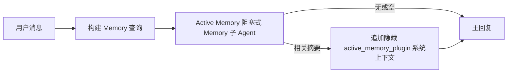

# Active Memory

Active Memory 是一个可选的 Plugin 拥有的阻塞式 Memory 子 Agent，在符合条件的对话式 Session 的主要回复之前运行。

它的存在是因为大多数 Memory 系统虽然有能力但是被动的。它们依赖主 Agent 决定何时搜索 Memory，或者用户说"记住这个"或"搜索 Memory"之类的话。到那时，Memory 本可以让回复感觉自然的时机已经过去。

Active Memory 在生成主要回复之前，给系统一次有限的机会来呈现相关 Memory。

## 粘贴到您的 Agent

如果您希望 Agent 以自包含、安全默认设置启用 Active Memory，请将以下内容粘贴到您的 Agent 中：

```json5
{
  plugins: {
    entries: {
      "active-memory": {
        enabled: true,
        config: {
          enabled: true,
          agents: ["main"],
          allowedChatTypes: ["direct"],
          modelFallback: "google/gemini-3-flash",
          queryMode: "recent",
          promptStyle: "balanced",
          timeoutMs: 15000,
          maxSummaryChars: 220,
          persistTranscripts: false,
          logging: true,
        },
      },
    },
  },
}
```

这将为 `main` Agent 开启 Plugin，默认将其限制为直接消息式 Session，让其首先继承当前 Session 模型，并仅在没有可用的显式或继承模型时才使用配置的回退模型。

之后，重启 Gateway：

```bash
openclaw gateway
```

要在对话中实时检查它：

```text
/verbose on
/trace on
```

## 开启 Active Memory

最安全的设置是：

1. 启用 Plugin
2. 针对一个对话式 Agent
3. 仅在调整时保持日志记录开启

在 `openclaw.json` 中从以下内容开始：

```json5
{
  plugins: {
    entries: {
      "active-memory": {
        enabled: true,
        config: {
          agents: ["main"],
          allowedChatTypes: ["direct"],
          modelFallback: "google/gemini-3-flash",
          queryMode: "recent",
          promptStyle: "balanced",
          timeoutMs: 15000,
          maxSummaryChars: 220,
          persistTranscripts: false,
          logging: true,
        },
      },
    },
  },
}
```

然后重启 Gateway：

```bash
openclaw gateway
```

含义：

- `plugins.entries.active-memory.enabled: true` 开启 Plugin
- `config.agents: ["main"]` 只让 `main` Agent 使用 Active Memory
- `config.allowedChatTypes: ["direct"]` 默认仅在直接消息式 Session 中保持 Active Memory 开启
- 如果 `config.model` 未设置，Active Memory 首先继承当前 Session 模型
- `config.modelFallback` 可选择为召回提供您自己的回退 provider/模型
- `config.promptStyle: "balanced"` 在 `recent` 模式下使用默认通用提示风格
- Active Memory 仍然只在符合条件的交互式持久聊天 Session 上运行

## 如何查看

Active Memory 为模型注入隐藏的系统上下文。它不会向客户端公开原始的 `<active_memory_plugin>...</active_memory_plugin>` 标签。

## Session 切换

当您想在不编辑配置的情况下暂停或恢复当前聊天 Session 的 Active Memory 时，使用 Plugin 命令：

```text
/active-memory status
/active-memory off
/active-memory on
```

这是 Session 范围的，不会更改 `plugins.entries.active-memory.enabled`、Agent 目标或其他全局配置。

如果您希望命令写入配置并为所有 Session 暂停或恢复 Active Memory，请使用明确的全局形式：

```text
/active-memory status --global
/active-memory off --global
/active-memory on --global
```

全局形式写入 `plugins.entries.active-memory.config.enabled`，保留 `plugins.entries.active-memory.enabled` 开启，以便命令之后仍可重新启用 Active Memory。

如果您想在实时 Session 中查看 Active Memory 的运行情况，请开启与您想要的输出相匹配的 Session 切换：

```text
/verbose on
/trace on
```

启用这些后，OpenClaw 可以显示：

- 当 `/verbose on` 时，Active Memory 状态行，如 `Active Memory: ok 842ms recent 34 chars`
- 当 `/trace on` 时，可读的调试摘要，如 `Active Memory Debug: Lemon pepper wings with blue cheese.`

这些行来自于馈送隐藏系统上下文的同一 Active Memory 传递，但它们是为人类格式化的，而不是公开原始提示标记。它们在正常助手回复之后作为后续诊断消息发送，这样 Telegram 等 Channel 客户端不会在回复前闪烁单独的诊断气泡。

默认情况下，阻塞式 Memory 子 Agent 转录是临时的，在运行完成后删除。

示例流程：

```text
/verbose on
/trace on
what wings should i order?
```

预期可见回复形状：

```text
...normal assistant reply...

🧩 Active Memory: ok 842ms recent 34 chars
🔎 Active Memory Debug: Lemon pepper wings with blue cheese.
```

## 运行时机

Active Memory 使用两个门控：

1. **配置选入**
   Plugin 必须启用，且当前 Agent ID 必须出现在 `plugins.entries.active-memory.config.agents` 中。
2. **严格运行时资格**
   即使启用并已定向，Active Memory 也只针对符合条件的交互式持久聊天 Session 运行。

实际规则是：

```text
plugin 已启用
+
agent id 已定向
+
允许的聊天类型
+
符合条件的交互式持久聊天 Session
=
active memory 运行
```

如果其中任何一个失败，Active Memory 就不会运行。

## Session 类型

`config.allowedChatTypes` 控制哪些类型的对话可以运行 Active Memory。

默认值为：

```json5
allowedChatTypes: ["direct"]
```

这意味着 Active Memory 默认在直接消息式 Session 中运行，但不在群组或 Channel Session 中运行，除非您明确选择加入。

示例：

```json5
allowedChatTypes: ["direct"]
```

```json5
allowedChatTypes: ["direct", "group"]
```

```json5
allowedChatTypes: ["direct", "group", "channel"]
```

## 运行位置

Active Memory 是一个对话丰富功能，而不是平台范围的推理功能。

| 界面                                                     | 是否运行 Active Memory                      |
| -------------------------------------------------------- | ------------------------------------------- |
| Control UI / Web 聊天持久 Session                        | 是，如果 Plugin 已启用且 Agent 已定向       |
| 同一持久聊天路径上的其他交互式 Channel Session            | 是，如果 Plugin 已启用且 Agent 已定向       |
| 无界面一次性运行                                         | 否                                          |
| Heartbeat/后台运行                                       | 否                                          |
| 通用内部 `agent-command` 路径                            | 否                                          |
| 子 Agent/内部辅助执行                                    | 否                                          |

## 使用场景

在以下情况下使用 Active Memory：

- Session 是持久且面向用户的
- Agent 有有意义的长期 Memory 可供搜索
- 连续性和个性化比原始提示确定性更重要

它特别适用于：

- 稳定的偏好
- 重复习惯
- 应该自然呈现的长期用户上下文

它不适合：

- 自动化
- 内部工作者
- 一次性 API 任务
- 隐藏个性化会令人惊讶的地方

## 工作原理

运行时形状为：



阻塞式 Memory 子 Agent 只能使用：

- `memory_search`
- `memory_get`

如果连接较弱，应返回 `NONE`。

## 查询模式

`config.queryMode` 控制阻塞式 Memory 子 Agent 看到多少对话。

## 提示风格

`config.promptStyle` 控制阻塞式 Memory 子 Agent 在决定是否返回 Memory 时的积极程度或严格程度。

可用风格：

- `balanced`：`recent` 模式的通用默认值
- `strict`：最不积极；当您希望附近上下文出血极少时最佳
- `contextual`：最友好的连续性；当对话历史应更重要时最佳
- `recall-heavy`：更愿意在较软但仍合理的匹配上呈现 Memory
- `precision-heavy`：除非匹配明显，否则积极地倾向于 `NONE`
- `preference-only`：针对最爱、习惯、例行公事、口味和重复个人事实进行优化

当 `config.promptStyle` 未设置时的默认映射：

```text
message -> strict
recent -> balanced
full -> contextual
```

如果您显式设置 `config.promptStyle`，该覆盖生效。

示例：

```json5
promptStyle: "preference-only"
```

## 模型回退策略

如果 `config.model` 未设置，Active Memory 按以下顺序尝试解析模型：

```text
显式 plugin 模型
-> 当前 Session 模型
-> Agent 主模型
-> 可选配置的回退模型
```

`config.modelFallback` 控制配置的回退步骤。

可选自定义回退：

```json5
modelFallback: "google/gemini-3-flash"
```

如果没有显式、继承或配置的回退模型可以解析，Active Memory 将跳过该轮次的召回。

`config.modelFallbackPolicy` 仅作为旧版配置的已弃用兼容性字段保留。它不再改变运行时行为。

## 高级逃生舱

这些选项有意不作为推荐设置的一部分。

`config.thinking` 可以覆盖阻塞式 Memory 子 Agent 的思考级别：

```json5
thinking: "medium"
```

默认值：

```json5
thinking: "off"
```

默认情况下不要启用此功能。Active Memory 在回复路径中运行，因此额外的思考时间会直接增加用户可见的延迟。

`config.promptAppend` 在默认 Active Memory 提示之后和对话上下文之前添加额外的操作员指令：

```json5
promptAppend: "Prefer stable long-term preferences over one-off events."
```

`config.promptOverride` 替换默认的 Active Memory 提示。OpenClaw 之后仍会追加对话上下文：

```json5
promptOverride: "You are a memory search agent. Return NONE or one compact user fact."
```

除非您有意测试不同的召回合同，否则不推荐进行提示自定义。默认提示经过调整，返回 `NONE` 或为主模型提供紧凑的用户事实上下文。

### `message`

只发送最新的用户消息。

```text
Latest user message only
```

在以下情况下使用：

- 您想要最快的行为
- 您希望对稳定偏好召回有最强的偏向
- 后续轮次不需要对话上下文

推荐超时：

- 从约 `3000` 到 `5000` 毫秒开始

### `recent`

发送最新的用户消息加上一个小的最近对话尾部。

```text
Recent conversation tail:
user: ...
assistant: ...
user: ...

Latest user message:
...
```

在以下情况下使用：

- 您想要速度和对话基础之间更好的平衡
- 后续问题通常取决于最后几轮

推荐超时：

- 从约 `15000` 毫秒开始

### `full`

将完整对话发送给阻塞式 Memory 子 Agent。

```text
Full conversation context:
user: ...
assistant: ...
user: ...
...
```

在以下情况下使用：

- 最强的召回质量比延迟更重要
- 对话中包含线程深处的重要设置

推荐超时：

- 与 `message` 或 `recent` 相比大幅增加
- 根据线程大小，从约 `15000` 毫秒或更高开始

一般来说，超时应随上下文大小增加：

```text
message < recent < full
```

## 转录持久化

Active Memory 阻塞式 Memory 子 Agent 运行在子 Agent 调用期间创建真实的 `session.jsonl` 转录。

默认情况下，该转录是临时的：

- 写入临时目录
- 仅用于阻塞式 Memory 子 Agent 运行
- 运行完成后立即删除

如果您想在磁盘上保留这些阻塞式 Memory 子 Agent 转录以便调试或检查，请明确开启持久化：

```json5
{
  plugins: {
    entries: {
      "active-memory": {
        enabled: true,
        config: {
          agents: ["main"],
          persistTranscripts: true,
          transcriptDir: "active-memory",
        },
      },
    },
  },
}
```

启用时，Active Memory 将转录存储在目标 Agent 的 Session 文件夹下的单独目录中，而不是在主用户对话转录路径中。

默认布局在概念上为：

```text
agents/<agent>/sessions/active-memory/<blocking-memory-sub-agent-session-id>.jsonl
```

您可以使用 `config.transcriptDir` 更改相对子目录。

谨慎使用：

- 在繁忙 Session 上，阻塞式 Memory 子 Agent 转录可能会快速累积
- `full` 查询模式可能会复制大量对话上下文
- 这些转录包含隐藏的提示上下文和召回的 Memory

## 配置

所有 Active Memory 配置都在以下位置：

```text
plugins.entries.active-memory
```

最重要的字段：

| 键                          | 类型                                                                                                  | 含义                                                                                         |
| --------------------------- | ----------------------------------------------------------------------------------------------------- | -------------------------------------------------------------------------------------------- |
| `enabled`                   | `boolean`                                                                                             | 启用 Plugin 本身                                                                             |
| `config.agents`             | `string[]`                                                                                            | 可以使用 Active Memory 的 Agent ID                                                           |
| `config.model`              | `string`                                                                                              | 可选的阻塞式 Memory 子 Agent 模型引用；未设置时，Active Memory 使用当前 Session 模型         |
| `config.queryMode`          | `"message" \| "recent" \| "full"`                                                                     | 控制阻塞式 Memory 子 Agent 看到多少对话                                                      |
| `config.promptStyle`        | `"balanced" \| "strict" \| "contextual" \| "recall-heavy" \| "precision-heavy" \| "preference-only"` | 控制阻塞式 Memory 子 Agent 在决定是否返回 Memory 时的积极程度或严格程度                     |
| `config.thinking`           | `"off" \| "minimal" \| "low" \| "medium" \| "high" \| "xhigh" \| "adaptive"`                         | 阻塞式 Memory 子 Agent 的高级思考覆盖；默认 `off` 以保证速度                                |
| `config.promptOverride`     | `string`                                                                                              | 高级完整提示替换；不建议正常使用                                                             |
| `config.promptAppend`       | `string`                                                                                              | 追加到默认或覆盖提示的高级额外指令                                                           |
| `config.timeoutMs`          | `number`                                                                                              | 阻塞式 Memory 子 Agent 的硬超时                                                              |
| `config.maxSummaryChars`    | `number`                                                                                              | Active Memory 摘要中允许的最大总字符数                                                       |
| `config.logging`            | `boolean`                                                                                             | 调整时发出 Active Memory 日志                                                                |
| `config.persistTranscripts` | `boolean`                                                                                             | 将阻塞式 Memory 子 Agent 转录保留在磁盘上，而不是删除临时文件                               |
| `config.transcriptDir`      | `string`                                                                                              | Agent Session 文件夹下的相对阻塞式 Memory 子 Agent 转录目录                                 |

有用的调整字段：

| 键                            | 类型     | 含义                                           |
| ----------------------------- | -------- | ---------------------------------------------- |
| `config.maxSummaryChars`      | `number` | Active Memory 摘要中允许的最大总字符数         |
| `config.recentUserTurns`      | `number` | `queryMode` 为 `recent` 时包含的之前用户轮次   |
| `config.recentAssistantTurns` | `number` | `queryMode` 为 `recent` 时包含的之前助手轮次   |
| `config.recentUserChars`      | `number` | 每个最近用户轮次的最大字符数                   |
| `config.recentAssistantChars` | `number` | 每个最近助手轮次的最大字符数                   |
| `config.cacheTtlMs`           | `number` | 重复相同查询的缓存复用                         |

## 推荐设置

从 `recent` 开始。

```json5
{
  plugins: {
    entries: {
      "active-memory": {
        enabled: true,
        config: {
          agents: ["main"],
          queryMode: "recent",
          promptStyle: "balanced",
          timeoutMs: 15000,
          maxSummaryChars: 220,
          logging: true,
        },
      },
    },
  },
}
```

如果您想在调整时检查实时行为，使用 `/verbose on` 获取正常状态行，使用 `/trace on` 获取 Active Memory 调试摘要，而不是寻找单独的 Active Memory 调试命令。在聊天 Channel 中，这些诊断行在主助手回复之后发送，而不是在其之前。

然后转向：

- `message` 如果您想要更低的延迟
- `full` 如果您决定额外上下文值得更慢的阻塞式 Memory 子 Agent

## 调试

如果 Active Memory 没有在您期望的位置出现：

1. 确认 Plugin 在 `plugins.entries.active-memory.enabled` 下已启用。
2. 确认当前 Agent ID 列在 `config.agents` 中。
3. 确认您通过交互式持久聊天 Session 进行测试。
4. 开启 `config.logging: true` 并查看 Gateway 日志。
5. 使用 `openclaw memory status --deep` 验证 Memory 搜索本身是否正常工作。

如果 Memory 命中太嘈杂，收紧：

- `maxSummaryChars`

如果 Active Memory 太慢：

- 降低 `queryMode`
- 降低 `timeoutMs`
- 减少最近轮次计数
- 减少每轮字符上限

## 常见问题

### 嵌入 Provider 意外更改

Active Memory 在 `agents.defaults.memorySearch` 下使用正常的 `memory_search` 管道。这意味着嵌入 Provider 设置仅在您的 `memorySearch` 设置需要嵌入来实现您想要的行为时才是必需的。

在实践中：

- 如果您想要一个非自动检测的 Provider（如 `ollama`），**必须**显式设置 Provider
- 如果自动检测无法为您的环境解析任何可用的嵌入 Provider，**必须**显式设置 Provider
- 如果您想要确定性的 Provider 选择而不是"第一个可用的优先"，**强烈建议**显式设置 Provider
- 如果自动检测已经解析了您想要的 Provider 并且该 Provider 在您的部署中是稳定的，通常**不需要**显式设置 Provider

如果 `memorySearch.provider` 未设置，OpenClaw 自动检测第一个可用的嵌入 Provider。

这在实际部署中可能令人困惑：

- 新可用的 API 密钥可能会改变 Memory 搜索使用的 Provider
- 某个命令或诊断界面可能使选择的 Provider 看起来与您在实时 Memory 同步或搜索引导期间实际命中的路径不同
- 托管 Provider 可能因配额或速率限制错误而失败，这些错误只有在 Active Memory 开始在每次回复前发出召回搜索时才会出现

当 `memory_search` 可以在降级的词法模式下运行时（通常在没有嵌入 Provider 可以解析时发生），Active Memory 仍然可以在没有嵌入的情况下运行。

不要对 Provider 运行时失败（如配额耗尽、速率限制、网络/Provider 错误或在已选择 Provider 后缺少本地/远程模型）假设同样的回退。

在实践中：

- 如果没有嵌入 Provider 可以解析，`memory_search` 可能会降级为词法检索
- 如果嵌入 Provider 已解析然后在运行时失败，OpenClaw 目前不保证该请求的词法回退
- 如果您需要确定性的 Provider 选择，请固定 `agents.defaults.memorySearch.provider`
- 如果您需要运行时错误上的 Provider 故障转移，请显式配置 `agents.defaults.memorySearch.fallback`

如果您依赖嵌入支持的召回、多模态索引或特定的本地/远程 Provider，请显式固定 Provider 而不是依赖自动检测。

常见固定示例：

OpenAI：

```json5
{
  agents: {
    defaults: {
      memorySearch: {
        provider: "openai",
        model: "text-embedding-3-small",
      },
    },
  },
}
```

Gemini：

```json5
{
  agents: {
    defaults: {
      memorySearch: {
        provider: "gemini",
        model: "gemini-embedding-001",
      },
    },
  },
}
```

Ollama：

```json5
{
  agents: {
    defaults: {
      memorySearch: {
        provider: "ollama",
        model: "nomic-embed-text",
      },
    },
  },
}
```

如果您期望在运行时错误（如配额耗尽）上的 Provider 故障转移，仅固定 Provider 是不够的。也需要显式配置回退：

```json5
{
  agents: {
    defaults: {
      memorySearch: {
        provider: "openai",
        fallback: "gemini",
      },
    },
  },
}
```

### 调试 Provider 问题

如果 Active Memory 缓慢、空或似乎意外切换 Provider：

- 在重现问题时查看 Gateway 日志；查找如 `active-memory: ... start|done`、`memory sync failed (search-bootstrap)` 或 Provider 特定嵌入错误的行
- 开启 `/trace on` 以在 Session 中呈现 Plugin 拥有的 Active Memory 调试摘要
- 如果您还想在每次回复后看到正常的 `🧩 Active Memory: ...` 状态行，开启 `/verbose on`
- 运行 `openclaw memory status --deep` 以检查当前 Memory 搜索后端和索引健康状况
- 检查 `agents.defaults.memorySearch.provider` 及相关的认证/配置，确保您期望的 Provider 在运行时实际上可以解析
- 如果您使用 `ollama`，验证已安装配置的嵌入模型，例如 `ollama list`

示例调试循环：

```text
1. 启动 Gateway 并查看其日志
2. 在聊天 Session 中，运行 /trace on
3. 发送一条应触发 Active Memory 的消息
4. 将聊天可见的调试行与 Gateway 日志行进行比较
5. 如果 Provider 选择不明确，显式固定 agents.defaults.memorySearch.provider
```

示例：

```json5
{
  agents: {
    defaults: {
      memorySearch: {
        provider: "ollama",
        model: "nomic-embed-text",
      },
    },
  },
}
```

或者，如果您想要 Gemini 嵌入：

```json5
{
  agents: {
    defaults: {
      memorySearch: {
        provider: "gemini",
      },
    },
  },
}
```

更改 Provider 后，重启 Gateway 并使用 `/trace on` 进行新的测试，使 Active Memory 调试行反映新的嵌入路径。

## 相关页面

- [Memory 搜索](/concepts/memory-search)
- [Memory 配置参考](/reference/memory-config)
- [Plugin SDK 设置](/plugins/sdk-setup)
