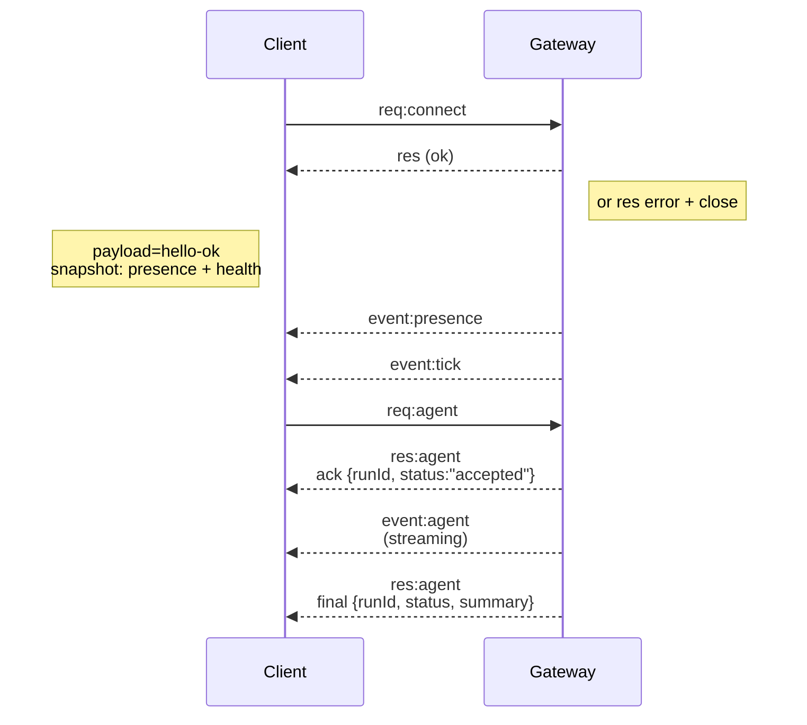

# Gateway architecture

## 概述

- 单个长期运行的 **Gateway** 拥有所有消息表面(WhatsApp 通过
  Baileys、Telegram 通过 grammY、Slack、Discord、Signal、iMessage、WebChat)。
- 控制平面客户端(macOS app、CLI、web UI、automations)通过配置的绑定主机(默认
  `127.0.0.1:18789`)上的 **WebSocket** 连接到 Gateway。
- **Nodes** (macOS/iOS/Android/headless)也通过 **WebSocket** 连接,但声明 `role: node` 并具有显式的 caps/commands。
- 每个主机一个 Gateway;它是打开 WhatsApp session 的唯一位置。
- **canvas host** 由 Gateway HTTP server 在以下位置提供:
  - `/__openclaw__/canvas/` (agent 可编辑的 HTML/CSS/JS)
  - `/__openclaw__/a2ui/` (A2UI host)
    它使用与 Gateway 相同的端口(默认 `18789`)。

## 组件和流程

### Gateway (daemon)

- 维护 provider 连接。
- 公开类型化的 WS API(requests、responses、server‑push events)。
- 针对 JSON Schema 验证入站帧。
- 发出事件,如 `agent`、`chat`、`presence`、`health`、`heartbeat`、`cron`。

### Clients (mac app / CLI / web admin)

- 每个客户端一个 WS 连接。
- 发送 requests(`health`、`status`、`send`、`agent`、`system-presence`)。
- 订阅 events(`tick`、`agent`、`presence`、`shutdown`)。

### Nodes (macOS / iOS / Android / headless)

- 使用 `role: node` 连接到**相同的 WS server**。
- 在 `connect` 中提供设备身份;配对是**基于设备的**(角色 `node`),批准存储在设备配对存储中。
- 公开命令,如 `canvas.*`、`camera.*`、`screen.record`、`location.get`。

协议详细信息:

- [Gateway protocol](/gateway/protocol)

### WebChat

- 静态 UI,使用 Gateway WS API 进行聊天历史和发送。
- 在远程设置中,通过与其他客户端相同的 SSH/Tailscale 隧道连接。

## 连接生命周期(单个客户端)



## 线路协议(摘要)

- Transport: WebSocket,带有 JSON payloads 的文本帧。
- 第一帧**必须**是 `connect`。
- 握手后:
  - Requests: `{type:"req", id, method, params}` → `{type:"res", id, ok, payload|error}`
  - Events: `{type:"event", event, payload, seq?, stateVersion?}`
- `hello-ok.features.methods` / `events` 是发现元数据，不是每个可调用辅助路由的生成转储。
- 共享密钥验证使用 `connect.params.auth.token` 或 `connect.params.auth.password`，具体取决于配置的 Gateway 验证模式。
- 带身份的模式，如 Tailscale Serve（`gateway.auth.allowTailscale: true`）或非 loopback `gateway.auth.mode: "trusted-proxy"`，通过请求标头而非 `connect.params.auth.*` 满足验证。
- 私有入口 `gateway.auth.mode: "none"` 完全禁用共享密钥验证；请勿在公共/不受信任的入口开启此模式。
- 副作用方法（`send`、`agent`）需要幂等性键以安全重试；server 保留短期去重缓存。
- Nodes 必须在 `connect` 中包含 `role: "node"` 以及 caps/commands/permissions。

## 配对 + 本地信任

- 所有 WS 客户端(operators + nodes)在 `connect` 时包含**设备身份**。
- 新设备 ID 需要配对批准;Gateway 为后续连接颁发**设备 token**。
- 直接本地 loopback 连接可以自动批准以保持同主机 UX 流畅。
- OpenClaw 还有一个用于受信任共享密钥辅助流程的窄后端/容器本地自连接路径。
- Tailnet 和 LAN 连接，包括同主机 tailnet 绑定，仍然需要显式配对批准。
- 所有连接必须签署 `connect.challenge` nonce。
- Signature payload `v3` 还绑定 `platform` + `deviceFamily`;gateway 在重新连接时固定已配对的元数据,并在元数据更改时要求重新配对。
- **非本地**连接仍然需要显式批准。
- Gateway auth (`gateway.auth.*`)仍然适用于**所有**连接,无论是本地还是远程。

详细信息:[Gateway protocol](/gateway/protocol)、[Pairing](/channels/pairing)、[Security](/gateway/security)。

## Protocol 类型和代码生成

- TypeBox schemas 定义 protocol。
- JSON Schema 从这些 schemas 生成。
- Swift models 从 JSON Schema 生成。

## 远程访问

- 首选: Tailscale 或 VPN。
- 备选: SSH 隧道
  ```bash
  ssh -N -L 18789:127.0.0.1:18789 user@host
  ```
- 相同的握手 + auth token 通过隧道应用。
- 可以在远程设置中为 WS 启用 TLS + 可选 pinning。

## 操作快照

- 启动: `openclaw gateway`(前台,日志到 stdout)。
- 健康检查: 通过 WS 的 `health`(也包含在 `hello-ok` 中)。
- 监督: launchd/systemd 用于自动重启。

## 不变量

- 每个主机恰好一个 Gateway 控制单个 Baileys session。
- 握手是强制性的；任何非 JSON 或非 connect 的第一帧都是硬关闭。
- Events 不会重放；客户端必须在间隙上刷新。

## 相关链接

- [Agent Loop](/concepts/agent-loop) — 详细的 Agent 执行周期
- [Gateway Protocol](/gateway/protocol) — WebSocket 协议契约
- [Queue](/concepts/queue) — 命令队列和并发
- [Security](/gateway/security) — 信任模型和安全加固
