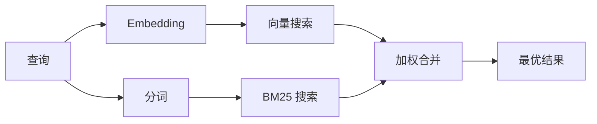

`memory_search` 从内存文件中找到相关笔记，即使措辞与原文不同。它通过将内存索引为小块并使用 embedding、关键词或两者结合进行搜索来工作。

## 快速开始

如果您配置了 GitHub Copilot 订阅、OpenAI、Gemini、Voyage 或 Mistral API 密钥，内存搜索会自动工作。显式设置提供商：

```json5
{
  agents: {
    defaults: {
      memorySearch: {
        provider: "openai", // 或 "gemini"、"local"、"ollama" 等
      },
    },
  },
}
```

要使用无 API 密钥的本地 embedding，请在 OpenClaw 旁边安装可选的 `node-llama-cpp` 运行时包并使用 `provider: "local"`。

## 支持的提供商

| 提供商         | ID               | 需要 API 密钥 | 备注                                     |
| -------------- | ---------------- | ------------- | ---------------------------------------- |
| Bedrock        | `bedrock`        | 否            | AWS 凭证链解析时自动检测                 |
| Gemini         | `gemini`         | 是            | 支持图像/音频索引                        |
| GitHub Copilot | `github-copilot` | 否            | 自动检测，使用 Copilot 订阅              |
| 本地           | `local`          | 否            | GGUF 模型，约 0.6 GB 下载               |
| Mistral        | `mistral`        | 是            | 自动检测                                 |
| Ollama         | `ollama`         | 否            | 本地，需显式设置                         |
| OpenAI         | `openai`         | 是            | 自动检测，速度快                         |
| Voyage         | `voyage`         | 是            | 自动检测                                 |

## 搜索工作原理

OpenClaw 并行运行两条检索路径并合并结果：



- **向量搜索**找到语义相似的笔记（"gateway host"匹配"运行 OpenClaw 的机器"）。
- **BM25 关键词搜索**找到精确匹配（ID、错误字符串、配置键）。

如果只有一条路径可用（无 embedding 或无 FTS），则单独运行另一条。

当 embedding 不可用时，OpenClaw 仍会对 FTS 结果使用词法排名，而不仅仅是回退到原始精确匹配排序。这种降级模式会对查询词覆盖率更强、相关文件路径更相关的块进行加权，即使没有 `sqlite-vec` 或 embedding provider 也能保持有效的召回。

## 提升搜索质量

当您有大量笔记历史时，两个可选功能有所帮助：

### 时间衰减

旧笔记逐渐降低排名权重，使近期信息优先显示。默认半衰期为 30 天，上个月的笔记得分为原始权重的 50%。`MEMORY.md` 等常青文件不会衰减。

<Tip>
如果您的 Agent 有数月的日常笔记，且过时信息总是排在近期上下文前面，请启用时间衰减。
</Tip>

### MMR（多样性）

减少冗余结果。如果有五条笔记都提到相同的路由器配置，MMR 确保顶部结果涵盖不同主题而非重复。

<Tip>
如果 `memory_search` 不断从不同日常笔记中返回几乎重复的片段，请启用 MMR。
</Tip>

### 同时启用

```json5
{
  agents: {
    defaults: {
      memorySearch: {
        query: {
          hybrid: {
            mmr: { enabled: true },
            temporalDecay: { enabled: true },
          },
        },
      },
    },
  },
}
```

## 多模态内存

使用 Gemini Embedding 2，您可以将图像和音频文件与 Markdown 一起索引。搜索查询仍为文本，但可以匹配视觉和音频内容。参见 [Memory 配置参考](/reference/memory-config) 了解设置方法。

## Session 内存搜索

您可以选择索引 Session 记录，使 `memory_search` 能够召回早期对话。这通过 `memorySearch.experimental.sessionMemory` 选择开启。参见[配置参考](/reference/memory-config)了解详情。

## 故障排除

**无结果？** 运行 `openclaw memory status` 检查索引。如果为空，运行 `openclaw memory index --force`。

**只有关键词匹配？** 您的 embedding 提供商可能未配置。检查 `openclaw memory status --deep`。

**本地 embedding 超时？** `ollama`、`lmstudio` 和 `local` 默认使用较长的内联批处理超时。如果主机速度较慢，请设置 `agents.defaults.memorySearch.sync.embeddingBatchTimeoutSeconds` 并重新运行 `openclaw memory index --force`。

**找不到 CJK 文本？** 使用 `openclaw memory index --force` 重建 FTS 索引。

## 延伸阅读

- [Active Memory](/concepts/active-memory) — 交互式聊天 Session 的子 Agent 内存
- [Memory](/concepts/memory) — 文件布局、后端、工具
- [Memory 配置参考](/reference/memory-config) — 所有配置项

## 相关链接

- [Memory 概述](/concepts/memory)
- [Active memory](/concepts/active-memory)
- [内置内存引擎](/concepts/memory-builtin)
