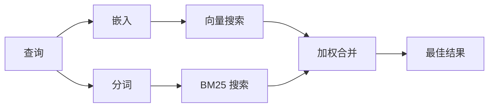

`memory_search` 从您的内存文件中查找相关笔记，即使措辞与原始文本不同。它通过将内存索引为小块，并使用嵌入、关键词或两者来搜索它们。

## 快速开始

如果您配置了 GitHub Copilot 订阅、OpenAI、Gemini、Voyage 或 Mistral API 密钥，内存搜索会自动工作。显式设置 Provider：

```json5
{
  agents: {
    defaults: {
      memorySearch: {
        provider: "openai", // 或 "gemini"、"local"、"ollama" 等
      },
    },
  },
}
```

对于多端点设置，`provider` 也可以是自定义的 `models.providers.<id>` 条目，例如 `ollama-5080`（当该 Provider 设置了 `api: "ollama"` 或其他嵌入适配器所有者时）。

对于无 API 密钥的本地嵌入，设置 `provider: "local"`。源代码检出可能仍需要原生构建批准：`pnpm approve-builds` 然后 `pnpm rebuild node-llama-cpp`。

某些 OpenAI 兼容嵌入端点需要非对称标签，如搜索用的 `input_type: "query"` 和索引块用的 `input_type: "document"` 或 `"passage"`。使用 `memorySearch.queryInputType` 和 `memorySearch.documentInputType` 配置这些；请参阅[内存配置参考](/reference/memory-config#provider-specific-config)。

## 支持的 Provider

| Provider | ID | 需要 API 密钥 | 备注 |
| -------------- | ---------------- | ------------- | ---------------------------------------------------- |
| Bedrock | `bedrock` | 否 | AWS 凭证链解析时自动检测 |
| Gemini | `gemini` | 是 | 支持图片/音频索引 |
| GitHub Copilot | `github-copilot` | 否 | 自动检测，使用 Copilot 订阅 |
| Local | `local` | 否 | GGUF 模型，约 0.6 GB 下载 |
| Mistral | `mistral` | 是 | 自动检测 |
| Ollama | `ollama` | 否 | 本地，必须显式设置 |
| OpenAI | `openai` | 是 | 自动检测，快速 |
| Voyage | `voyage` | 是 | 自动检测 |

## 搜索工作原理

OpenClaw 并行运行两条检索路径并合并结果：



- **向量搜索**找到含义相似的笔记（"gateway host"匹配"运行 OpenClaw 的机器"）。
- **BM25 关键词搜索**找到精确匹配（ID、错误字符串、配置键）。

如果只有一条路径可用（没有嵌入或没有 FTS），则单独运行另一条。

当嵌入不可用时，OpenClaw 仍然对 FTS 结果使用词法排名，而不是仅回退到原始精确匹配排序。该降级模式提升了具有更强查询词覆盖率和相关文件路径的块，即使没有 `sqlite-vec` 或嵌入 Provider，也能保持召回的有用性。

## 提升搜索质量

有两个可选功能在笔记历史较长时有所帮助：

### 时间衰减

旧笔记逐渐失去排名权重，使近期信息优先显示。默认半衰期为 30 天，上个月的笔记评分为原始权重的 50%。`MEMORY.md` 等常青文件从不衰减。

<Tip>
如果您的 Agent 有数月的每日笔记，旧信息不断超过近期上下文的排名，请启用时间衰减。
</Tip>

### MMR（多样性）

减少冗余结果。如果五条笔记都提到相同的路由器配置，MMR 确保最佳结果涵盖不同主题，而非重复。

<Tip>
如果 `memory_search` 持续从不同每日笔记返回几乎重复的片段，请启用 MMR。
</Tip>

### 同时启用

```json5
{
  agents: {
    defaults: {
      memorySearch: {
        query: {
          hybrid: {
            mmr: { enabled: true },
            temporalDecay: { enabled: true },
          },
        },
      },
    },
  },
}
```

## 多模态内存

使用 Gemini Embedding 2，您可以将图片和音频文件与 Markdown 一起索引。搜索查询仍为文本，但它们与视觉和音频内容匹配。有关设置，请参阅[内存配置参考](/reference/memory-config)。

## Session 内存搜索

您可以选择性地索引 Session 记录，使 `memory_search` 能够召回早期对话。这是通过 `memorySearch.experimental.sessionMemory` 可选启用的。有关详细信息，请参阅[配置参考](/reference/memory-config)。

## 故障排除

**没有结果？** 运行 `openclaw memory status` 检查索引。如果为空，运行 `openclaw memory index --force`。

**只有关键词匹配？** 您的嵌入 Provider 可能未配置。检查 `openclaw memory status --deep`。

**本地嵌入超时？** `ollama`、`lmstudio` 和 `local` 默认使用较长的内联批处理超时。如果主机只是速度较慢，设置 `agents.defaults.memorySearch.sync.embeddingBatchTimeoutSeconds` 并重新运行 `openclaw memory index --force`。

**找不到 CJK 文本？** 使用 `openclaw memory index --force` 重建 FTS 索引。

## 延伸阅读

- [活跃内存](/concepts/active-memory)——交互式聊天 Session 的子 Agent 内存
- [内存](/concepts/memory)——文件布局、后端、工具
- [内存配置参考](/reference/memory-config)——所有配置旋钮

## 相关

- [内存概述](/concepts/memory)
- [活跃内存](/concepts/active-memory)
- [内置内存引擎](/concepts/memory-builtin)
