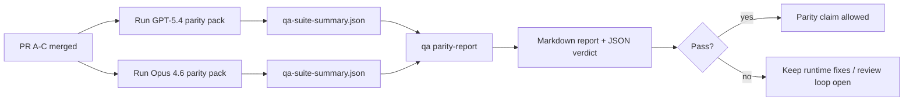

# GPT-5.4 / Codex 兼容性维护者说明

本说明解释了如何将 GPT-5.4 / Codex 兼容性程序审查为四个合并单元，同时不丢失原始的六合同架构。

## 合并单元

### PR A：严格代理执行

负责：

- `executionContract`
- GPT-5-优先同轮跟进
- `update_plan` 作为非终止进度跟踪
- 显式阻塞状态而不是仅计划的静默停止

不负责：

- 认证/运行时失败分类
- 权限真实性
- 重播/继续重新设计
- 兼容性基准测试

### PR B：运行时真实性

负责：

- Codex OAuth 范围正确性
- 类型化的 Provider/运行时失败分类
- 真实的 `/elevated full` 可用性和阻塞原因

不负责：

- 工具 Schema 规范化
- 重播/活跃状态
- 基准测试门控

### PR C：执行正确性

负责：

- Provider 拥有的 OpenAI/Codex 工具兼容性
- 无参数严格 Schema 处理
- 重播无效呈现
- 暂停、阻塞和放弃的长期任务状态可见性

不负责：

- 自选续续
- Provider 钩子之外的通用 Codex 方言行为
- 基准测试门控

### PR D：兼容性测试框架

负责：

- 第一波 GPT-5.4 vs Opus 4.6 场景包
- 兼容性文档
- 兼容性报告和发布门控机制

不负责：

- QA 实验室之外的运行时行为更改
- 测试框架内的认证/代理/DNS 模拟

## 映射回原始六合同

| 原始合同                   | 合并单元 |
| -------------------------- | -------- |
| Provider 传输/认证正确性   | PR B     |
| 工具合同/Schema 兼容性     | PR C     |
| 同轮执行                   | PR A     |
| 权限真实性                 | PR B     |
| 重播/继续/活跃正确性       | PR C     |
| 基准测试/发布门控          | PR D     |

## 审查顺序

1. PR A
2. PR B
3. PR C
4. PR D

PR D 是证明层。它不应该成为延迟运行时正确性 PR 的原因。

## 需要关注的内容

### PR A

- GPT-5 运行要么行动，要么以关闭方式失败，而不是停留在注释上
- `update_plan` 不再看起来像是自身的进度
- 行为保持 GPT-5-优先和嵌入 Pi 范围

### PR B

- 认证/代理/运行时失败不再折叠为通用的"模型失败"处理
- `/elevated full` 只在实际可用时才描述为可用
- 阻塞原因对模型和用户可见的运行时都是可见的

### PR C

- 严格的 OpenAI/Codex 工具注册行为可预测
- 无参数工具不会因严格 Schema 检查而失败
- 重播和压缩结果保留真实的活跃状态

### PR D

- 场景包是可理解且可重现的
- 包中包含可变重播安全通道，而不仅仅是只读流程
- 报告对人类和自动化都是可读的
- 兼容性声明有证据支持，而不是依赖传闻

PR D 的预期构件：

- `qa-suite-report.md` / `qa-suite-summary.json` 用于每次模型运行
- `qa-agentic-parity-report.md` 包含聚合和场景级比较
- `qa-agentic-parity-summary.json` 包含机器可读的评判结果

## 发布门控

在以下条件满足之前，不得声明 GPT-5.4 与 Opus 4.6 相当或更优：

- PR A、PR B 和 PR C 已合并
- PR D 干净地运行第一波兼容性包
- 运行时真实性回归测试套件保持绿色
- 兼容性报告显示没有假成功案例，且停止行为没有回归

兼容性测试框架不是唯一的证据来源。在审查中明确保持这种分离：

- PR D 负责使用 QA 实验室对 GPT-5.4 与 Opus 4.6 的基于场景的比较
- PR B 确定性套件仍然负责认证/代理/DNS 和全访问真实性证据

## 目标到证据映射

| 完成门控项目                  | 主要负责人  | 审查构件                                                            |
| ----------------------------- | ----------- | ------------------------------------------------------------------- |
| 无仅计划停滞                  | PR A        | 严格代理运行时测试和 `approval-turn-tool-followthrough`             |
| 无假进度或假工具完成          | PR A + PR D | 兼容性虚假成功计数加场景级报告详细信息                             |
| 无错误的 `/elevated full` 指导 | PR B        | 确定性运行时真实性套件                                              |
| 重播/活跃失败保持显式         | PR C + PR D | 生命周期/重播套件加 `compaction-retry-mutating-tool`                |
| GPT-5.4 匹配或超越 Opus 4.6   | PR D        | `qa-agentic-parity-report.md` 和 `qa-agentic-parity-summary.json`  |

## 审查员速查：之前与之后

| 之前的用户可见问题                              | 之后的审查信号                                                                           |
| ----------------------------------------------- | ---------------------------------------------------------------------------------------- |
| GPT-5.4 在规划后停止                            | PR A 显示代行或阻塞行为，而不是仅注释完成                                               |
| 工具使用在严格 OpenAI/Codex Schema 下感觉不稳定 | PR C 使工具注册和无参数调用可预测                                                        |
| `/elevated full` 提示有时具有误导性             | PR B 将指导与实际运行时能力和阻塞原因绑定                                               |
| 长期任务可能消失在重播/压缩歧义中              | PR C 发出显式的暂停、阻塞、放弃和重播无效状态                                           |
| 兼容性声明是有根据的                            | PR D 在两个模型上使用相同的场景覆盖生成报告加 JSON 评判                                |
