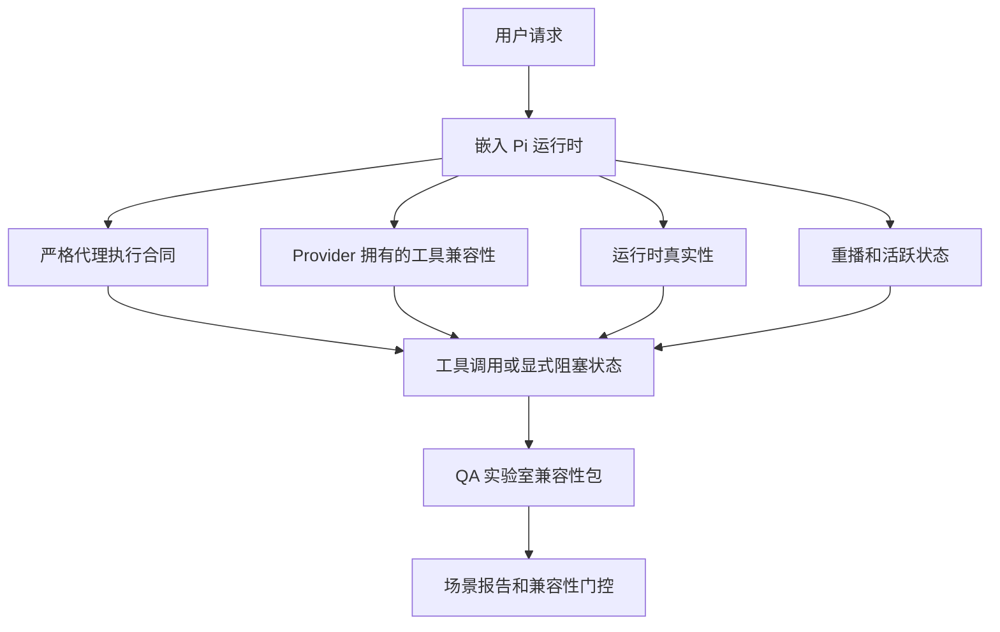
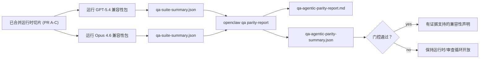

# OpenClaw 中的 GPT-5.4 / Codex 代理兼容性

OpenClaw 在工具使用前沿模型方面已经运行良好，但 GPT-5.4 和 Codex 风格模型在几个实际方面仍然表现不佳：

- 它们可能在规划后停止而不是实际执行工作
- 它们可能错误使用严格的 OpenAI/Codex 工具 Schema
- 即使在完全访问不可能的情况下，它们也可能要求 `/elevated full`
- 它们可能在重播或压缩期间丢失长期运行的任务状态
- 对 Claude Opus 4.6 的兼容性声明是基于传闻而不是可重现的场景

此兼容性程序以四个可审查的切片修复了这些差距。

## 更改内容

### PR A：严格代理执行

此切片为嵌入 Pi GPT-5 运行添加了一个可选入的 `strict-agentic` 执行合同。

启用时，OpenClaw 停止将仅计划轮次作为"足够好"的完成。如果模型只说出其意图而不实际使用工具或取得进展，OpenClaw 会用"立即行动"引导重试，然后以显式阻塞状态关闭失败，而不是静默结束任务。

这最显著地改善了以下情况的 GPT-5.4 体验：

- 短暂的"好的，去做吧"跟进
- 第一步很明显的代码任务
- `update_plan` 应该是进度跟踪而不是填充文字的流程

### PR B：运行时真实性

此切片让 OpenClaw 在两件事上说真话：

- Provider/运行时调用失败的原因
- `/elevated full` 是否实际可用

这意味着 GPT-5.4 获得更好的运行时信号，用于缺少范围、认证刷新失败、HTML 403 认证失败、代理问题、DNS 或超时失败以及被阻塞的完全访问模式。模型不太可能产生错误的补救方案或继续请求运行时无法提供的权限模式。

### PR C：执行正确性

此切片改善了两种正确性：

- Provider 拥有的 OpenAI/Codex 工具 Schema 兼容性
- 重播和长期任务活跃呈现

工具兼容工作减少了严格 OpenAI/Codex 工具注册的 Schema 摩擦，特别是围绕无参数工具和严格对象根期望。重播/活跃工作使长期运行的任务更可观察，因此暂停、阻塞和放弃状态是可见的，而不是消失在通用失败文字中。

### PR D：兼容性测试框架

此切片添加了第一波 QA 实验室兼容性包，以便 GPT-5.4 和 Opus 4.6 可以通过相同的场景进行练习并使用共享证据进行比较。

兼容性包是证明层。它本身不改变运行时行为。

在您拥有两个 `qa-suite-summary.json` 构件后，使用以下命令生成发布门控比较：

```bash
pnpm openclaw qa parity-report \
  --repo-root . \
  --candidate-summary .artifacts/qa-e2e/gpt54/qa-suite-summary.json \
  --baseline-summary .artifacts/qa-e2e/opus46/qa-suite-summary.json \
  --output-dir .artifacts/qa-e2e/parity
```

该命令写入：

- 人类可读的 Markdown 报告
- 机器可读的 JSON 评判
- 明确的 `pass` / `fail` 门控结果

## 为什么这在实践中改善了 GPT-5.4

在这项工作之前，OpenClaw 上的 GPT-5.4 在实际编码 Session 中可能感觉比 Opus 代理性更弱，因为运行时容忍了对 GPT-5 风格模型特别有害的行为：

- 仅注释轮次
- 工具周围的 Schema 摩擦
- 模糊的权限反馈
- 静默重播或压缩故障

目标不是让 GPT-5.4 模仿 Opus。目标是给 GPT-5.4 一个运行时合同，奖励真正的进展，提供更清晰的工具和权限语义，并将失败模式转变为显式的机器和人类可读的状态。

这将用户体验从：

- "模型有个好计划但停了"

改变为：

- "模型要么行动了，要么 OpenClaw 呈现了它无法行动的确切原因"

## GPT-5.4 用户的前后对比

| 此程序之前                                                            | PR A-D 之后                                                                    |
| --------------------------------------------------------------------- | ------------------------------------------------------------------------------ |
| GPT-5.4 可能在合理计划后停止而不采取下一个工具步骤                   | PR A 将"仅计划"转变为"立即行动或呈现阻塞状态"                                  |
| 严格工具 Schema 可能以令人困惑的方式拒绝无参数或 OpenAI/Codex 形状的工具 | PR C 使 Provider 拥有的工具注册和调用更可预测                                  |
| `/elevated full` 指导在被阻塞的运行时中可能模糊或错误                | PR B 给 GPT-5.4 和用户提供真实的运行时和权限提示                               |
| 重播或压缩失败可能感觉任务静默消失                                    | PR C 显式呈现暂停、阻塞、放弃和重播无效结果                                   |
| "GPT-5.4 感觉比 Opus 更差"主要是有根据的                             | PR D 将其变成相同场景包、相同指标和硬通过/失败门控                             |

## 架构



## 发布流程



## 场景包

第一波兼容性包目前涵盖五个场景：

### `approval-turn-tool-followthrough`

检查模型在短暂批准后不会停在"我会那样做"上。它应该在同一轮次中采取第一个具体行动。

### `model-switch-tool-continuity`

检查工具使用工作在模型/运行时切换边界上保持连贯，而不是重置为注释或丢失执行上下文。

### `source-docs-discovery-report`

检查模型能够读取源和文档、综合发现，并继续代理任务，而不是生成薄薄的摘要然后提前停止。

### `image-understanding-attachment`

检查涉及附件的混合模式任务保持可操作性，不会崩溃为模糊叙述。

### `compaction-retry-mutating-tool`

检查具有真实可变写入的任务在运行压缩、重试或在压力下丢失回复状态时保持重播不安全性显式，而不是静默看起来重播安全。

## 场景矩阵

| 场景                               | 测试内容                         | 良好的 GPT-5.4 行为                                                      | 失败信号                                                                 |
| ---------------------------------- | -------------------------------- | ------------------------------------------------------------------------ | ------------------------------------------------------------------------ |
| `approval-turn-tool-followthrough` | 计划后的短暂批准轮次             | 立即开始第一个具体工具行动，而不是重述意图                               | 仅计划跟进，没有工具活动，或没有真实阻塞器的阻塞轮次                     |
| `model-switch-tool-continuity`     | 工具使用下的运行时/模型切换      | 保持任务上下文并继续连贯地行动                                           | 重置为注释，丢失工具上下文，或切换后停止                                 |
| `source-docs-discovery-report`     | 源读取 + 综合 + 行动             | 找到源，使用工具，并生成有用的报告而不停滞                               | 薄薄摘要，缺少工具工作，或不完整轮次停止                                 |
| `image-understanding-attachment`   | 附件驱动的代理工作               | 解释附件，将其与工具连接，并继续任务                                     | 模糊叙述，附件被忽略，或没有具体的下一个行动                             |
| `compaction-retry-mutating-tool`   | 压缩压力下的可变工作             | 执行真实写入并在副作用后保持重播不安全性显式                             | 可变写入发生但重播安全性被暗示、缺失或矛盾                               |

## 发布门控

GPT-5.4 只有在合并的运行时同时通过兼容性包和运行时真实性回归时才能被认为达到兼容或更优。

所需结果：

- 在下一个工具行动明确时，没有仅计划停滞
- 没有没有真实执行的假完成
- 没有不正确的 `/elevated full` 指导
- 没有静默重播或压缩放弃
- 至少与商定的 Opus 4.6 基准一样强的兼容性包指标

对于第一波测试框架，门控比较：

- 完成率
- 意外停止率
- 有效工具调用率
- 假成功计数

兼容性证据有意分为两层：

- PR D 使用 QA 实验室证明同场景 GPT-5.4 与 Opus 4.6 行为
- PR B 确定性套件在测试框架外证明认证、代理、DNS 和 `/elevated full` 真实性

## 目标到证据矩阵

| 完成门控项目                                     | 负责 PR    | 证据来源                                                             | 通过信号                                                                                 |
| ------------------------------------------------ | ---------- | -------------------------------------------------------------------- | ---------------------------------------------------------------------------------------- |
| GPT-5.4 不再在规划后停滞                         | PR A       | `approval-turn-tool-followthrough` 加 PR A 运行时套件                | 批准轮次触发真实工作或显式阻塞状态                                                       |
| GPT-5.4 不再伪造进度或假工具完成                 | PR A + PR D | 兼容性报告场景结果和假成功计数                                      | 无可疑通过结果，无仅注释完成                                                             |
| GPT-5.4 不再给出错误的 `/elevated full` 指导     | PR B       | 确定性真实性套件                                                     | 阻塞原因和完全访问提示保持运行时准确                                                     |
| 重播/活跃失败保持显式                            | PR C + PR D | PR C 生命周期/重播套件加 `compaction-retry-mutating-tool`           | 可变工作保持重播不安全性显式，而不是静默消失                                             |
| GPT-5.4 在商定指标上匹配或超越 Opus 4.6         | PR D       | `qa-agentic-parity-report.md` 和 `qa-agentic-parity-summary.json`   | 相同场景覆盖，完成、停止行为或有效工具使用上没有回归                                    |

## 如何读取兼容性评判

使用 `qa-agentic-parity-summary.json` 中的评判作为第一波兼容性包的最终机器可读决定。

- `pass` 意味着 GPT-5.4 覆盖了与 Opus 4.6 相同的场景，并且在商定的聚合指标上没有回归。
- `fail` 意味着至少有一个硬门控触发：更弱的完成、更差的意外停止、更弱的有效工具使用、任何假成功案例或场景覆盖不匹配。
- "共享/基础 CI 问题"本身不是兼容性结果。如果 PR D 之外的 CI 噪音阻塞了运行，评判应该等待干净的已合并运行时执行，而不是从分支时代日志推断。
- 认证、代理、DNS 和 `/elevated full` 真实性仍然来自 PR B 的确定性套件，因此最终发布声明需要：通过的 PR D 兼容性评判和绿色 PR B 真实性覆盖。

## 谁应该启用 `strict-agentic`

在以下情况下使用 `strict-agentic`：

- Agent 预期在下一步明显时立即行动
- GPT-5.4 或 Codex 系列模型是主要运行时
- 您偏好显式阻塞状态而不是"有帮助的"仅摘要回复

在以下情况下保持默认合同：

- 您希望现有的较宽松行为
- 您不使用 GPT-5 系列模型
- 您在测试提示而不是运行时执行
