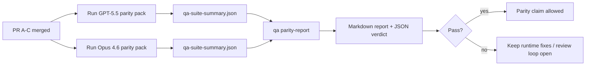

本说明解释如何将 GPT-5.5 / Codex 对等程序作为四个合并单元进行审查，同时不丢失原始六合约架构。

## 合并单元

### PR A：严格智能体执行

负责：

- `executionContract`
- GPT-5 优先的同轮跟进
- `update_plan` 作为非终止进度跟踪
- 显式阻塞状态，而不是仅计划的静默停止

不负责：

- 认证/运行时失败分类
- 权限真实性
- 重放/续集重新设计
- 对等基准测试

### PR B：运行时真实性

负责：

- Codex OAuth 范围正确性
- 类型化 Provider/运行时失败分类
- 真实的 `/elevated full` 可用性和阻塞原因

不负责：

- 工具 schema 规范化
- 重放/活跃性状态
- 基准门控

### PR C：执行正确性

负责：

- Provider 拥有的 OpenAI/Codex 工具兼容性
- 无参数严格 schema 处理
- 重放无效显示
- 暂停、阻塞和放弃的长任务状态可见性

不负责：

- 自选择续集
- Provider 钩子之外的通用 Codex 方言行为
- 基准门控

### PR D：对等测试套件

负责：

- 第一波 GPT-5.5 与 Opus 4.6 场景包
- 对等文档
- 对等报告和发布门控机制

不负责：

- QA 实验室之外的运行时行为变更
- 测试套件内的认证/代理/DNS 模拟

## 映射回原始六合约

| 原始合约                        | 合并单元 |
| ------------------------------- | -------- |
| Provider 传输/认证正确性        | PR B     |
| 工具合约/schema 兼容性          | PR C     |
| 同轮执行                        | PR A     |
| 权限真实性                      | PR B     |
| 重放/续集/活跃性正确性          | PR C     |
| 基准/发布门控                   | PR D     |

## 审查顺序

1. PR A
2. PR B
3. PR C
4. PR D

PR D 是证明层。它不应该成为延迟运行时正确性 PR 的原因。

## 需要关注的内容

### PR A

- GPT-5 运行会行动或失败关闭，而不是停止在注释
- `update_plan` 不再单独看起来像进度
- 行为保持 GPT-5 优先和嵌入式 Pi 范围

### PR B

- 认证/代理/运行时失败不再折叠成通用的"模型失败"处理
- `/elevated full` 仅在实际可用时被描述为可用
- 阻塞原因对模型和面向用户的运行时都可见

### PR C

- 严格 OpenAI/Codex 工具注册行为可预测
- 无参数工具不会在严格 schema 检查中失败
- 重放和压缩结果保持真实的活跃性状态

### PR D

- 场景包可理解且可重现
- 该包包含变异重放安全通道，而不仅仅是只读流程
- 报告对人类和自动化都可读
- 对等声明有证据支持，而非基于传闻

PR D 的预期工件：

- 每次模型运行的 `qa-suite-report.md` / `qa-suite-summary.json`
- 带有聚合和场景级别比较的 `qa-agentic-parity-report.md`
- 带有机器可读判决的 `qa-agentic-parity-summary.json`

## 发布门控

在以下情况之前，不要声称 GPT-5.5 与 Opus 4.6 对等或更优：

- PR A、PR B 和 PR C 已合并
- PR D 干净地运行了第一波对等包
- 运行时真实性回归套件保持绿色
- 对等报告显示没有假成功案例，停止行为没有回归

对等测试套件不是唯一的证据来源。在审查中保持这个划分明确：

- PR D 负责基于场景的 GPT-5.5 与 Opus 4.6 比较
- PR B 确定性套件仍然负责认证/代理/DNS 和完全访问真实性证据

## 快速维护者合并工作流

当你准备好落地一个对等 PR 并想要一个可重复、低风险的顺序时使用此流程。

1. 在合并前确认证据标准已满足：
   - 可重现的症状或失败测试
   - 在受影响代码中验证的根本原因
   - 在被指控路径中的修复
   - 回归测试或明确的手动验证说明
2. 在合并前分类/标记：
   - 当 PR 不应该落地时应用任何 `r:*` 自动关闭标签
   - 保持合并候选项没有未解决的阻塞线程
3. 在受影响的表面上本地验证：
   - `pnpm check:changed`
   - 当测试改变或修复置信度依赖于测试覆盖率时运行 `pnpm test:changed`
4. 使用标准维护者流程落地（`/landpr` 流程），然后验证：
   - 链接问题的自动关闭行为
   - `main` 上的 CI 和合并后状态
5. 落地后，对相关开放 PR/问题运行重复搜索，并仅使用规范参考关闭。

如果任何一个证据标准项缺失，请求更改而不是合并。

## 目标到证据映射

| 完成门控项目                     | 主要负责人  | 审查工件                                                            |
| -------------------------------- | ----------- | ------------------------------------------------------------------- |
| 没有仅计划的停滞                 | PR A        | 严格智能体运行时测试和 `approval-turn-tool-followthrough`           |
| 没有假进度或假工具完成           | PR A + PR D | 对等假成功计数加场景级别报告详情                                    |
| 没有错误的 `/elevated full` 指导 | PR B        | 确定性运行时真实性套件                                              |
| 重放/活跃性失败保持显式          | PR C + PR D | 生命周期/重放套件加 `compaction-retry-mutating-tool`                |
| GPT-5.5 匹配或优于 Opus 4.6      | PR D        | `qa-agentic-parity-report.md` 和 `qa-agentic-parity-summary.json`  |

## 审查者速查：之前与之后

| 之前的用户可见问题                                 | 之后的审查信号                                                                          |
| -------------------------------------------------- | --------------------------------------------------------------------------------------- |
| GPT-5.5 在规划后停止                               | PR A 显示行动或阻塞行为，而不是仅注释的完成                                             |
| 工具使用在严格 OpenAI/Codex schema 下感觉脆弱      | PR C 保持工具注册和无参数调用可预测                                                     |
| `/elevated full` 提示有时具有误导性                | PR B 将指导与实际运行时能力和阻塞原因绑定                                               |
| 长任务可能消失在重放/压缩模糊中                    | PR C 发出明确的暂停、阻塞、放弃和重放无效状态                                           |
| 对等声明基于传闻                                   | PR D 生成报告加 JSON 判决，在两个模型上具有相同的场景覆盖                               |

## 相关

- [GPT-5.5 / Codex 智能体对等](/help/gpt55-codex-agentic-parity)
