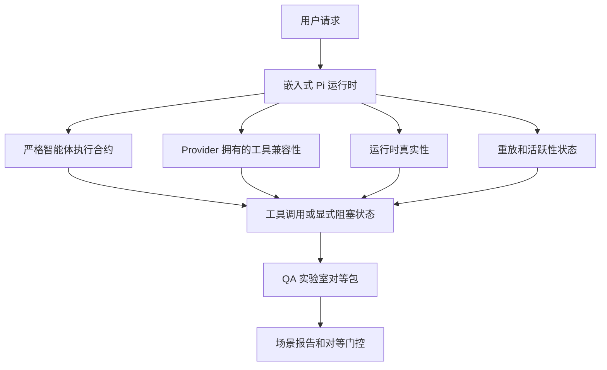

# OpenClaw 中的 GPT-5.5 / Codex 智能体对等

OpenClaw 已经与使用工具的前沿模型配合良好，但 GPT-5.5 和 Codex 风格的模型在一些实际方面仍然表现不足：

- 它们可能在规划后停止，而不是执行工作
- 它们可能错误地使用严格的 OpenAI/Codex 工具 schema
- 即使无法实现完全访问，它们也可能要求 `/elevated full`
- 它们可能在重放或压缩期间丢失长期运行的任务状态
- 与 Claude Opus 4.6 的对等声明基于传闻而非可重复的场景

这个对等程序在四个可审查的切片中修复了这些差距。

## 变更内容

### PR A：严格智能体执行

该切片为嵌入式 Pi GPT-5 运行添加了可选的 `strict-agentic` 执行合约。

启用后，OpenClaw 停止接受仅计划的轮次作为"足够好"的完成。如果模型只说明它打算做什么而不实际使用工具或取得进展，OpenClaw 会用"立即行动"的指导重试，然后以显式阻塞状态失败关闭，而不是静默结束任务。

这在以下情况最能改善 GPT-5.5 体验：

- 简短的"好，就这样做"跟进
- 第一步显而易见的代码任务
- `update_plan` 应该是进度跟踪而非填充文本的流程

### PR B：运行时真实性

该切片使 OpenClaw 对两件事说实话：

- Provider/运行时调用失败的原因
- `/elevated full` 是否实际可用

这意味着 GPT-5.5 获得了更好的运行时信号，用于丢失的范围、认证刷新失败、HTML 403 认证失败、代理问题、DNS 或超时失败，以及被阻塞的完全访问模式。模型不太可能幻觉出错误的修复或继续要求运行时无法提供的权限模式。

### PR C：执行正确性

该切片改进了两种正确性：

- Provider 拥有的 OpenAI/Codex 工具 schema 兼容性
- 重放和长任务活跃性显示

工具兼容性工作减少了严格 OpenAI/Codex 工具注册的 schema 摩擦，特别是围绕无参数工具和严格对象根期望。重放/活跃性工作使长期运行的任务更可观察，因此暂停、阻塞和放弃的状态可见，而不是消失在通用失败文本中。

### PR D：对等测试套件

该切片添加了第一波 QA 实验室对等包，使 GPT-5.5 和 Opus 4.6 可以通过相同的场景进行练习，并使用共享证据进行比较。

对等包是证明层。它本身不改变运行时行为。

有了两个 `qa-suite-summary.json` 工件后，使用以下命令生成发布门控比较：

```bash
pnpm openclaw qa parity-report \
  --repo-root . \
  --candidate-summary .artifacts/qa-e2e/gpt55/qa-suite-summary.json \
  --baseline-summary .artifacts/qa-e2e/opus46/qa-suite-summary.json \
  --output-dir .artifacts/qa-e2e/parity
```

该命令写入：

- 人类可读的 Markdown 报告
- 机器可读的 JSON 判决
- 显式的 `pass` / `fail` 门控结果

## 为什么这在实践中改善了 GPT-5.5

在这项工作之前，OpenClaw 上的 GPT-5.5 在实际编程 Session 中感觉比 Opus 的智能体能力差，因为运行时容忍了对 GPT-5 风格模型特别有害的行为：

- 仅注释的轮次
- 工具周围的 schema 摩擦
- 模糊的权限反馈
- 静默的重放或压缩故障

目标不是让 GPT-5.5 模仿 Opus。目标是给 GPT-5.5 一个奖励真实进度的运行时合约，提供更清晰的工具和权限语义，并将失败模式转变为显式的机器和人类可读状态。

这将用户体验从：

- "模型有个好计划但停止了"

改变为：

- "模型要么行动了，要么 OpenClaw 显示了它无法行动的确切原因"

## GPT-5.5 用户的之前与之后

| 此程序之前                                                                               | PR A-D 之后                                                                            |
| ---------------------------------------------------------------------------------------- | -------------------------------------------------------------------------------------- |
| GPT-5.5 可能在合理计划后停止，而不执行下一个工具步骤                                    | PR A 将"仅计划"变为"立即行动或显示阻塞状态"                                            |
| 严格工具 schema 可能以令人困惑的方式拒绝无参数或 OpenAI/Codex 形状的工具                | PR C 使 Provider 拥有的工具注册和调用更可预测                                          |
| `/elevated full` 指导在被阻塞的运行时中可能模糊或错误                                   | PR B 给 GPT-5.5 和用户提供真实的运行时和权限提示                                      |
| 重放或压缩失败可能感觉像任务静默消失                                                     | PR C 明确显示暂停、阻塞、放弃和重放无效的结果                                          |
| "GPT-5.5 感觉比 Opus 差"主要基于传闻                                                    | PR D 将其变成相同的场景包、相同的指标和硬通过/失败门控                                  |

## 架构



## 发布流程


## 场景包

第一波对等包目前涵盖五个场景：

### `approval-turn-tool-followthrough`

检查模型在短暂批准后不停止于"我会做那个"。它应该在同一轮次中采取第一个具体行动。

### `model-switch-tool-continuity`

检查工具使用工作在模型/运行时切换边界上保持连贯，而不是重置为注释或失去执行上下文。

### `source-docs-discovery-report`

检查模型可以读取源码和文档、综合发现，并继续以智能体方式执行任务，而不是产生薄弱的摘要并过早停止。

### `image-understanding-attachment`

检查涉及附件的混合模式任务保持可操作性，不会陷入模糊的叙述。

### `compaction-retry-mutating-tool`

检查具有真实变异写入的任务在运行压缩、重试或在压力下丢失回复状态后保持重放不安全性显式，而不是静默地看起来像是重放安全的。

## 场景矩阵

| 场景                               | 测试内容                              | 良好的 GPT-5.5 行为                                                            | 失败信号                                                                       |
| ---------------------------------- | ------------------------------------- | ------------------------------------------------------------------------------ | ------------------------------------------------------------------------------ |
| `approval-turn-tool-followthrough` | 计划后的短暂批准轮次                  | 立即开始第一个具体工具操作，而不是重述意图                                     | 仅计划的跟进、无工具活动或没有真实阻塞器的阻塞轮次                              |
| `model-switch-tool-continuity`     | 工具使用下的运行时/模型切换           | 保留任务上下文并继续连贯行动                                                   | 重置为注释、丢失工具上下文或切换后停止                                          |
| `source-docs-discovery-report`     | 源码阅读 + 综合 + 行动                | 找到源码、使用工具并生成有用报告而不停滞                                       | 薄弱摘要、缺少工具工作或不完整轮次停止                                          |
| `image-understanding-attachment`   | 由附件驱动的智能体工作                | 解读附件、将其连接到工具并继续任务                                             | 模糊叙述、忽略附件或没有具体的下一步行动                                        |
| `compaction-retry-mutating-tool`   | 压缩压力下的变异工作                  | 执行真实写入并在副作用后保持重放不安全性显式                                   | 变异写入发生但重放安全性被暗示、缺失或矛盾                                      |

## 发布门控

只有当合并的运行时同时通过对等包和运行时真实性回归时，GPT-5.5 才能被视为与 Opus 4.6 对等或更优。

必需结果：

- 当下一个工具操作清晰时，没有仅计划的停滞
- 没有没有真实执行的假完成
- 没有错误的 `/elevated full` 指导
- 没有静默的重放或压缩放弃
- 至少与商定的 Opus 4.6 基准一样强的对等包指标

对于第一波测试套件，门控比较：

- 完成率
- 意外停止率
- 有效工具调用率
- 假成功计数

对等证据有意分布在两层：

- PR D 使用 QA 实验室证明了相同场景的 GPT-5.5 与 Opus 4.6 行为
- PR B 确定性套件在测试套件外证明了认证、代理、DNS 和 `/elevated full` 真实性

## 目标到证据矩阵

| 完成门控项目                                  | 负责 PR    | 证据来源                                                          | 通过信号                                                                                 |
| --------------------------------------------- | ---------- | ----------------------------------------------------------------- | ---------------------------------------------------------------------------------------- |
| GPT-5.5 不再在规划后停滞                       | PR A       | `approval-turn-tool-followthrough` 加 PR A 运行时套件             | 批准轮次触发真实工作或显式阻塞状态                                                       |
| GPT-5.5 不再伪造进度或假工具完成               | PR A + PR D | 对等报告场景结果和假成功计数                                     | 没有可疑的通过结果，没有仅注释的完成                                                     |
| GPT-5.5 不再给出错误的 `/elevated full` 指导   | PR B       | 确定性真实性套件                                                  | 阻塞原因和完全访问提示保持运行时准确                                                     |
| 重放/活跃性失败保持显式                        | PR C + PR D | PR C 生命周期/重放套件加 `compaction-retry-mutating-tool`        | 变异工作保持重放不安全性显式，而不是静默消失                                             |
| GPT-5.5 在商定指标上匹配或优于 Opus 4.6        | PR D       | `qa-agentic-parity-report.md` 和 `qa-agentic-parity-summary.json` | 相同的场景覆盖，完成、停止行为或有效工具使用没有回归                                     |

## 如何阅读对等判决

将 `qa-agentic-parity-summary.json` 中的判决用作第一波对等包的最终机器可读决定。

- `pass` 意味着 GPT-5.5 覆盖了与 Opus 4.6 相同的场景，并且在商定的聚合指标上没有回归。
- `fail` 意味着至少触发了一个硬门控：完成率更弱、意外停止更差、有效工具使用更弱、任何假成功案例，或场景覆盖不匹配。
- "shared/base CI 问题"本身不是对等结果。如果 PR D 之外的 CI 噪音阻塞了运行，判决应该等待干净的已合并运行时执行，而不是从分支时代的日志推断。
- 认证、代理、DNS 和 `/elevated full` 真实性仍然来自 PR B 的确定性套件，因此最终发布声明需要两者：通过的 PR D 对等判决和绿色的 PR B 真实性覆盖。

## 谁应该启用 `strict-agentic`

在以下情况使用 `strict-agentic`：

- Agent 预期在下一步明显时立即行动
- GPT-5.5 或 Codex 家族模型是主要运行时
- 你更喜欢显式阻塞状态，而不是"有帮助的"仅回顾回复

在以下情况保留默认合约：

- 你想要现有的更宽松行为
- 你没有使用 GPT-5 家族模型
- 你在测试提示词而不是运行时强制执行

## 相关

- [GPT-5.5 / Codex 对等维护者说明](/help/gpt55-codex-agentic-parity-maintainers)
