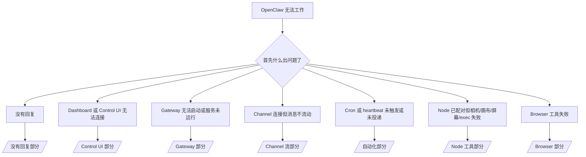

# 故障排除

如果你只有 2 分钟，使用这个页面作为分类入口。

## 前 60 秒

按顺序运行以下命令：

```bash
openclaw status
openclaw status --all
openclaw gateway probe
openclaw gateway status
openclaw doctor
openclaw channels status --probe
openclaw logs --follow
```

一行良好输出：

- `openclaw status` → 显示已配置的 channels 且无明显 auth 错误。
- `openclaw status --all` → 完整报告存在且可分享。
- `openclaw gateway probe` → 预期的 gateway 目标可达（`Reachable: yes`）。`RPC: limited - missing scope: operator.read` 是降级诊断，不是连接失败。
- `openclaw gateway status` → `Runtime: running` 和 `RPC probe: ok`。
- `openclaw doctor` → 无阻塞性配置/服务错误。
- `openclaw channels status --probe` → channels 报告 `connected` 或 `ready`。
- `openclaw logs --follow` → 稳定活动，无重复的致命错误。

## Anthropic 长 context 429

如果你看到：
`HTTP 429: rate_limit_error: Extra usage is required for long context requests`，
请转到 [/gateway/troubleshooting#anthropic-429-extra-usage-required-for-long-context](/gateway/troubleshooting#anthropic-429-extra-usage-required-for-long-context)。

## Plugin 安装失败，缺少 openclaw extensions

如果安装失败并显示 `package.json missing openclaw.extensions`，说明 plugin 包使用了 OpenClaw 不再接受的旧格式。

在 plugin 包中修复：

1. 将 `openclaw.extensions` 添加到 `package.json`。
2. 将条目指向构建的运行时文件（通常是 `./dist/index.js`）。
3. 重新发布 plugin 并再次运行 `openclaw plugins install <npm-spec>`。

示例：

```json
{
  "name": "@openclaw/my-plugin",
  "version": "1.2.3",
  "openclaw": {
    "extensions": ["./dist/index.js"]
  }
}
```

参考：[/tools/plugin#distribution-npm](/tools/plugin#distribution-npm)

## 决策树



<AccordionGroup>
  <Accordion title="没有回复">
    ```bash
    openclaw status
    openclaw gateway status
    openclaw channels status --probe
    openclaw pairing list --channel <channel> [--account <id>]
    openclaw logs --follow
    ```

    良好输出看起来像：

    - `Runtime: running`
    - `RPC probe: ok`
    - 你的 channel 在 `channels status --probe` 中显示 connected/ready
    - 发件人显示已批准（或 DM 策略是 open/allowlist）

    常见日志签名：

    - `drop guild message (mention required` → Discord 中提及门控阻止了消息。
    - `pairing request` → 发件人未批准且等待 DM 配对批准。
    - `blocked` / `allowlist` 在 channel 日志中 → 发件人、房间或群组被过滤。

    深度页面：

    - [/gateway/troubleshooting#no-replies](/gateway/troubleshooting#no-replies)
    - [/channels/troubleshooting](/channels/troubleshooting)
    - [/channels/pairing](/channels/pairing)

  </Accordion>

  <Accordion title="Dashboard 或 Control UI 无法连接">
    ```bash
    openclaw status
    openclaw gateway status
    openclaw logs --follow
    openclaw doctor
    openclaw channels status --probe
    ```

    良好输出看起来像：

    - `openclaw gateway status` 中显示 `Dashboard: http://...`
    - `RPC probe: ok`
    - 日志中无 auth 循环

    常见日志签名：

    - `device identity required` → HTTP/非安全 context 无法完成设备 auth。
    - `AUTH_TOKEN_MISMATCH` 带重试提示（`canRetryWithDeviceToken=true`）→ 可能自动发生一次受信任的设备 token 重试。
    - 该重试后重复的 `unauthorized` → 错误的 token/密码、auth 模式不匹配或过时的配对设备 token。
    - `gateway connect failed:` → UI 指向错误的 URL/端口或无法访问的 gateway。

    深度页面：

    - [/gateway/troubleshooting#dashboard-control-ui-connectivity](/gateway/troubleshooting#dashboard-control-ui-connectivity)
    - [/web/control-ui](/web/control-ui)
    - [/gateway/authentication](/gateway/authentication)

  </Accordion>

  <Accordion title="Gateway 无法启动或服务已安装但未运行">
    ```bash
    openclaw status
    openclaw gateway status
    openclaw logs --follow
    openclaw doctor
    openclaw channels status --probe
    ```

    良好输出看起来像：

    - `Service: ... (loaded)`
    - `Runtime: running`
    - `RPC probe: ok`

    常见日志签名：

    - `Gateway start blocked: set gateway.mode=local` → gateway 模式未设置/远程。
    - `refusing to bind gateway ... without auth` → 无 token/密码的非 loopback 绑定。
    - `another gateway instance is already listening` 或 `EADDRINUSE` → 端口已被占用。

    深度页面：

    - [/gateway/troubleshooting#gateway-service-not-running](/gateway/troubleshooting#gateway-service-not-running)
    - [/gateway/background-process](/gateway/background-process)
    - [/gateway/configuration](/gateway/configuration)

  </Accordion>

  <Accordion title="Channel 连接但消息不流动">
    ```bash
    openclaw status
    openclaw gateway status
    openclaw logs --follow
    openclaw doctor
    openclaw channels status --probe
    ```

    良好输出看起来像：

    - Channel 传输已连接。
    - 配对/允许列表检查通过。
    - 在需要的地方检测到提及。

    常见日志签名：

    - `mention required` → 群组提及门控阻止了处理。
    - `pairing` / `pending` → DM 发件人尚未批准。
    - `not_in_channel`、`missing_scope`、`Forbidden`、`401/403` → channel 权限 token 问题。

    深度页面：

    - [/gateway/troubleshooting#channel-connected-messages-not-flowing](/gateway/troubleshooting#channel-connected-messages-not-flowing)
    - [/channels/troubleshooting](/channels/troubleshooting)

  </Accordion>

  <Accordion title="Cron 或 heartbeat 未触发或未投递">
    ```bash
    openclaw status
    openclaw gateway status
    openclaw cron status
    openclaw cron list
    openclaw cron runs --id <jobId> --limit 20
    openclaw logs --follow
    ```

    良好输出看起来像：

    - `cron.status` 显示已启用且有下次唤醒时间。
    - `cron runs` 显示最近的 `ok` 条目。
    - Heartbeat 已启用且不在活跃小时之外。

    常见日志签名：

    - `cron: scheduler disabled; jobs will not run automatically` → cron 被禁用。
    - `heartbeat skipped` 带 `reason=quiet-hours` → 在配置的活跃小时之外。
    - `requests-in-flight` → 主通道繁忙；heartbeat 唤醒被延迟。
    - `unknown accountId` → heartbeat 投递目标账户不存在。

    深度页面：

    - [/gateway/troubleshooting#cron-and-heartbeat-delivery](/gateway/troubleshooting#cron-and-heartbeat-delivery)
    - [/automation/troubleshooting](/automation/troubleshooting)
    - [/gateway/heartbeat](/gateway/heartbeat)

  </Accordion>

  <Accordion title="Node 已配对但相机/画布/屏幕/exec 失败">
    ```bash
    openclaw status
    openclaw gateway status
    openclaw nodes status
    openclaw nodes describe --node <idOrNameOrIp>
    openclaw logs --follow
    ```

    良好输出看起来像：

    - Node 被列为已连接且为角色 `node` 配对。
    - 你调用的命令存在能力。
    - 该工具的权限状态已授予。

    常见日志签名：

    - `NODE_BACKGROUND_UNAVAILABLE` → 将 node 应用带到前台。
    - `*_PERMISSION_REQUIRED` → OS 权限被拒绝/缺失。
    - `SYSTEM_RUN_DENIED: approval required` → exec 批准正在等待。
    - `SYSTEM_RUN_DENIED: allowlist miss` → 命令不在 exec 允许列表中。

    深度页面：

    - [/gateway/troubleshooting#node-paired-tool-fails](/gateway/troubleshooting#node-paired-tool-fails)
    - [/nodes/troubleshooting](/nodes/troubleshooting)
    - [/tools/exec-approvals](/tools/exec-approvals)

  </Accordion>

  <Accordion title="Browser 工具失败">
    ```bash
    openclaw status
    openclaw gateway status
    openclaw browser status
    openclaw logs --follow
    openclaw doctor
    ```

    良好输出看起来像：

    - Browser 状态显示 `running: true` 和选择的 browser/profile。
    - `openclaw` 启动，或 `user` 可以看到本地 Chrome 标签。

    常见日志签名：

    - `Failed to start Chrome CDP on port` → 本地 browser 启动失败。
    - `browser.executablePath not found` → 配置的二进制路径错误。
    - `No Chrome tabs found for profile="user"` → Chrome MCP 附加 profile 没有打开的本地 Chrome 标签。
    - `Browser attachOnly is enabled ... not reachable` → 仅附加 profile 没有活跃的 CDP 目标。

    深度页面：

    - [/gateway/troubleshooting#browser-tool-fails](/gateway/troubleshooting#browser-tool-fails)
    - [/tools/browser-linux-troubleshooting](/tools/browser-linux-troubleshooting)
    - [/tools/browser-wsl2-windows-remote-cdp-troubleshooting](/tools/browser-wsl2-windows-remote-cdp-troubleshooting)

  </Accordion>
</AccordionGroup>
