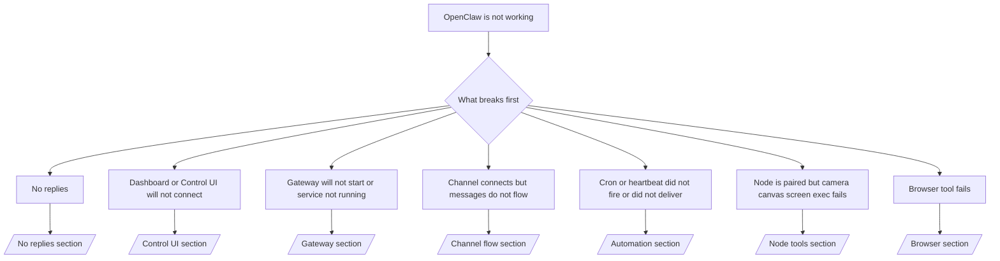

如果你只有 2 分钟，请将此页面作为分类入口。

## 前 60 秒

按顺序运行以下命令：

```bash
openclaw status
openclaw status --all
openclaw gateway probe
openclaw gateway status
openclaw doctor
openclaw channels status --probe
openclaw logs --follow
```

一行内的好输出：

- `openclaw status` → 显示已配置的 Channel 且没有明显的认证错误。
- `openclaw status --all` → 完整报告已存在且可分享。
- `openclaw gateway probe` → 预期 Gateway 目标可达（`Reachable: yes`）。`Capability: ...` 告知探测能证明的认证级别，`Read probe: limited - missing scope: operator.read` 是降级诊断，不是连接失败。
- `openclaw gateway status` → `Runtime: running`、`Connectivity probe: ok`，以及合理的 `Capability: ...` 行。如果你还需要读取范围 RPC 证明，使用 `--require-rpc`。
- `openclaw doctor` → 没有阻塞的配置/服务错误。
- `openclaw channels status --probe` → 可达的 Gateway 返回每个账户的实时传输状态加上探测/审计结果，如 `works` 或 `audit ok`；如果 Gateway 不可达，命令会退回到仅配置摘要。
- `openclaw logs --follow` → 稳定的活动，没有重复的致命错误。

## Anthropic 长上下文 429

如果你看到：
`HTTP 429: rate_limit_error: Extra usage is required for long context requests`，
前往 [/gateway/troubleshooting#anthropic-429-extra-usage-required-for-long-context](/gateway/troubleshooting#anthropic-429-extra-usage-required-for-long-context)。

## 本地 OpenAI 兼容后端直接可用但在 OpenClaw 中失败

如果你的本地或自托管 `/v1` 后端能回应小型的直接
`/v1/chat/completions` 探测，但在 `openclaw infer model run` 或正常
Agent 轮次中失败：

1. 如果错误提示 `messages[].content` 期望字符串，设置
   `models.providers.<provider>.models[].compat.requiresStringContent: true`。
2. 如果后端仅在 OpenClaw Agent 轮次时仍然失败，设置
   `models.providers.<provider>.models[].compat.supportsTools: false` 然后重试。
3. 如果小型直接调用仍然有效但较大的 OpenClaw 提示词使后端崩溃，
   将剩余问题视为上游模型/服务器限制，并在深度指南中继续：
   [/gateway/troubleshooting#local-openai-compatible-backend-passes-direct-probes-but-agent-runs-fail](/gateway/troubleshooting#local-openai-compatible-backend-passes-direct-probes-but-agent-runs-fail)

## Plugin 安装失败，提示缺少 openclaw extensions

如果安装失败，错误为 `package.json missing openclaw.extensions`，该 Plugin 包
使用的是 OpenClaw 不再接受的旧格式。

在 Plugin 包中修复：

1. 在 `package.json` 中添加 `openclaw.extensions`。
2. 将条目指向已构建的运行时文件（通常是 `./dist/index.js`）。
3. 重新发布 Plugin 并再次运行 `openclaw plugins install <package>`。

示例：

```json
{
  "name": "@openclaw/my-plugin",
  "version": "1.2.3",
  "openclaw": {
    "extensions": ["./dist/index.js"]
  }
}
```

参考：[Plugin 架构](/plugins/architecture)

## Plugin 存在但被可疑所有权阻止

如果 `openclaw doctor`、setup 或启动警告显示：

```text
blocked plugin candidate: suspicious ownership (... uid=1000, expected uid=0 or root)
plugin present but blocked
```

Plugin 文件由与加载它们的进程不同的 Unix 用户所有。不要删除 Plugin 配置。修复文件所有权或以拥有状态目录的相同用户运行 OpenClaw。

Docker 安装通常以 `node`（uid `1000`）运行。对于默认 Docker 设置，修复主机绑定挂载：

```bash
sudo chown -R 1000:1000 /path/to/openclaw-config /path/to/openclaw-workspace
openclaw doctor --fix
```

如果你特意以 root 运行 OpenClaw，将受管理的 Plugin 根目录修复为 root 所有权：

```bash
sudo chown -R root:root /path/to/openclaw-config/npm
openclaw doctor --fix
```

深度文档：

- [Plugin 路径所有权](/tools/plugin#blocked-plugin-path-ownership)
- [Docker 权限](/install/docker#permissions-and-eacces)

## 决策树



<AccordionGroup>
  <Accordion title="无回复">
    ```bash
    openclaw status
    openclaw gateway status
    openclaw channels status --probe
    openclaw pairing list --channel <channel> [--account <id>]
    openclaw logs --follow
    ```

    好输出看起来像：

    - `Runtime: running`
    - `Connectivity probe: ok`
    - `Capability: read-only`、`write-capable` 或 `admin-capable`
    - 你的 Channel 显示传输已连接，且在支持的情况下，`channels status --probe` 中显示 `works` 或 `audit ok`
    - 发送者已批准（或 DM 策略为开放/白名单）

    常见日志特征：

    - `drop guild message (mention required` → Discord 中的提及门控阻止了消息。
    - `pairing request` → 发送者未批准，正在等待 DM 配对批准。
    - `blocked` / `allowlist` 在 Channel 日志中 → 发送者、房间或群组被过滤。

    深度页面：

    - [/gateway/troubleshooting#no-replies](/gateway/troubleshooting#no-replies)
    - [/channels/troubleshooting](/channels/troubleshooting)
    - [/channels/pairing](/channels/pairing)

  </Accordion>

  <Accordion title="Dashboard 或 Control UI 无法连接">
    ```bash
    openclaw status
    openclaw gateway status
    openclaw logs --follow
    openclaw doctor
    openclaw channels status --probe
    ```

    好输出看起来像：

    - `Dashboard: http://...` 在 `openclaw gateway status` 中显示
    - `Connectivity probe: ok`
    - `Capability: read-only`、`write-capable` 或 `admin-capable`
    - 日志中没有认证循环

    常见日志特征：

    - `device identity required` → HTTP/非安全上下文无法完成设备认证。
    - `origin not allowed` → 浏览器 `Origin` 不允许 Control UI Gateway 目标。
    - `AUTH_TOKEN_MISMATCH` 带有重试提示（`canRetryWithDeviceToken=true`）→ 可能自动发生一次可信设备令牌重试。
    - 该缓存令牌重试会重用与配对设备令牌存储的缓存范围集。显式 `deviceToken` / 显式 `scopes` 调用者保留其请求的范围集。
    - 在异步 Tailscale Serve Control UI 路径上，同一 `{scope, ip}` 的失败尝试在限制器记录失败之前被序列化，因此第二次并发的错误重试可能已经显示 `retry later`。
    - 来自 localhost 浏览器来源的 `too many failed authentication attempts (retry later)` → 来自相同 `Origin` 的重复失败被暂时锁定；另一个 localhost 来源使用单独的桶。
    - 重试后重复出现 `unauthorized` → 令牌/密码错误、认证模式不匹配或配对设备令牌过期。
    - `gateway connect failed:` → UI 指向错误的 URL/端口或不可达的 Gateway。

    深度页面：

    - [/gateway/troubleshooting#dashboard-control-ui-connectivity](/gateway/troubleshooting#dashboard-control-ui-connectivity)
    - [/web/control-ui](/web/control-ui)
    - [/gateway/authentication](/gateway/authentication)

  </Accordion>

  <Accordion title="Gateway 无法启动或服务已安装但未运行">
    ```bash
    openclaw status
    openclaw gateway status
    openclaw logs --follow
    openclaw doctor
    openclaw channels status --probe
    ```

    好输出看起来像：

    - `Service: ... (loaded)`
    - `Runtime: running`
    - `Connectivity probe: ok`
    - `Capability: read-only`、`write-capable` 或 `admin-capable`

    常见日志特征：

    - `Gateway start blocked: set gateway.mode=local` 或 `existing config is missing gateway.mode` → Gateway 模式为远程，或配置文件缺少本地模式标记，应修复。
    - `refusing to bind gateway ... without auth` → 非环回绑定没有有效的 Gateway 认证路径（令牌/密码，或在已配置的情况下使用可信代理）。
    - `another gateway instance is already listening` 或 `EADDRINUSE` → 端口已被占用。

    深度页面：

    - [/gateway/troubleshooting#gateway-service-not-running](/gateway/troubleshooting#gateway-service-not-running)
    - [/gateway/background-process](/gateway/background-process)
    - [/gateway/configuration](/gateway/configuration)

  </Accordion>

  <Accordion title="Channel 已连接但消息不流动">
    ```bash
    openclaw status
    openclaw gateway status
    openclaw logs --follow
    openclaw doctor
    openclaw channels status --probe
    ```

    好输出看起来像：

    - Channel 传输已连接。
    - 配对/白名单检查通过。
    - 在需要时检测到提及。

    常见日志特征：

    - `mention required` → 群组提及门控阻止了处理。
    - `pairing` / `pending` → DM 发送者尚未批准。
    - `not_in_channel`、`missing_scope`、`Forbidden`、`401/403` → Channel 权限令牌问题。

    深度页面：

    - [/gateway/troubleshooting#channel-connected-messages-not-flowing](/gateway/troubleshooting#channel-connected-messages-not-flowing)
    - [/channels/troubleshooting](/channels/troubleshooting)

  </Accordion>

  <Accordion title="Cron 或心跳未触发或未送达">
    ```bash
    openclaw status
    openclaw gateway status
    openclaw cron status
    openclaw cron list
    openclaw cron runs --id <jobId> --limit 20
    openclaw logs --follow
    ```

    好输出看起来像：

    - `cron.status` 显示已启用并有下一次唤醒时间。
    - `cron runs` 显示最近的 `ok` 条目。
    - 心跳已启用且不在活跃时段之外。

    常见日志特征：

    - `cron: scheduler disabled; jobs will not run automatically` → Cron 已禁用。
    - `heartbeat skipped` 带 `reason=quiet-hours` → 超出配置的活跃时段。
    - `heartbeat skipped` 带 `reason=empty-heartbeat-file` → `HEARTBEAT.md` 存在但只包含空白/仅标题的脚手架。
    - `heartbeat skipped` 带 `reason=no-tasks-due` → `HEARTBEAT.md` 任务模式处于活跃状态，但没有任何任务间隔到期。
    - `heartbeat skipped` 带 `reason=alerts-disabled` → 所有心跳可见性已禁用（`showOk`、`showAlerts` 和 `useIndicator` 全部关闭）。
    - `requests-in-flight` → 主通道繁忙；心跳唤醒被推迟。
    - `unknown accountId` → 心跳投递目标账户不存在。

    深度页面：

    - [/gateway/troubleshooting#cron-and-heartbeat-delivery](/gateway/troubleshooting#cron-and-heartbeat-delivery)
    - [/automation/cron-jobs#troubleshooting](/automation/cron-jobs#troubleshooting)
    - [/gateway/heartbeat](/gateway/heartbeat)

  </Accordion>

  <Accordion title="Node 已配对但工具相机画布屏幕执行失败">
    ```bash
    openclaw status
    openclaw gateway status
    openclaw nodes status
    openclaw nodes describe --node <idOrNameOrIp>
    openclaw logs --follow
    ```

    好输出看起来像：

    - Node 列出为已连接且已为角色 `node` 配对。
    - 你调用的命令具有相应能力。
    - 工具的权限状态已授予。

    常见日志特征：

    - `NODE_BACKGROUND_UNAVAILABLE` → 将 Node 应用置于前台。
    - `*_PERMISSION_REQUIRED` → OS 权限被拒绝/缺失。
    - `SYSTEM_RUN_DENIED: approval required` → 执行批准待处理。
    - `SYSTEM_RUN_DENIED: allowlist miss` → 命令不在执行白名单中。

    深度页面：

    - [/gateway/troubleshooting#node-paired-tool-fails](/gateway/troubleshooting#node-paired-tool-fails)
    - [/nodes/troubleshooting](/nodes/troubleshooting)
    - [/tools/exec-approvals](/tools/exec-approvals)

  </Accordion>

  <Accordion title="执行突然要求批准">
    ```bash
    openclaw config get tools.exec.host
    openclaw config get tools.exec.security
    openclaw config get tools.exec.ask
    openclaw gateway restart
    ```

    发生了什么变化：

    - 如果 `tools.exec.host` 未设置，默认为 `auto`。
    - `host=auto` 在沙盒运行时处于活跃时解析为 `sandbox`，否则解析为 `gateway`。
    - `host=auto` 仅是路由；无提示的"YOLO"行为来自 gateway/node 上的 `security=full` 加 `ask=off`。
    - 在 `gateway` 和 `node` 上，未设置的 `tools.exec.security` 默认为 `full`。
    - 未设置的 `tools.exec.ask` 默认为 `off`。
    - 结果：如果你看到批准，某些主机本地或每 Session 策略将执行从当前默认值收紧了。

    恢复当前默认的无批准行为：

    ```bash
    openclaw config set tools.exec.host gateway
    openclaw config set tools.exec.security full
    openclaw config set tools.exec.ask off
    openclaw gateway restart
    ```

    更安全的替代方案：

    - 如果你只想要稳定的主机路由，只设置 `tools.exec.host=gateway`。
    - 如果你想要主机执行但仍然想审查白名单遗漏，使用 `security=allowlist` 和 `ask=on-miss`。
    - 如果你希望 `host=auto` 解析回 `sandbox`，启用沙盒模式。

    常见日志特征：

    - `Approval required.` → 命令正在等待 `/approve ...`。
    - `SYSTEM_RUN_DENIED: approval required` → Node 主机执行批准待处理。
    - `exec host=sandbox requires a sandbox runtime for this session` → 隐式/显式沙盒选择但沙盒模式关闭。

    深度页面：

    - [/tools/exec](/tools/exec)
    - [/tools/exec-approvals](/tools/exec-approvals)
    - [/gateway/security#what-the-audit-checks-high-level](/gateway/security#what-the-audit-checks-high-level)

  </Accordion>

  <Accordion title="浏览器工具失败">
    ```bash
    openclaw status
    openclaw gateway status
    openclaw browser status
    openclaw logs --follow
    openclaw doctor
    ```

    好输出看起来像：

    - 浏览器状态显示 `running: true` 和选定的浏览器/配置文件。
    - `openclaw` 启动，或 `user` 可以看到本地 Chrome 标签页。

    常见日志特征：

    - `unknown command "browser"` 或 `unknown command 'browser'` → `plugins.allow` 已设置且不包含 `browser`。
    - `Failed to start Chrome CDP on port` → 本地浏览器启动失败。
    - `browser.executablePath not found` → 配置的二进制路径错误。
    - `browser.cdpUrl must be http(s) or ws(s)` → 配置的 CDP URL 使用不支持的协议。
    - `browser.cdpUrl has invalid port` → 配置的 CDP URL 有错误或超出范围的端口。
    - `No Chrome tabs found for profile="user"` → Chrome MCP 附加配置文件没有打开的本地 Chrome 标签页。
    - `Remote CDP for profile "<name>" is not reachable` → 配置的远程 CDP 端点从此主机不可达。
    - `Browser attachOnly is enabled ... not reachable` 或 `Browser attachOnly is enabled and CDP websocket ... is not reachable` → 仅附加配置文件没有实时 CDP 目标。
    - 在仅附加或远程 CDP 配置文件上的过期视口/暗模式/语言区域/离线覆盖 → 运行 `openclaw browser stop --browser-profile <name>` 关闭活跃控制 Session 并释放模拟状态，无需重启 Gateway。

    深度页面：

    - [/gateway/troubleshooting#browser-tool-fails](/gateway/troubleshooting#browser-tool-fails)
    - [/tools/browser#missing-browser-command-or-tool](/tools/browser#missing-browser-command-or-tool)
    - [/tools/browser-linux-troubleshooting](/tools/browser-linux-troubleshooting)
    - [/tools/browser-wsl2-windows-remote-cdp-troubleshooting](/tools/browser-wsl2-windows-remote-cdp-troubleshooting)

  </Accordion>

</AccordionGroup>

## 相关

- [FAQ](/help/faq) — 常见问题
- [Gateway 故障排除](/gateway/troubleshooting) — Gateway 特定问题
- [Doctor](/gateway/doctor) — 自动健康检查和修复
- [Channel 故障排除](/channels/troubleshooting) — Channel 连接问题
- [自动化故障排除](/automation/cron-jobs#troubleshooting) — Cron 和心跳问题
