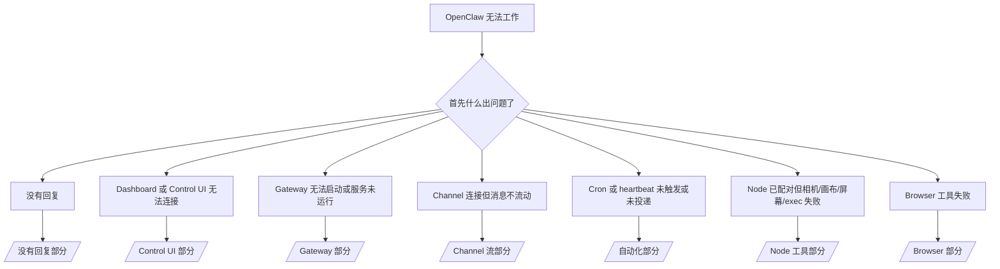

# 故障排除

如果你只有 2 分钟，使用这个页面作为分类入口。

## 前 60 秒

按顺序运行以下命令：

```bash
openclaw status
openclaw status --all
openclaw gateway probe
openclaw gateway status
openclaw doctor
openclaw channels status --probe
openclaw logs --follow
```

一行良好输出：

- `openclaw status` → 显示已配置的 channels 且无明显 auth 错误。
- `openclaw status --all` → 完整报告存在且可分享。
- `openclaw gateway probe` → 预期的 gateway 目标可达（`Reachable: yes`）。`Capability: ...` 告诉你探测能证明的 auth 级别，`Read probe: limited - missing scope: operator.read` 是降级诊断，不是连接失败。
- `openclaw gateway status` → `Runtime: running`、`Connectivity probe: ok` 和合理的 `Capability: ...` 行。如果你还需要读取范围的 RPC 证明，使用 `--require-rpc`。
- `openclaw doctor` → 无阻塞性配置/服务错误。
- `openclaw channels status --probe` → 可达的 gateway 返回每个账户的实时传输状态加上探测/审计结果，如 `works` 或 `audit ok`；如果 gateway 不可达，命令回退到仅配置摘要。
- `openclaw logs --follow` → 稳定活动，无重复的致命错误。

## Anthropic 长 context 429

如果你看到：
`HTTP 429: rate_limit_error: Extra usage is required for long context requests`，
请转到 [/gateway/troubleshooting#anthropic-429-extra-usage-required-for-long-context](/gateway/troubleshooting#anthropic-429-extra-usage-required-for-long-context)。

## 本地 OpenAI 兼容后端直接有效但在 OpenClaw 中失败

如果你的本地或自托管 `/v1` 后端能回答小型直接 `/v1/chat/completions` 探测，但在 `openclaw infer model run` 或正常的 agent 轮次中失败：

1. 如果错误提到 `messages[].content` 期望字符串，设置 `models.providers.<provider>.models[].compat.requiresStringContent: true`。
2. 如果后端仍然只在 OpenClaw agent 轮次上失败，设置 `models.providers.<provider>.models[].compat.supportsTools: false` 并重试。
3. 如果微小的直接调用仍然有效但较大的 OpenClaw prompts 使后端崩溃，将剩余问题视为上游 model/服务器限制，并继续在深度运行手册中查看：[/gateway/troubleshooting#local-openai-compatible-backend-passes-direct-probes-but-agent-runs-fail](/gateway/troubleshooting#local-openai-compatible-backend-passes-direct-probes-but-agent-runs-fail)

## Plugin 安装失败，缺少 openclaw extensions

如果安装失败并显示 `package.json missing openclaw.extensions`，说明 plugin 包使用了 OpenClaw 不再接受的旧格式。

在 plugin 包中修复：

1. 将 `openclaw.extensions` 添加到 `package.json`。
2. 将条目指向构建的运行时文件（通常是 `./dist/index.js`）。
3. 重新发布 plugin 并再次运行 `openclaw plugins install <package>`。

示例：

```json
{
  "name": "@openclaw/my-plugin",
  "version": "1.2.3",
  "openclaw": {
    "extensions": ["./dist/index.js"]
  }
}
```

参考：[Plugin 架构](/plugins/architecture)

## 决策树



<AccordionGroup>
  <Accordion title="没有回复">
    ```bash
    openclaw status
    openclaw gateway status
    openclaw channels status --probe
    openclaw pairing list --channel <channel> [--account <id>]
    openclaw logs --follow
    ```

    良好输出看起来像：

    - `Runtime: running`
    - `Connectivity probe: ok`
    - `Capability: read-only`、`write-capable` 或 `admin-capable`
    - 你的 channel 在 `channels status --probe` 中显示传输已连接，在支持的情况下显示 `works` 或 `audit ok`
    - 发件人显示已批准（或 DM 策略是 open/allowlist）

    常见日志签名：

    - `drop guild message (mention required` → Discord 中提及门控阻止了消息。
    - `pairing request` → 发件人未批准且等待 DM 配对批准。
    - `blocked` / `allowlist` 在 channel 日志中 → 发件人、房间或群组被过滤。

    深度页面：

    - [/gateway/troubleshooting#no-replies](/gateway/troubleshooting#no-replies)
    - [/channels/troubleshooting](/channels/troubleshooting)
    - [/channels/pairing](/channels/pairing)

  </Accordion>

  <Accordion title="Dashboard 或 Control UI 无法连接">
    ```bash
    openclaw status
    openclaw gateway status
    openclaw logs --follow
    openclaw doctor
    openclaw channels status --probe
    ```

    良好输出看起来像：

    - `openclaw gateway status` 中显示 `Dashboard: http://...`
    - `Connectivity probe: ok`
    - `Capability: read-only`、`write-capable` 或 `admin-capable`
    - 日志中无 auth 循环

    常见日志签名：

    - `device identity required` → HTTP/非安全 context 无法完成设备 auth。
    - `origin not allowed` → 浏览器 `Origin` 对于 Control UI gateway 目标不被允许。
    - `AUTH_TOKEN_MISMATCH` 带重试提示（`canRetryWithDeviceToken=true`）→ 可能自动发生一次受信任的设备 token 重试。
    - 该缓存 token 重试重用了与配对设备 token 一起存储的缓存范围集。显式 `deviceToken` / 显式 `scopes` 调用者保留其请求的范围集。
    - 在异步 Tailscale Serve Control UI 路径上，同一 `{scope, ip}` 的失败尝试在限制器记录失败之前被序列化，因此第二个并发的错误重试已经可能显示 `retry later`。
    - 来自 localhost 浏览器源的 `too many failed authentication attempts (retry later)` → 来自同一 `Origin` 的重复失败被临时锁定；另一个 localhost 源使用单独的桶。
    - 该重试后重复的 `unauthorized` → 错误的 token/密码、auth 模式不匹配或过时的配对设备 token。
    - `gateway connect failed:` → UI 指向错误的 URL/端口或无法访问的 gateway。

    深度页面：

    - [/gateway/troubleshooting#dashboard-control-ui-connectivity](/gateway/troubleshooting#dashboard-control-ui-connectivity)
    - [/web/control-ui](/web/control-ui)
    - [/gateway/authentication](/gateway/authentication)

  </Accordion>

  <Accordion title="Gateway 无法启动或服务已安装但未运行">
    ```bash
    openclaw status
    openclaw gateway status
    openclaw logs --follow
    openclaw doctor
    openclaw channels status --probe
    ```

    良好输出看起来像：

    - `Service: ... (loaded)`
    - `Runtime: running`
    - `Connectivity probe: ok`
    - `Capability: read-only`、`write-capable` 或 `admin-capable`

    常见日志签名：

    - `Gateway start blocked: set gateway.mode=local` 或 `existing config is missing gateway.mode` → gateway 模式是 remote，或配置文件缺少 local 模式标记，应该修复。
    - `refusing to bind gateway ... without auth` → 无有效 gateway auth 路径（token/密码，或在配置时的受信任代理）的非 loopback 绑定。
    - `another gateway instance is already listening` 或 `EADDRINUSE` → 端口已被占用。

    深度页面：

    - [/gateway/troubleshooting#gateway-service-not-running](/gateway/troubleshooting#gateway-service-not-running)
    - [/gateway/background-process](/gateway/background-process)
    - [/gateway/configuration](/gateway/configuration)

  </Accordion>

  <Accordion title="Channel 连接但消息不流动">
    ```bash
    openclaw status
    openclaw gateway status
    openclaw logs --follow
    openclaw doctor
    openclaw channels status --probe
    ```

    良好输出看起来像：

    - Channel 传输已连接。
    - 配对/允许列表检查通过。
    - 在需要的地方检测到提及。

    常见日志签名：

    - `mention required` → 群组提及门控阻止了处理。
    - `pairing` / `pending` → DM 发件人尚未批准。
    - `not_in_channel`、`missing_scope`、`Forbidden`、`401/403` → channel 权限 token 问题。

    深度页面：

    - [/gateway/troubleshooting#channel-connected-messages-not-flowing](/gateway/troubleshooting#channel-connected-messages-not-flowing)
    - [/channels/troubleshooting](/channels/troubleshooting)

  </Accordion>

  <Accordion title="Cron 或 heartbeat 未触发或未投递">
    ```bash
    openclaw status
    openclaw gateway status
    openclaw cron status
    openclaw cron list
    openclaw cron runs --id <jobId> --limit 20
    openclaw logs --follow
    ```

    良好输出看起来像：

    - `cron.status` 显示已启用且有下次唤醒时间。
    - `cron runs` 显示最近的 `ok` 条目。
    - Heartbeat 已启用且不在活跃小时之外。

    常见日志签名：

    - `cron: scheduler disabled; jobs will not run automatically` → cron 被禁用。
    - `heartbeat skipped` 带 `reason=quiet-hours` → 在配置的活跃小时之外。
    - `heartbeat skipped` 带 `reason=empty-heartbeat-file` → `HEARTBEAT.md` 存在但只包含空白/仅标题的脚手架。
    - `heartbeat skipped` 带 `reason=no-tasks-due` → `HEARTBEAT.md` 任务模式已激活但没有任何任务间隔到期。
    - `heartbeat skipped` 带 `reason=alerts-disabled` → 所有 heartbeat 可见性已禁用（`showOk`、`showAlerts` 和 `useIndicator` 全部关闭）。
    - `requests-in-flight` → 主通道繁忙；heartbeat 唤醒被延迟。
    - `unknown accountId` → heartbeat 投递目标账户不存在。

    深度页面：

    - [/gateway/troubleshooting#cron-and-heartbeat-delivery](/gateway/troubleshooting#cron-and-heartbeat-delivery)
    - [/automation/cron-jobs#troubleshooting](/automation/cron-jobs#troubleshooting)
    - [/gateway/heartbeat](/gateway/heartbeat)

    </Accordion>

    <Accordion title="Node 已配对但工具失败（相机/画布/屏幕/exec）">
      ```bash
      openclaw status
      openclaw gateway status
      openclaw nodes status
      openclaw nodes describe --node <idOrNameOrIp>
      openclaw logs --follow
      ```

      良好输出看起来像：

      - Node 被列为已连接且为角色 `node` 配对。
      - 你调用的命令存在能力。
      - 该工具的权限状态已授予。

      常见日志签名：

      - `NODE_BACKGROUND_UNAVAILABLE` → 将 node 应用带到前台。
      - `*_PERMISSION_REQUIRED` → OS 权限被拒绝/缺失。
      - `SYSTEM_RUN_DENIED: approval required` → exec 批准正在等待。
      - `SYSTEM_RUN_DENIED: allowlist miss` → 命令不在 exec 允许列表中。

      深度页面：

      - [/gateway/troubleshooting#node-paired-tool-fails](/gateway/troubleshooting#node-paired-tool-fails)
      - [/nodes/troubleshooting](/nodes/troubleshooting)
      - [/tools/exec-approvals](/tools/exec-approvals)

    </Accordion>

    <Accordion title="Exec 突然要求批准">
      ```bash
      openclaw config get tools.exec.host
      openclaw config get tools.exec.security
      openclaw config get tools.exec.ask
      openclaw gateway restart
      ```

      发生了什么变化：

      - 如果 `tools.exec.host` 未设置，默认为 `auto`。
      - `host=auto` 在沙盒运行时激活时解析为 `sandbox`，否则为 `gateway`。
      - `host=auto` 仅用于路由；无提示的"YOLO"行为来自 `security=full` 加上 gateway/node 上的 `ask=off`。
      - 在 `gateway` 和 `node` 上，未设置的 `tools.exec.security` 默认为 `full`。
      - 未设置的 `tools.exec.ask` 默认为 `off`。
      - 结果：如果你看到批准，某些主机本地或每 session 的策略将 exec 从当前默认值收紧了。

      恢复当前默认的无批准行为：

      ```bash
      openclaw config set tools.exec.host gateway
      openclaw config set tools.exec.security full
      openclaw config set tools.exec.ask off
      openclaw gateway restart
      ```

      更安全的替代方案：

      - 如果你只需要稳定的主机路由，仅设置 `tools.exec.host=gateway`。
      - 如果你想要主机 exec 但仍然想在允许列表未命中时进行审查，使用 `security=allowlist` 配合 `ask=on-miss`。
      - 如果你希望 `host=auto` 解析回 `sandbox`，启用沙盒模式。

      常见日志签名：

      - `Approval required.` → 命令正在等待 `/approve ...`。
      - `SYSTEM_RUN_DENIED: approval required` → node 主机 exec 批准正在等待。
      - `exec host=sandbox requires a sandbox runtime for this session` → 隐式/显式沙盒选择但沙盒模式关闭。

      深度页面：

      - [/tools/exec](/tools/exec)
      - [/tools/exec-approvals](/tools/exec-approvals)
      - [/gateway/security#what-the-audit-checks-high-level](/gateway/security#what-the-audit-checks-high-level)

    </Accordion>

    <Accordion title="Browser 工具失败">
      ```bash
      openclaw status
      openclaw gateway status
      openclaw browser status
      openclaw logs --follow
      openclaw doctor
      ```

      良好输出看起来像：

      - Browser 状态显示 `running: true` 和选择的 browser/profile。
      - `openclaw` 启动，或 `user` 可以看到本地 Chrome 标签。

      常见日志签名：

      - `unknown command "browser"` 或 `unknown command 'browser'` → `plugins.allow` 已设置且不包含 `browser`。
      - `Failed to start Chrome CDP on port` → 本地 browser 启动失败。
      - `browser.executablePath not found` → 配置的二进制路径错误。
      - `browser.cdpUrl must be http(s) or ws(s)` → 配置的 CDP URL 使用了不支持的协议。
      - `browser.cdpUrl has invalid port` → 配置的 CDP URL 有错误或超范围的端口。
      - `No Chrome tabs found for profile="user"` → Chrome MCP 附加 profile 没有打开的本地 Chrome 标签。
      - `Remote CDP for profile "<name>" is not reachable` → 配置的远程 CDP 端点从此主机不可达。
      - `Browser attachOnly is enabled ... not reachable` 或 `Browser attachOnly is enabled and CDP websocket ... is not reachable` → 仅附加 profile 没有活跃的 CDP 目标。
      - 仅附加或远程 CDP profile 上的陈旧视口/深色模式/区域设置/离线覆盖 → 运行 `openclaw browser stop --browser-profile <name>` 关闭活跃控制 session 并释放模拟状态，而无需重启 gateway。

      深度页面：

      - [/gateway/troubleshooting#browser-tool-fails](/gateway/troubleshooting#browser-tool-fails)
      - [/tools/browser#missing-browser-command-or-tool](/tools/browser#missing-browser-command-or-tool)
      - [/tools/browser-linux-troubleshooting](/tools/browser-linux-troubleshooting)
      - [/tools/browser-wsl2-windows-remote-cdp-troubleshooting](/tools/browser-wsl2-windows-remote-cdp-troubleshooting)

    </Accordion>

  </AccordionGroup>

## 相关

- [FAQ](/help/faq) — 常见问题解答
- [Gateway 故障排除](/gateway/troubleshooting) — gateway 特定问题
- [Doctor](/gateway/doctor) — 自动健康检查和修复
- [Channel 故障排除](/channels/troubleshooting) — channel 连接问题
- [自动化故障排除](/automation/cron-jobs#troubleshooting) — cron 和 heartbeat 问题
