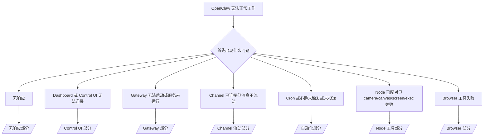

# 故障排除

如果您只有 2 分钟时间,请将此页面用作分类入口。

## 前 60 秒

按顺序运行以下命令:

```bash
openclaw status
openclaw status --all
openclaw gateway probe
openclaw gateway status
openclaw doctor
openclaw channels status --probe
openclaw logs --follow
```

良好输出的一行总结:

- `openclaw status` → 显示已配置的通道且无明显身份验证错误。
- `openclaw status --all` → 完整报告可用且可共享。
- `openclaw gateway probe` → 预期的 Gateway 目标可访问。
- `openclaw gateway status` → `Runtime: running` 和 `RPC probe: ok`。
- `openclaw doctor` → 无阻塞性配置/服务错误。
- `openclaw channels status --probe` → 通道报告 `connected` 或 `ready`。
- `openclaw logs --follow` → 稳定活动,无重复的致命错误。

## Anthropic 长上下文 429

如果您看到：
`HTTP 429: rate_limit_error: Extra usage is required for long context requests`，
请前往 [/gateway/troubleshooting#anthropic-429-extra-usage-required-for-long-context](/gateway/troubleshooting#anthropic-429-extra-usage-required-for-long-context)。

## 决策树



<AccordionGroup>
  <Accordion title="无响应">
    ```bash
    openclaw status
    openclaw gateway status
    openclaw channels status --probe
    openclaw pairing list --channel <channel> [--account <id>]
    openclaw logs --follow
    ```

    良好输出如下:

    - `Runtime: running`
    - `RPC probe: ok`
    - 您的通道在 `channels status --probe` 中显示 connected/ready
    - 发送者显示已批准(或 DM 策略是 open/allowlist)

    常见日志特征:

    - `drop guild message (mention required` → Discord 中提及门控阻止了消息。
    - `pairing request` → 发送者未批准且等待 DM 配对批准。
    - `blocked` / `allowlist` 在通道日志中 → 发送者、房间或群组被过滤。

    深度页面:

    - [/gateway/troubleshooting#no-replies](/gateway/troubleshooting#no-replies)
    - [/channels/troubleshooting](/channels/troubleshooting)
    - [/channels/pairing](/channels/pairing)

  </Accordion>

  <Accordion title="Dashboard 或 Control UI 无法连接">
    ```bash
    openclaw status
    openclaw gateway status
    openclaw logs --follow
    openclaw doctor
    openclaw channels status --probe
    ```

    良好输出如下:

    - `Dashboard: http://...` 在 `openclaw gateway status` 中显示
    - `RPC probe: ok`
    - 日志中无身份验证循环

    常见日志特征:

    - `device identity required` → HTTP/非安全上下文无法完成设备身份验证。
    - `unauthorized` / 重新连接循环 → 错误的 token/password 或身份验证模式不匹配。
    - `gateway connect failed:` → UI 目标是错误的 URL/端口或无法访问的 Gateway。

    深度页面:

    - [/gateway/troubleshooting#dashboard-control-ui-connectivity](/gateway/troubleshooting#dashboard-control-ui-connectivity)
    - [/web/control-ui](/web/control-ui)
    - [/gateway/authentication](/gateway/authentication)

  </Accordion>

  <Accordion title="Gateway 无法启动或服务已安装但未运行">
    ```bash
    openclaw status
    openclaw gateway status
    openclaw logs --follow
    openclaw doctor
    openclaw channels status --probe
    ```

    良好输出如下:

    - `Service: ... (loaded)`
    - `Runtime: running`
    - `RPC probe: ok`

    常见日志特征:

    - `Gateway start blocked: set gateway.mode=local` → Gateway 模式未设置/remote。
    - `refusing to bind gateway ... without auth` → 非 loopback 绑定且无 token/password。
    - `another gateway instance is already listening` 或 `EADDRINUSE` → 端口已被占用。

    深度页面:

    - [/gateway/troubleshooting#gateway-service-not-running](/gateway/troubleshooting#gateway-service-not-running)
    - [/gateway/background-process](/gateway/background-process)
    - [/gateway/configuration](/gateway/configuration)

  </Accordion>

  <Accordion title="Channel 已连接但消息不流动">
    ```bash
    openclaw status
    openclaw gateway status
    openclaw logs --follow
    openclaw doctor
    openclaw channels status --probe
    ```

    良好输出如下:

    - Channel 传输已连接。
    - 配对/允许列表检查通过。
    - 在需要的地方检测到提及。

    常见日志特征:

    - `mention required` → 群组提及门控阻止了处理。
    - `pairing` / `pending` → DM 发送者尚未批准。
    - `not_in_channel`, `missing_scope`, `Forbidden`, `401/403` → Channel 权限 token 问题。

    深度页面:

    - [/gateway/troubleshooting#channel-connected-messages-not-flowing](/gateway/troubleshooting#channel-connected-messages-not-flowing)
    - [/channels/troubleshooting](/channels/troubleshooting)

  </Accordion>

  <Accordion title="Cron 或心跳未触发或未投递">
    ```bash
    openclaw status
    openclaw gateway status
    openclaw cron status
    openclaw cron list
    openclaw cron runs --id <jobId> --limit 20
    openclaw logs --follow
    ```

    良好输出如下:

    - `cron.status` 显示已启用,有下次唤醒时间。
    - `cron runs` 显示最近的 `ok` 条目。
    - 心跳已启用且不在活动时间之外。

    常见日志特征:

    - `cron: scheduler disabled; jobs will not run automatically` → cron 已禁用。
    - `heartbeat skipped` 带 `reason=quiet-hours` → 在配置的活动时间之外。
    - `requests-in-flight` → 主通道繁忙;心跳唤醒被推迟。
    - `unknown accountId` → 心跳投递目标账户不存在。

    深度页面:

    - [/gateway/troubleshooting#cron-and-heartbeat-delivery](/gateway/troubleshooting#cron-and-heartbeat-delivery)
    - [/automation/troubleshooting](/automation/troubleshooting)
    - [/gateway/heartbeat](/gateway/heartbeat)

  </Accordion>

  <Accordion title="Node 已配对但工具失败(camera/canvas/screen/exec)">
    ```bash
    openclaw status
    openclaw gateway status
    openclaw nodes status
    openclaw nodes describe --node <idOrNameOrIp>
    openclaw logs --follow
    ```

    良好输出如下:

    - Node 列为已连接且为角色 `node` 配对。
    - 您调用的命令存在能力。
    - 工具的权限状态已授予。

    常见日志特征:

    - `NODE_BACKGROUND_UNAVAILABLE` → 将 Node 应用带到前台。
    - `*_PERMISSION_REQUIRED` → OS 权限被拒绝/缺失。
    - `SYSTEM_RUN_DENIED: approval required` → exec 批准待处理。
    - `SYSTEM_RUN_DENIED: allowlist miss` → 命令不在 exec 允许列表中。

    深度页面:

    - [/gateway/troubleshooting#node-paired-tool-fails](/gateway/troubleshooting#node-paired-tool-fails)
    - [/nodes/troubleshooting](/nodes/troubleshooting)
    - [/tools/exec-approvals](/tools/exec-approvals)

  </Accordion>

  <Accordion title="Browser 工具失败">
    ```bash
    openclaw status
    openclaw gateway status
    openclaw browser status
    openclaw logs --follow
    openclaw doctor
    ```

    良好输出如下:

    - Browser 状态显示 `running: true` 和选择的 browser/profile。
    - `openclaw` profile 启动或 `chrome` relay 有附加的标签页。

    常见日志特征:

    - `Failed to start Chrome CDP on port` → 本地 browser 启动失败。
    - `browser.executablePath not found` → 配置的二进制路径错误。
    - `Chrome extension relay is running, but no tab is connected` → extension 未附加。
    - `Browser attachOnly is enabled ... not reachable` → 仅附加 profile 没有活动的 CDP 目标。

    深度页面:

    - [/gateway/troubleshooting#browser-tool-fails](/gateway/troubleshooting#browser-tool-fails)
    - [/tools/browser-linux-troubleshooting](/tools/browser-linux-troubleshooting)
    - [/tools/chrome-extension](/tools/chrome-extension)

  </Accordion>
</AccordionGroup>
