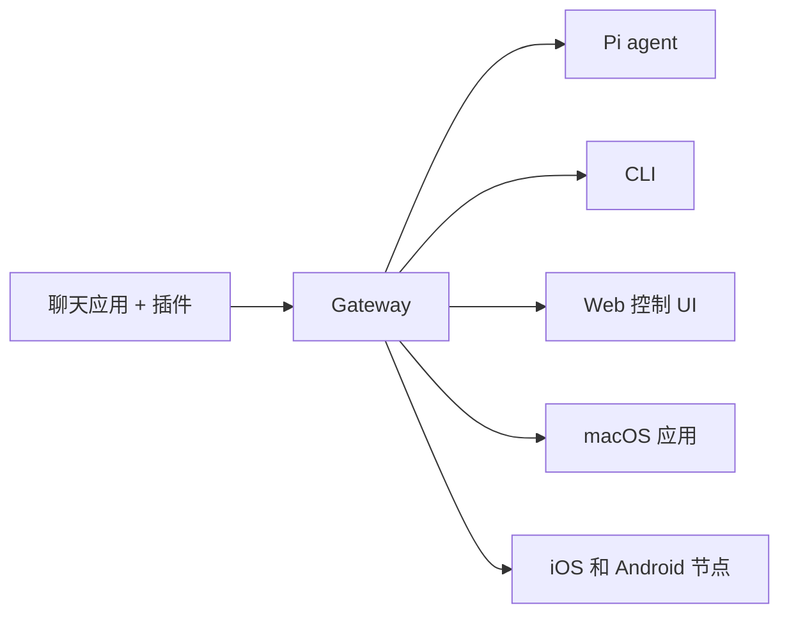

# OpenClaw 🦞

<p align="center">
    
    
</p>

> _"脱壳！脱壳！"_ — 来自一只太空龙虾，大概

<p align="center">
  <strong>适用于任何操作系统的 gateway，用于跨 Discord、Google Chat、iMessage、Matrix、Microsoft Teams、Signal、Slack、Telegram、WhatsApp、Zalo 等的 AI agent。</strong><br />
  发送消息，从口袋里获取 agent 响应。通过内置 Channel、捆绑 Channel 插件、WebChat 和移动节点运行单个 Gateway。
</p>

<Columns>
  <Card title="入门" href="/start/getting-started" icon="rocket">
    在几分钟内安装 OpenClaw 并启动 Gateway。
  </Card>
  <Card title="运行向导" href="/start/wizard" icon="sparkles">
    使用 `openclaw onboard` 和配对流程进行引导式设置。
  </Card>
  <Card title="打开控制 UI" href="/web/control-ui" icon="layout-dashboard">
    启动浏览器仪表板以进行聊天、配置和会话管理。
  </Card>
</Columns>

## 什么是 OpenClaw?

OpenClaw 是一个**自托管 gateway**，它将您最喜欢的聊天应用和 Channel surfaces — 内置 Channel 加上捆绑或外部 Channel 插件，如 Discord、Google Chat、iMessage、Matrix、Microsoft Teams、Signal、Slack、Telegram、WhatsApp、Zalo 等 — 连接到 AI 编码 agent，如 Pi。您在自己的机器（或服务器）上运行单个 Gateway 进程，它就成为您的消息应用和始终可用的 AI 助手之间的桥梁。

**适合谁？** 希望拥有可以随时随地发送消息的个人 AI 助手的开发人员和高级用户 — 无需放弃对数据的控制或依赖托管服务。

**它有何不同？**

- **自托管**：在您的硬件上运行，按您的规则
- **多通道**：一个 Gateway 同时服务内置 Channel 加上捆绑或外部 Channel 插件
- **原生 Agent**：专为具有工具使用、会话、内存和多 agent 路由的编码 agent 而构建
- **开源**：MIT 许可证，社区驱动

**需要什么？** Node 24（推荐），或 Node 22 LTS（`22.14+`）以保持兼容性，来自您选择的 Provider 的 API 密钥，以及 5 分钟时间。为了最佳质量和安全性，请使用可用的最强最新一代模型。

## 工作原理



Gateway 是会话、路由和通道连接的单一真实来源。

## 核心功能

<Columns>
  <Card title="多通道 gateway" icon="network" href="/channels">
    使用单个 Gateway 进程支持 Discord、iMessage、Signal、Slack、Telegram、WhatsApp、WebChat 等。
  </Card>
  <Card title="插件 Channel" icon="plug" href="/tools/plugin">
    捆绑插件在正常当前版本中添加 Matrix、Nostr、Twitch、Zalo 等。
  </Card>
  <Card title="多 agent 路由" icon="route" href="/concepts/multi-agent">
    每个 agent、workspace 或发送者的隔离会话。
  </Card>
  <Card title="媒体支持" icon="image" href="/nodes/images">
    发送和接收图像、音频和文档。
  </Card>
  <Card title="Web 控制 UI" icon="monitor" href="/web/control-ui">
    用于聊天、配置、会话和节点的浏览器仪表板。
  </Card>
  <Card title="移动节点" icon="smartphone" href="/nodes">
    配对 iOS 和 Android 节点，支持 Canvas、相机和语音工作流。
  </Card>
</Columns>

## 快速开始

<Steps>
  <Step title="安装 OpenClaw">
    ```bash
    npm install -g openclaw@latest
    ```
  </Step>
  <Step title="入门并安装服务">
    ```bash
    openclaw onboard --install-daemon
    ```
  </Step>
  <Step title="聊天">
    在浏览器中打开控制 UI 并发送消息：

    ```bash
    openclaw dashboard
    ```

    或连接一个通道（[Telegram](/channels/telegram) 最快）并通过手机聊天。

  </Step>
</Steps>

需要完整的安装和开发设置？请参阅[快速开始](/start/getting-started)。

## 仪表板

Gateway 启动后打开浏览器控制 UI。

- 本地默认地址：[http://127.0.0.1:18789/](http://127.0.0.1:18789/)
- 远程访问：[Web surfaces](/web) 和 [Tailscale](/gateway/tailscale)

<p align="center">
  
</p>

## 配置（可选）

配置位于 `~/.openclaw/openclaw.json`。

- 如果您**什么都不做**，OpenClaw 使用捆绑的 Pi 二进制文件，以 RPC 模式和每个发送者的会话运行。
- 如果您想锁定它，从 `channels.whatsapp.allowFrom` 开始，（对于群组）提及规则。

示例：

```json5
{
  channels: {
    whatsapp: {
      allowFrom: ["+15555550123"],
      groups: { "*": { requireMention: true } },
    },
  },
  messages: { groupChat: { mentionPatterns: ["@openclaw"] } },
}
```

## 从这里开始

<Columns>
  <Card title="文档中心" href="/start/hubs" icon="book-open">
    按用例组织的所有文档和指南。
  </Card>
  <Card title="配置" href="/gateway/configuration" icon="settings">
    核心 Gateway 设置、令牌和 provider 配置。
  </Card>
  <Card title="远程访问" href="/gateway/remote" icon="globe">
    SSH 和 tailnet 访问模式。
  </Card>
  <Card title="Channel" href="/channels/telegram" icon="message-square">
    Feishu、Microsoft Teams、WhatsApp、Telegram、Discord 等的 Channel 特定设置。
  </Card>
  <Card title="节点" href="/nodes" icon="smartphone">
    iOS 和 Android 节点，支持配对、Canvas、相机和设备操作。
  </Card>
  <Card title="帮助" href="/help" icon="life-buoy">
    常见修复和故障排除入口点。
  </Card>
</Columns>

## 了解更多

<Columns>
  <Card title="完整功能列表" href="/concepts/features" icon="list">
    完整的通道、路由和媒体功能。
  </Card>
  <Card title="多 agent 路由" href="/concepts/multi-agent" icon="route">
    Workspace 隔离和每个 agent 的会话。
  </Card>
  <Card title="安全" href="/gateway/security" icon="shield">
    令牌、允许列表和安全控制。
  </Card>
  <Card title="故障排除" href="/gateway/troubleshooting" icon="wrench">
    Gateway 诊断和常见错误。
  </Card>
  <Card title="关于和致谢" href="/reference/credits" icon="info">
    项目起源、贡献者和许可证。
  </Card>
</Columns>
