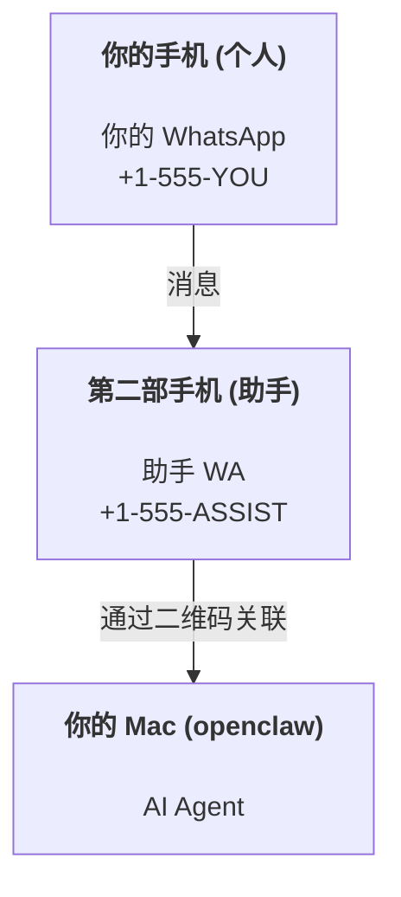

OpenClaw 是一个自托管的 Gateway，可将 Discord、Google Chat、iMessage、Matrix、Microsoft Teams、Signal、Slack、Telegram、WhatsApp、Zalo 等连接到 AI Agent。本指南介绍"个人助手"设置：一个专用的 WhatsApp 号码，表现得像你永远在线的 AI 助手。

## ⚠️ 安全第一

你正在让一个 Agent 处于以下位置：

- 在你的机器上运行命令（取决于你的工具策略）
- 读取/写入工作区中的文件
- 通过 WhatsApp/Telegram/Discord/Mattermost 及其他内置 Channel 发送消息

从保守开始：

- 始终设置 `channels.whatsapp.allowFrom`（切勿在你的个人 Mac 上向全世界开放运行）。
- 为助手使用专用的 WhatsApp 号码。
- 心跳现在默认为每 30 分钟一次。在你信任该设置之前，通过设置 `agents.defaults.heartbeat.every: "0m"` 来禁用它。

## 前提条件

- OpenClaw 已安装并完成引导 — 如果还没完成，请参阅[入门指南](/start/getting-started)
- 第二个电话号码（SIM/eSIM/预付费），用于助手

## 双手机设置（推荐）

你需要这样：



如果你将你的个人 WhatsApp 链接到 OpenClaw，发给你的每条消息都会变成"Agent 输入"。这通常不是你想要的。

## 5 分钟快速开始

1. 配对 WhatsApp Web（显示二维码；用助手手机扫描）：

```bash
openclaw channels login
```

2. 启动 Gateway（保持运行）：

```bash
openclaw gateway --port 18789
```

3. 在 `~/.openclaw/openclaw.json` 中放置最小配置：

```json5
{
  gateway: { mode: "local" },
  channels: { whatsapp: { allowFrom: ["+15555550123"] } },
}
```

现在从你的白名单手机向助手号码发送消息。

当引导完成时，OpenClaw 会自动打开 Dashboard 并打印一个干净的（非令牌化的）链接。如果 Dashboard 提示需要认证，请将配置的共享密钥粘贴到 Control UI 设置中。引导默认使用令牌（`gateway.auth.token`），但如果你将 `gateway.auth.mode` 切换为 `password`，密码认证也可以使用。稍后重新打开：`openclaw dashboard`。

## 给 Agent 一个工作区（AGENTS）

OpenClaw 从其工作区目录读取操作说明和"记忆"。

默认情况下，OpenClaw 使用 `~/.openclaw/workspace` 作为 Agent 工作区，并在设置/首次运行 Agent 时自动创建它（加上初始的 `AGENTS.md`、`SOUL.md`、`TOOLS.md`、`IDENTITY.md`、`USER.md`、`HEARTBEAT.md`）。`BOOTSTRAP.md` 仅在工作区是全新时创建（在你删除它之后不应再回来）。`MEMORY.md` 是可选的（不自动创建）；当存在时，它会在正常 Session 中加载。子 Agent Session 仅注入 `AGENTS.md` 和 `TOOLS.md`。

<Tip>
像对待 OpenClaw 的"记忆"一样对待这个文件夹，并将其设为 git 仓库（最好是私有的），以便备份你的 `AGENTS.md` + 记忆文件。如果安装了 git，全新的工作区会自动初始化。
</Tip>

```bash
openclaw setup
```

完整工作区布局 + 备份指南：[Agent 工作区](/concepts/agent-workspace)
记忆工作流：[记忆](/concepts/memory)

可选：使用 `agents.defaults.workspace` 选择不同的工作区（支持 `~`）。

```json5
{
  agents: {
    defaults: {
      workspace: "~/.openclaw/workspace",
    },
  },
}
```

如果你已经从仓库发布自己的工作区文件，你可以完全禁用引导文件创建：

```json5
{
  agents: {
    defaults: {
      skipBootstrap: true,
    },
  },
}
```

## 将其变成"助手"的配置

OpenClaw 默认为良好的助手设置，但你通常需要调整：

- `SOUL.md` 中的人设/指令（参见 [`SOUL.md`](/concepts/soul)）
- 思考默认值（如果需要）
- 心跳（一旦你信任它）

示例：

```json5
{
  logging: { level: "info" },
  agents: {
    defaults: {
      model: { primary: "anthropic/claude-opus-4-6" },
      workspace: "~/.openclaw/workspace",
      thinkingDefault: "high",
      timeoutSeconds: 1800,
      // 从 0 开始；稍后启用。
      heartbeat: { every: "0m" },
    },
    list: [
      {
        id: "main",
        default: true,
        groupChat: {
          mentionPatterns: ["@openclaw", "openclaw"],
        },
      },
    ],
  },
  channels: {
    whatsapp: {
      allowFrom: ["+15555550123"],
      groups: {
        "*": { requireMention: true },
      },
    },
  },
  session: {
    scope: "per-sender",
    resetTriggers: ["/new", "/reset"],
    reset: {
      mode: "daily",
      atHour: 4,
      idleMinutes: 10080,
    },
  },
}
```

## Session 和记忆

- Session 文件：`~/.openclaw/agents/<agentId>/sessions/{{SessionId}}.jsonl`
- Session 元数据（Token 使用情况、最后路由等）：`~/.openclaw/agents/<agentId>/sessions/sessions.json`（旧版：`~/.openclaw/sessions/sessions.json`）
- `/new` 或 `/reset` 为该聊天启动一个新的 Session（通过 `resetTriggers` 配置）。如果单独发送，OpenClaw 不会调用模型，而是直接确认重置。
- `/compact [instructions]` 压缩 Session 上下文并报告剩余的上下文预算。

## 心跳（主动模式）

默认情况下，OpenClaw 每 30 分钟运行一次心跳，提示词为：
`Read HEARTBEAT.md if it exists (workspace context). Follow it strictly. Do not infer or repeat old tasks from prior chats. If nothing needs attention, reply HEARTBEAT_OK.`
设置 `agents.defaults.heartbeat.every: "0m"` 以禁用。

- 如果 `HEARTBEAT.md` 存在但实际上是空的（只有空行和 markdown 标题如 `# Heading`），OpenClaw 会跳过心跳运行以节省 API 调用。
- 如果文件丢失，心跳仍然运行，模型决定做什么。
- 如果 Agent 回复 `HEARTBEAT_OK`（可选带有简短填充；参见 `agents.defaults.heartbeat.ackMaxChars`），OpenClaw 会抑制该心跳的出站传递。
- 默认情况下，心跳向 DM 样式的 `user:<id>` 目标传递是允许的。设置 `agents.defaults.heartbeat.directPolicy: "block"` 以抑制直接目标传递，同时保持心跳运行活跃。
- 心跳运行完整的 Agent 轮次——较短的间隔会消耗更多 Token。

```json5
{
  agents: {
    defaults: {
      heartbeat: { every: "30m" },
    },
  },
}
```

## 媒体输入和输出

入站附件（图像/音频/文档）可以通过模板显示给你的命令：

- `{{MediaPath}}` （本地临时文件路径）
- `{{MediaUrl}}` （伪 URL）
- `{{Transcript}}` （如果启用了音频转录）

来自 Agent 的出站附件：包含 `MEDIA:<path-or-url>` 在其自己的一行（无空格）。该指令必须以纯文本开头行，位于代码围栏之外，且不带 **粗体** 或 `内联代码` 等 Markdown 包装器。示例：

```
Here's the screenshot.
MEDIA:https://example.com/screenshot.png
```

OpenClaw 提取这些并作为媒体与文本一起发送。

以下形式不是附件指令，会作为普通文本发送：

```md
**MEDIA:https://example.com/screenshot.png**
`MEDIA:https://example.com/screenshot.png`
Here is the screenshot: MEDIA:https://example.com/screenshot.png
```

本地路径行为遵循与 Agent 相同的文件读取信任模型：

- 如果 `tools.fs.workspaceOnly` 为 `true`，出站 `MEDIA:` 本地路径仅限于 OpenClaw 临时根目录、媒体缓存、Agent 工作区路径和沙箱生成的文件。
- 如果 `tools.fs.workspaceOnly` 为 `false`，出站 `MEDIA:` 可以使用 Agent 已被允许读取的主机本地文件。
- 本地路径可以是绝对路径、工作区相对路径，或使用 `~/` 的主目录相对路径。
- 主机本地发送仍然只允许媒体和安全文档类型（图像、音频、视频、PDF 和 Office 文档）。纯文本和类似密钥的文件不被视为可发送媒体。

这意味着当你的文件系统策略已经允许这些读取时，工作区之外生成的图像/文件现在可以发送，而无需重新开放任意主机文本附件的泄露风险。

## 运维清单

```bash
openclaw status          # 本地状态（凭据、Session、排队事件）
openclaw status --all    # 完整诊断（只读、可粘贴）
openclaw status --deep   # 向 Gateway 请求实时健康探针，支持时包含 Channel 探针
openclaw health --json   # Gateway 健康快照（WS；默认可返回新鲜的缓存快照）
```

日志位于 `/tmp/openclaw/` 下（默认：`openclaw-YYYY-MM-DD.log`）。

## 下一步

- WebChat：[WebChat](/web/webchat)
- Gateway 运维：[Gateway 手册](/gateway)
- Cron + 唤醒：[Cron 任务](/automation/cron-jobs)
- macOS 菜单栏配套应用：[OpenClaw macOS 应用](/platforms/macos)
- iOS 节点应用：[iOS 应用](/platforms/ios)
- Android 节点应用：[Android 应用](/platforms/android)
- Windows 状态：[Windows（WSL2）](/platforms/windows)
- Linux 状态：[Linux 应用](/platforms/linux)
- 安全：[安全](/gateway/security)

## 相关

- [入门指南](/start/getting-started)
- [设置](/start/setup)
- [Channels 概述](/channels)
